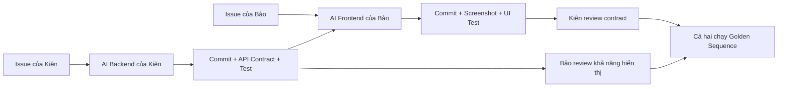
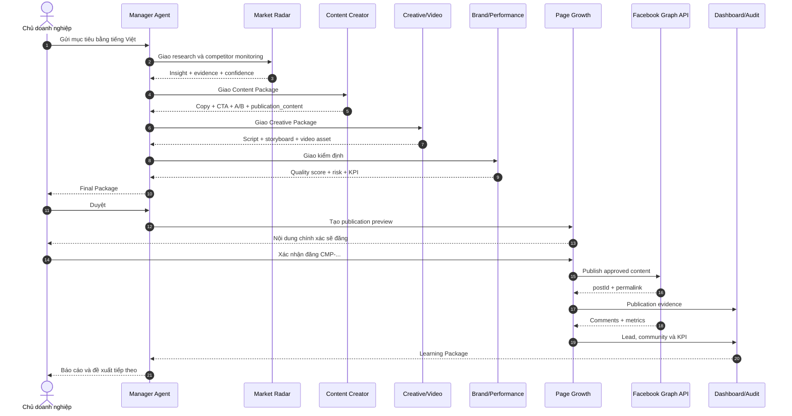

# Phân công 2 người phát triển Phòng AI Agent Marketing

## 1. Mục tiêu tài liệu

Tài liệu này là nguồn phân công chính để hai thành viên cùng dùng AI hỗ trợ lập trình, phát triển song song và tích hợp an toàn hệ thống **Phòng Marketing Intelligence & Growth vận hành bằng AI Agent**.

Sản phẩm hoàn chỉnh phải thực hiện được chu trình:

```text
Nhận yêu cầu -> Nghiên cứu thị trường và đối thủ -> Lập chiến dịch
-> Tạo nội dung và video -> Kiểm định chất lượng -> Người quản lý duyệt
-> Đăng Facebook -> Chăm sóc khách hàng -> Đo lường -> Tự cải tiến
```

Phạm vi hiện tại là Telegram-first và Facebook-first. Không đưa Lark vào luồng triển khai này.

## 2. Phạm vi chức năng đã chốt

| Mã | Chức năng | Đầu ra bắt buộc |
|---|---|---|
| F01 | Nhận yêu cầu tiếng Việt | Brief có mục tiêu, khách hàng, kênh, ràng buộc và KPI |
| F02 | Nghiên cứu thị trường | Insight có nguồn, bằng chứng, độ tin cậy và thời gian thu thập |
| F03 | Theo dõi đối thủ | Thay đổi giá, khuyến mãi, sản phẩm, nội dung và mức ảnh hưởng |
| F04 | Lập chiến dịch | Kế hoạch, thông điệp, lịch nội dung, KPI và người chịu trách nhiệm |
| F05 | Tạo nội dung | Bài Facebook, CTA, biến thể A/B và nội dung xuất bản chính xác |
| F06 | Tạo video sản phẩm | Kịch bản, storyboard, giọng đọc, phụ đề, video và metadata |
| F07 | Kiểm định chất lượng | Điểm chất lượng, claim/rủi ro, quyết định và yêu cầu sửa |
| F08 | Phê duyệt | Agent tự bàn giao nội bộ; Admin chỉ duyệt Final Package |
| F09 | Đăng Facebook | Preview, xác nhận cuối, `postId`, permalink và audit evidence |
| F10 | Chăm sóc khách hàng | Phân loại bình luận/inbox/lead/khiếu nại và đề xuất phản hồi |
| F11 | Đo lường | Reach, engagement, click, lead, conversion và so sánh KPI |
| F12 | Tự cải tiến | Bài học chiến dịch và đề xuất hành động/chiến dịch tiếp theo |

## 3. Thành viên và quyền sở hữu

Hệ thống giữ đúng 6 agent. Không tạo thêm bot trong giai đoạn này.

| Agent | Vai trò doanh nghiệp | Backend/AI Agent | Giao diện/Dashboard |
|---|---|---|---|
| Marketing Manager Agent | Trưởng phòng, nhận yêu cầu và điều phối | Kiên | Bảo |
| Market Radar Agent | Nghiên cứu thị trường và đối thủ | Kiên | Bảo |
| Content Creator Agent | Copywriter và Content Marketer | Kiên | Bảo |
| Strategy & Creative Agent | Chiến lược nội dung và sản xuất video | Kiên | Bảo |
| Brand & Performance Agent | Kiểm định thương hiệu, KPI và hiệu quả | Kiên | Bảo |
| Page Growth & Community Agent | Xuất bản, cộng đồng và lead | Kiên | Bảo |

Nguyên tắc cân bằng:

- **Kiên (Người 1)** sở hữu Telegram, logic của 6 AI Agent, workflow, AI/API, dữ liệu runtime và hành động tích hợp.
- **Bảo (Người 2)** sở hữu giao diện, dashboard, trực quan hóa văn phòng Agent, trải nghiệm duyệt, báo cáo và kiểm thử frontend.
- Mỗi người có 40 điểm chuyên môn và 10 điểm tích hợp chung, tổng cộng **50/50**.
- Kiên cung cấp API/schema ổn định; Bảo không đọc trực tiếp file runtime hoặc gọi API bên thứ ba từ trình duyệt.

## 4. Kiến trúc trách nhiệm

```mermaid
flowchart LR
    Admin["Admin qua Telegram"] --> K1["Kiên: Telegram và Manager Intent"]
    K1 --> K2["Kiên: 6 Agent, Workflow và Policy"]
    K2 --> K3["Kiên: AI, Meta, Video, Community, Metrics"]
    K3 --> API["Control API + SSE + Shared Schema"]
    API --> B1["Bảo: Dashboard và Agent Office"]
    B1 --> B2["Bảo: Campaign, Approval, Content Studio"]
    B2 --> B3["Bảo: Community, Analytics, Audit UI"]
    B3 --> AdminUI["Admin theo dõi và ra quyết định"]
    AdminUI -. "lệnh/duyệt qua Telegram" .-> K1
```



## 5. Phân công Kiên (Người 1): Telegram, AI Agent và Backend

### 5.1. Trách nhiệm chính

1. Vận hành Telegram và hiểu yêu cầu tiếng Việt tự nhiên.
2. Xây logic, prompt, skill và output contract cho cả 6 agent.
3. Điều phối workflow, policy tự duyệt nội bộ và Final Approval.
4. Tích hợp AI provider, Market/Competitor data, video provider và Meta Graph.
5. Xử lý community, metrics, Learning Package và audit nghiệp vụ.
6. Cung cấp Control API/SSE đã redacted cho dashboard của Bảo.
7. Bảo đảm persistence, idempotency, bảo mật và khả năng phục hồi.
8. Viết unit/integration test cho toàn bộ backend.

### 5.2. Hạng mục chi tiết

| ID | Hạng mục | Điểm | Tiêu chí hoàn thành |
|---|---|---:|---|
| K01 | Telegram và Vietnamese Intent | 3 | Hiểu tạo chiến dịch, duyệt, từ chối, sửa, trạng thái và xác nhận bằng câu tự nhiên |
| K02 | Workflow và Agent Orchestrator | 5 | Không nhảy stage, không tạo run trùng, tự bàn giao nội bộ |
| K03 | AI Provider và Structured Output | 4 | Sáu agent có prompt/skill riêng; output có evidence, risk và quality score |
| K04 | Market/Competitor Intelligence | 4 | Phát hiện thay đổi giá, chương trình, sản phẩm, nội dung và chống cảnh báo trùng |
| K05 | Content, Creative và Video Backend | 5 | Tạo copy/A-B/publication content và quản lý video job qua provider adapter |
| K06 | Brand, Performance và Quality Gate | 4 | Kiểm tra claim, tone, CTA, KPI và quyết định có cấu trúc |
| K07 | Meta Publication Guard | 4 | Chỉ đăng đúng preview đã xác nhận; lưu `postId`; không retry mù |
| K08 | Community và Lead Policy | 3 | Phân loại FAQ, lead, spam, khiếu nại và dữ liệu nhạy cảm |
| K09 | Metrics, Learning và Control API | 4 | Thu chỉ số, tạo bài học và cung cấp read model/SSE cho dashboard |
| K10 | Persistence, Security và Backend Tests | 4 | Phục hồi state, idempotency, redaction và failure-path tests |
| **Tổng** |  | **40** |  |

### 5.3. File sở hữu chính

- `scripts/telegram-bot.ts`
- `scripts/telegram-setup.ts`
- `src/integrations/managerIntent.ts`
- `src/integrations/marketingWorkflow.ts`
- `src/integrations/workflowApproval.ts`
- `src/integrations/approvalPolicy.ts`
- `src/integrations/telegramAdapter.ts`
- `src/integrations/telegramRuntime.ts`
- `src/integrations/telegramStateStore.ts`
- `src/integrations/aiProvider.ts`
- `src/integrations/agentWorkProduct.ts`
- `src/integrations/metaGraphAdapter.ts`
- `src/integrations/customerCarePolicy.ts`
- `src/integrations/controlApi.ts`
- `scripts/control-api.ts`
- Các test tương ứng trong `tests/`.

### 5.4. Module mới dự kiến

- `src/integrations/competitorMonitor.ts`
- `src/integrations/marketResearch.ts`
- `src/integrations/videoGenerationAdapter.ts`
- `src/integrations/campaignAnalytics.ts`
- `src/integrations/communityInbox.ts`
- `src/domain/competitorTypes.ts`
- `src/domain/mediaTypes.ts`
- `src/domain/analyticsTypes.ts`
- `tests/competitorMonitor.test.ts`
- `tests/marketResearch.test.ts`
- Các test backend cho video, analytics và community.

## 6. Phân công Bảo (Người 2): Giao diện, Dashboard và Trực quan hóa

### 6.1. Trách nhiệm chính

1. Thiết kế trải nghiệm vận hành chuyên nghiệp cho phòng Marketing AI.
2. Xây dashboard tổng quan realtime từ Control API/SSE của Kiên.
3. Trực quan hóa 6 agent đang nhận việc, xử lý, bàn giao và chờ duyệt.
4. Xây Campaign Board, Approval Center, Competitor Intelligence và Content/Video Studio.
5. Xây Community/Lead Center, Analytics và Learning Dashboard.
6. Hiển thị trạng thái lỗi, loading, empty state và dữ liệu stale rõ ràng.
7. Bảo đảm responsive, accessibility và không lộ secret trên giao diện.
8. Viết component/UI tests và Playwright smoke flow.

### 6.2. Hạng mục chi tiết

| ID | Hạng mục | Điểm | Tiêu chí hoàn thành |
|---|---|---:|---|
| B01 | Design System và App Shell | 4 | Navigation, màu trạng thái, typography và component foundation nhất quán |
| B02 | Executive Dashboard | 5 | KPI, campaign health, pending approval, risk và hành động ưu tiên |
| B03 | Visual Agent Office | 5 | Sáu agent có trạng thái realtime, task hiện tại, handoff và activity timeline |
| B04 | Campaign Pipeline Board | 4 | Theo dõi đầy đủ các stage, owner, SLA, evidence và lỗi |
| B05 | Approval & Publication Center | 4 | So sánh phiên bản, xem Final/preview, trạng thái duyệt và publication evidence |
| B06 | Competitor Intelligence UI | 4 | Bảng thay đổi, bộ lọc, mức ảnh hưởng, nguồn và lịch sử snapshot |
| B07 | Content & Video Studio | 4 | Xem copy A/B, storyboard, video job, asset preview và trạng thái render |
| B08 | Community & Lead Center | 4 | Inbox phân loại, lead score, SLA, escalation và trạng thái xử lý |
| B09 | Analytics & Learning Dashboard | 4 | KPI theo campaign/content, xu hướng và đề xuất cải tiến |
| B10 | Frontend Quality | 2 | Component tests, responsive desktop/mobile, accessibility và Playwright smoke |
| **Tổng** |  | **40** |  |

### 6.3. File sở hữu chính

- `scripts/smoke-agent-flow.cjs`
- `src/App.tsx`
- `src/styles.css`
- Các component, hook và test giao diện tương ứng.

### 6.4. Module mới dự kiến

- `src/components/agent-office/*`
- `src/components/campaigns/*`
- `src/components/approvals/*`
- `src/components/competitors/*`
- `src/components/content-studio/*`
- `src/components/community/*`
- `src/components/analytics/*`
- `src/hooks/useControlApi.ts`
- `src/hooks/useRuntimeEvents.ts`
- `tests/dashboard.test.tsx`
- `tests/agentOffice.test.tsx`

## 7. Phần làm chung: mỗi người 10 điểm tích hợp

| ID | Công việc chung | Người thực hiện | Người xác nhận | Điểm |
|---|---|---|---|---:|
| S01 | Chốt schema Campaign, Run, Evidence, Media Asset và Metric | Kiên đề xuất backend contract | Bảo xác nhận khả năng hiển thị | 4 |
| S02 | Golden Sequence end-to-end | Kiên chạy Telegram/backend | Bảo đối soát dashboard/UI | 4 |
| S03 | Security review và xoay token | Kiên kiểm tra API/secret | Bảo kiểm tra UI/redaction | 3 |
| S04 | Performance và chi phí | Kiên đo API/token | Bảo đo render/load time | 2 |
| S05 | README, sequence diagram và tài liệu khóa luận | Mỗi người viết phần mình | Review chéo | 3 |
| S06 | Demo rehearsal và dữ liệu mẫu | Kiên vận hành luồng | Bảo trình bày dashboard | 2 |
| S07 | Release checklist | Kiên kiểm tra runtime | Bảo kiểm tra giao diện | 2 |
| **Tổng** |  |  |  | **20** |

## 8. Hợp đồng dữ liệu dùng chung

Hai người phải chốt schema trước khi phát triển module phụ thuộc. Không sửa schema dùng chung trong feature branch mà chưa có sự đồng ý của người còn lại.

### 8.1. Agent Work Product

```ts
interface AgentWorkProduct {
  campaignId: string;
  runId: string;
  agentRole: string;
  summary: string;
  deliverables: string[];
  evidence: Array<{ source: string; capturedAt: string; note: string }>;
  risks: string[];
  qualityScore: number;
  recommendation: "approve" | "approve_with_conditions" | "revise" | "escalate";
  nextAction: string;
}
```

### 8.2. Media Asset

```ts
interface MediaAsset {
  id: string;
  campaignId: string;
  type: "image" | "video" | "audio" | "subtitle" | "storyboard";
  status: "queued" | "processing" | "ready" | "failed";
  provider: string;
  localPath?: string;
  externalUrl?: string;
  checksum?: string;
  createdAt: string;
}
```

### 8.3. Publication Evidence

```ts
interface PublicationEvidence {
  campaignId: string;
  channel: "facebook";
  previewHash: string;
  postId: string;
  permalink?: string;
  publishedAt: string;
  confirmedBy: string;
}
```

### 8.4. Nguyên tắc contract

- Mọi thời gian dùng ISO 8601.
- Mọi ID phải ổn định và duy nhất.
- `publication_content` tách khỏi báo cáo nội bộ.
- Không lưu token hoặc dữ liệu cá nhân vào evidence.
- Module gọi API phải trả lỗi có cấu trúc, không nuốt lỗi.
- Dashboard chỉ đọc dữ liệu đã được redacted.

## 9. Kế hoạch phát triển song song

### Sprint 0 - Chuẩn hóa nền tảng

**Kiên**

- Chốt intent, workflow stages, Agent Work Product và Control API contract.
- Tạo test fixture cho một campaign chuẩn và SSE event mẫu.

**Bảo**

- Chốt information architecture, design system và dashboard read model.
- Tạo giao diện mock từ fixture và event mẫu của Kiên.

**Điểm tích hợp**

- Cùng chạy fixture và xác nhận cùng một `campaignId` xuất hiện ở Telegram, runtime và dashboard.

### Sprint 1 - Research và Creative

**Kiên**

- Xây Market Research và Competitor Monitoring.
- Hoàn thiện Content Package, Creative/Video contract và API read model.

**Bảo**

- Xây Executive Dashboard, Visual Agent Office và Competitor Intelligence UI.
- Hiển thị Content Package và asset pipeline trên Content/Video Studio.

**Điểm tích hợp**

- Output backend của Kiên phải hiển thị được trên UI của Bảo mà không ánh xạ thủ công hoặc đọc file runtime trực tiếp.

### Sprint 2 - Quality và Publication

**Kiên**

- Hoàn thiện policy engine, Final Gate và intent duyệt/từ chối.
- Hoàn thiện Brand Gate, Meta publication guard, idempotency và phục hồi runtime.

**Bảo**

- Hoàn thiện Campaign Board và Approval & Publication Center.
- Hiển thị preview, quality gate, audit và publication evidence realtime.

**Điểm tích hợp**

- Chỉ `publication_content` đã duyệt và có xác nhận cuối mới được gửi tới Meta.

### Sprint 3 - Community và Learning

**Kiên**

- Xây community triage, metrics, Learning Package và intent follow-up.
- Cho Manager tạo chiến dịch tiếp theo từ dữ liệu đã đo.

**Bảo**

- Xây Community & Lead Center.
- Hoàn thiện Analytics & Learning Dashboard.

**Điểm tích hợp**

- Metrics của bài đã đăng phải quay lại đúng campaign và tạo được đề xuất tiếp theo.

### Sprint 4 - Hoàn thiện khóa luận và demo

**Cả hai**

- Chạy Golden Sequence.
- Chụp bằng chứng từng stage.
- Hoàn thiện sequence diagram, ERD, DFD và test report.
- Diễn tập demo lỗi AI, lỗi Meta và khởi động lại runtime.

## 10. Quy trình GitHub bắt buộc

Nhánh tích hợp hiện tại: `codex/six-agent-meta-office`.

### 10.1. Quy tắc branch

```text
feature/kien-<issue>-<ten-ngan>   # Kiên: Telegram/AI/backend
feature/bao-<issue>-<ten-ngan>    # Bảo: UI/dashboard
fix/kien-<issue>-<ten-ngan>
fix/bao-<issue>-<ten-ngan>
docs/<issue>-<ten-ngan>
```

Ví dụ:

```text
feature/kien-21-competitor-monitor
feature/bao-22-agent-office-dashboard
```

### 10.2. Một vòng làm việc

1. Tạo GitHub Issue có owner và acceptance criteria.
2. Đồng bộ nhánh tích hợp mới nhất.
3. Tạo một feature branch cho đúng một Issue.
4. Gửi Issue và tài liệu này cho AI đọc.
5. Yêu cầu AI inspect trước khi sửa.
6. Viết test thất bại trước đối với logic mới.
7. Code đúng phạm vi file sở hữu.
8. Chạy test, typecheck, build và smoke liên quan.
9. Commit theo Conventional Commits.
10. Push branch và tạo Pull Request.
11. Người còn lại review contract, bảo mật và regression.
12. Chỉ merge khi CI đạt và không có token trong diff.

### 10.3. Commit chuẩn

```text
feat(radar): detect competitor price changes
feat(video): add product video job adapter
fix(meta): prevent duplicate publication retries
test(workflow): cover final approval sequence
docs(thesis): update agent collaboration diagram
```

Không gom Telegram, video, dashboard và tài liệu vào cùng một commit.

## 11. Prompt dùng cho AI code

Mỗi người mở phiên AI mới và gửi prompt sau:

```text
Bạn đang làm việc trong repo AI_Agent_marketing.

Hãy đọc:
1. docs/PHAN_CONG_2_NGUOI_PHAT_TRIEN_PHONG_AI_AGENT_MARKETING.md
2. README.md
3. GitHub Issue được giao
4. Các file liên quan và test hiện có

Vai trò của tôi: [KIÊN - TELEGRAM/AI/BACKEND hoặc BẢO - UI/DASHBOARD].
Issue: [LINK HOẶC NỘI DUNG ISSUE].

Yêu cầu:
- Chỉ sửa phạm vi thuộc Issue và quyền sở hữu file của tôi.
- Không xóa hoặc revert thay đổi có sẵn.
- Không đưa token hoặc .env vào code, log, test, tài liệu.
- Tôn trọng hợp đồng dữ liệu dùng chung.
- Viết test trước cho logic mới.
- Chạy test, typecheck và build trước khi báo hoàn thành.
- Không tự merge, deploy, đăng Facebook hoặc chi tiền.
- Cuối cùng báo file đã sửa, lệnh kiểm tra, kết quả và commit đề xuất.
```

### 11.1. Cách hai người dùng AI Agent song song

| Phiên AI | Phạm vi được phép | Đầu ra bàn giao |
|---|---|---|
| AI của Kiên | Telegram, workflow, agent logic, provider/API, state và backend tests | Schema, endpoint, event mẫu, test evidence và migration note |
| AI của Bảo | Component, layout, dashboard, visualization, frontend state và UI tests | Screenshot, interaction evidence, component contract và responsive report |

Quy trình cộng tác:



Mỗi lần Kiên thay đổi API/schema, biên bản bàn giao phải ghi endpoint, mẫu JSON, trường thêm/bỏ và test liên quan. Mỗi lần Bảo thay đổi UI flow, biên bản phải ghi màn hình, trạng thái tương tác, ảnh kiểm thử và dữ liệu backend cần dùng. AI chỉ hỗ trợ phân tích, code và kiểm thử; Kiên và Bảo vẫn chịu trách nhiệm review, commit và merge.

## 12. Tiêu chí hoàn thành từng Pull Request

- [ ] Issue có acceptance criteria rõ ràng.
- [ ] Không sửa file ngoài phạm vi nếu chưa giải thích.
- [ ] Có test cho happy path và failure path.
- [ ] Không có secret trong code, ảnh, log hoặc fixture.
- [ ] Output đúng schema.
- [ ] Không tạo hành động bên ngoài khi chưa có approval.
- [ ] `npm run test` đạt.
- [ ] `npm run typecheck` đạt.
- [ ] `npm run build` đạt.
- [ ] Smoke test liên quan đạt.
- [ ] PR có ảnh hoặc log bằng chứng khi thay đổi UI/runtime.
- [ ] Người còn lại đã review.

## 13. Golden Sequence nghiệm thu

### 13.1. Yêu cầu kiểm thử

```text
Hãy tạo chiến dịch Facebook 7 ngày cho một sản phẩm ứng dụng AI trong doanh nghiệp.
Khách hàng là chủ doanh nghiệp 5-30 nhân sự. Mục tiêu là tạo lead tư vấn.
Hãy nghiên cứu hai đối thủ, đề xuất thông điệp, tạo bài Facebook, kịch bản video
30 giây, CTA, KPI và phương án đo lường. Không dùng tuyên bố phóng đại.
```

### 13.2. Kết quả mong đợi

1. Manager tạo một campaign duy nhất.
2. Radar trả insight và bằng chứng đối thủ.
3. Content trả bài Facebook và A/B variant.
4. Creative trả video package hoặc video job hoàn chỉnh.
5. Brand trả quality score, risk và KPI.
6. Manager trình Final Package đúng một lần.
7. Admin nhắn `Duyệt`.
8. Page Growth gửi đúng preview.
9. Admin nhắn `Xác nhận đăng CMP-...`.
10. Meta trả `postId` hoặc lỗi có cấu trúc.
11. Community phân loại tương tác mới.
12. Analytics cập nhật KPI và Learning Package.
13. Dashboard và audit phản ánh cùng một campaign.

### 13.3. Sequence diagram tích hợp



## 14. Ma trận test

| Nhóm test | Kiên | Bảo | Bắt buộc |
|---|---:|---:|---:|
| Intent tiếng Việt | Chính | Review | Có |
| Workflow/state/idempotency | Chính | Review | Có |
| AI structured output | Chính | Review | Có |
| Competitor monitoring | Chính | Review | Có |
| Video generation adapter | Review | Chính | Có |
| Brand quality gate | Review | Chính | Có |
| Meta publish guard | Review | Chính | Có |
| Community policy | Review | Chính | Có |
| Dashboard/control API | Review | Chính | Có |
| Golden Sequence | Cùng chạy | Cùng chạy | Có |

Các failure path tối thiểu:

- AI timeout hoặc trả output sai schema.
- Đối thủ không truy cập được hoặc thay đổi HTML.
- Video provider timeout.
- Final Package thiếu `publication_content`.
- Admin xác nhận sai campaign.
- Meta API từ chối hoặc timeout.
- Bot nhận trùng Telegram update.
- Runtime state bị hỏng.
- Bình luận chứa dữ liệu nhạy cảm hoặc khiếu nại.

## 15. Quy tắc bảo mật và vận hành

- Token Telegram, AI, Meta và media provider chỉ nằm trong `.env` local.
- Token đã xuất hiện trong ảnh/chat phải được thu hồi và tạo lại.
- Không tự động đăng, chạy ads, thay đổi giá hoặc gửi tin hàng loạt.
- Final Approval và Publication Confirmation là hai hành động khác nhau.
- Không tự retry publish khi chưa đối soát Page để tránh bài trùng.
- Log phải che token, dữ liệu cá nhân và nội dung nhạy cảm.
- Chỉ Operator ID và Group ID được cấu hình mới có quyền điều khiển.
- Mọi hành động ra bên ngoài phải có actor, timestamp và evidence.

## 16. Definition of Done toàn dự án

Dự án được coi là hoàn thành khi:

1. Sáu agent hoạt động đúng vai trò và không trả lời lẫn nhiệm vụ.
2. Mười hai chức năng F01-F12 có test hoặc bằng chứng chạy thật.
3. Agent tự bàn giao nội bộ; Admin chỉ duyệt Final và xác nhận đăng.
4. Facebook chỉ nhận nội dung trùng khớp preview đã xác nhận.
5. Video pipeline tạo được asset thật hoặc mock có contract tương đương.
6. Competitor monitoring có snapshot, change event và evidence.
7. Community xử lý FAQ an toàn và chuyển escalation đúng trường hợp.
8. Metrics quay lại đúng campaign và tạo Learning Package.
9. Dashboard hiển thị realtime campaign, agent, audit, approval và KPI.
10. Toàn bộ test, typecheck, build và smoke đều đạt.
11. Git history thể hiện rõ đóng góp của cả hai thành viên.
12. README và tài liệu khóa luận đủ để giảng viên tái hiện demo.

## 17. Việc đầu tiên của hai người

**Kiên bắt đầu Issue K01:** thiết kế `CompetitorChangeEvent`, triển khai Competitor Monitor bằng fixture và mở read-only endpoint cho dashboard.

**Bảo bắt đầu Issue B01:** xây App Shell, Design System và Visual Agent Office bằng fixture/API contract do Kiên cung cấp.

Sau khi hai Issue đầu tiên được merge, Kiên chạy luồng Telegram còn Bảo đối soát cùng campaign trên dashboard. Chỉ phát triển API thật tiếp theo khi dữ liệu, trạng thái và audit khớp hoàn toàn giữa hai phía.
