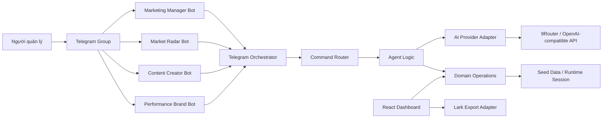
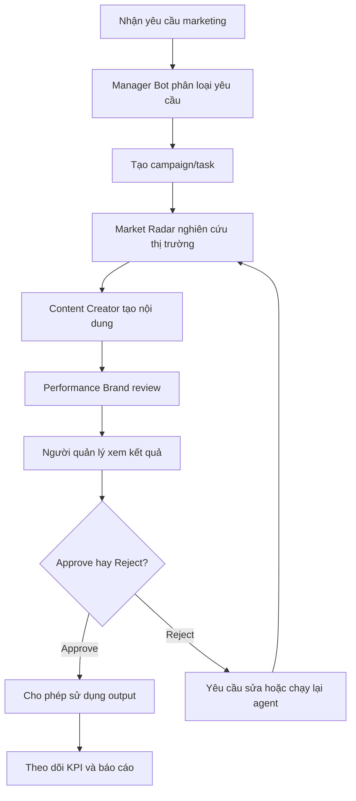
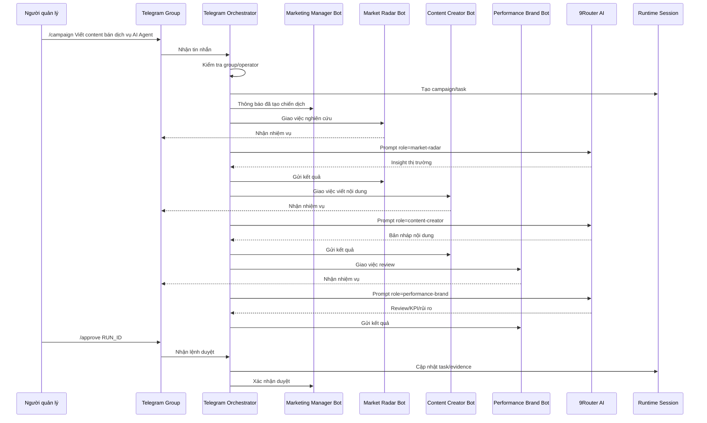
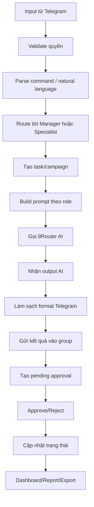
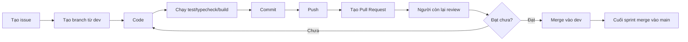

# Tài liệu đầy đủ dự án AI Agent Marketing Command Center qua Telegram

## 1. Tên dự án

**AI Agent Marketing Command Center qua Telegram**

Tên mô tả học thuật:

**Xây dựng hệ thống điều phối quy trình marketing bằng AI Agent cho doanh nghiệp nhỏ thông qua Telegram và Dashboard quản trị**

## 2. Tầm nhìn dự án

Dự án hướng tới việc xây dựng một hệ thống giúp một cá nhân hoặc một doanh nghiệp nhỏ có thể vận hành hoạt động marketing như đang có một đội ngũ chuyên môn gồm nhiều phòng ban. Thay vì chỉ dùng AI như một chatbot hỏi đáp đơn lẻ, hệ thống tổ chức các AI Agent thành từng vai trò cụ thể, có nhiệm vụ rõ ràng, có luồng phối hợp, có dữ liệu đầu vào/đầu ra và có cơ chế phê duyệt bởi con người.

Telegram được dùng làm kênh giao tiếp chính trong giai đoạn MVP. Người quản lý chỉ cần nhắn yêu cầu trong Telegram group, hệ thống sẽ tự điều phối các bot chuyên môn xử lý từng phần của quy trình marketing. Dashboard web local đóng vai trò bảng điều hành để theo dõi chiến dịch, task, agent, approval, nội dung, KPI và export dữ liệu.

## 3. Vấn đề thực tế cần giải quyết

Các doanh nghiệp nhỏ thường gặp những vấn đề sau:

- Không có đủ nhân sự để chia thành nhiều phòng ban marketing.
- Một người phải làm nhiều việc: nghiên cứu thị trường, viết nội dung, kiểm tra thương hiệu, đo KPI, lập lịch đăng bài.
- Dùng AI rời rạc, không có workflow rõ ràng.
- Nội dung AI tạo ra dễ bị lan man, thiếu kiểm soát chất lượng.
- Không có bước phê duyệt trước khi sử dụng output.
- Không có dashboard để nhìn toàn cảnh công việc.
- Không có audit log để biết ai đã làm gì, bot nào tạo output nào, output nào đã được duyệt.

Dự án giải quyết bằng cách tạo một hệ thống điều phối AI Agent theo mô hình doanh nghiệp nhỏ, trong đó mỗi bot là một vai trò nghiệp vụ.

## 4. Mục tiêu dự án

### 4.1. Mục tiêu nghiệp vụ

- Tạo một hệ thống giúp người quản lý giao việc marketing nhanh qua Telegram.
- Tự động chia yêu cầu thành các phần việc cho từng AI Agent.
- Mỗi bot xử lý đúng chuyên môn.
- Output được trình bày rõ ràng, ngắn gọn, có giá trị ra quyết định.
- Mọi output quan trọng đều phải chờ con người phê duyệt.
- Dashboard hiển thị được toàn bộ hoạt động marketing.
- Có tài liệu thiết kế đủ chuẩn để trình bày với giáo viên.

### 4.2. Mục tiêu kỹ thuật

- Xây dựng app web bằng React + TypeScript.
- Xây dựng Telegram bot service bằng Node.js/TypeScript.
- Tích hợp Telegram Bot API.
- Tích hợp AI thông qua 9Router/OpenAI-compatible API.
- Có data model rõ ràng.
- Có seed data phục vụ demo.
- Có test, typecheck, build.
- Có tài liệu sequence diagram, data flow diagram, ERD, workflow.

## 5. Phạm vi MVP

### 5.1. Có trong MVP

- Telegram group có 4 bot:
  - Marketing Manager Bot.
  - Market Radar Bot.
  - Content Creator Bot.
  - Performance Brand Bot.
- Người dùng có thể nhắn câu tự nhiên hoặc dùng lệnh `/campaign`.
- Manager Bot tự tạo chiến dịch và phân công cho các bot còn lại.
- Các bot chuyên môn gọi AI qua 9Router để tạo output.
- Output được làm sạch để phù hợp Telegram.
- Có cơ chế `/approve RUN_ID` và `/reject RUN_ID`.
- Có dashboard local.
- Có task pipeline.
- Có agent board.
- Có daily brief.
- Có export Lark-ready.

### 5.2. Chưa có trong MVP

- Chưa deploy production.
- Chưa có database server.
- Chưa kết nối Lark Base API thật.
- Chưa kết nối GitHub/GitLab API thật.
- Chưa tự động đăng bài.
- Chưa tự động chạy quảng cáo.
- Chưa tự động gửi email hoặc publish ra ngoài.

## 6. Kiến trúc hệ thống



## 7. Thành phần chính

| Thành phần | Vai trò | File/Module liên quan |
|---|---|---|
| Telegram Group | Nơi người dùng ra lệnh và xem bot phối hợp | Telegram app |
| Telegram Orchestrator | Lắng nghe tin nhắn, route command, gọi AI, gửi output | `scripts/telegram-bot.ts` |
| Telegram Setup | Cài menu command, tên, mô tả cho bot | `scripts/telegram-setup.ts` |
| Telegram Adapter | Định nghĩa bot profile, command, session, approval | `src/integrations/telegramAdapter.ts` |
| AI Provider | Tạo prompt, gọi 9Router, fallback mock | `src/integrations/aiProvider.ts` |
| Domain Operations | Xử lý task, agent run, daily brief, dashboard stats | `src/domain/operations.ts` |
| Data Types | Định nghĩa kiểu dữ liệu | `src/domain/types.ts` |
| Seed Data | Dữ liệu mẫu | `src/data/seed.ts` |
| Web Dashboard | Bảng điều hành | `src/App.tsx`, `src/styles.css` |
| Lark Export | Xuất dữ liệu chuẩn Lark-ready | `src/integrations/larkAdapter.ts` |

## 8. Bộ bot chuẩn cho hệ thống marketing

### 8.1. Marketing Manager Bot

Vai trò: trưởng phòng marketing/điều phối viên.

Nhiệm vụ:

- Nhận yêu cầu từ người quản lý.
- Hiểu câu tự nhiên hoặc lệnh `/campaign`.
- Tạo chiến dịch.
- Giao việc cho từng bot.
- Giữ cổng phê duyệt.
- Tổng hợp báo cáo.

Không được làm:

- Không tự đăng bài.
- Không tự chạy quảng cáo.
- Không tự phê duyệt output.
- Không làm thay toàn bộ việc chuyên môn của bot khác.

Lệnh:

- `/brief`
- `/flow`
- `/campaign`
- `/tasks`
- `/approve`
- `/reject`
- `/report`
- `/whoami`

### 8.2. Market Radar Bot

Vai trò: phòng nghiên cứu thị trường.

Nhiệm vụ:

- Phân tích thị trường.
- Tìm insight.
- Phân tích khách hàng mục tiêu.
- Nhận diện nỗi đau.
- Phân tích đối thủ.
- Đề xuất góc truyền thông.

Không được làm:

- Không viết bài hoàn chỉnh.
- Không review thương hiệu thay Performance Brand Bot.
- Không bịa số liệu.

Lệnh:

- `/trend`
- `/competitor`
- `/audience`
- `/insight`
- `/angle`

### 8.3. Content Creator Bot

Vai trò: phòng sáng tạo nội dung.

Nhiệm vụ:

- Viết hook.
- Viết bài social.
- Viết caption.
- Viết script video ngắn.
- Tạo CTA.
- Đề xuất biến thể nội dung.

Không được làm:

- Không tự nhận nội dung đã đăng.
- Không tự chạy ads.
- Không bịa số liệu thị trường.

Lệnh:

- `/post`
- `/caption`
- `/script`
- `/calendar`
- `/hook`

### 8.4. Performance Brand Bot

Vai trò: phòng kiểm duyệt thương hiệu và hiệu suất.

Nhiệm vụ:

- Review tone thương hiệu.
- Kiểm tra claim nhạy cảm.
- Tối ưu CTA.
- Đề xuất KPI.
- Đưa khuyến nghị go/no-go.

Không được làm:

- Không viết lại toàn bộ bài nếu không cần.
- Không tự duyệt.
- Không launch/publish.

Lệnh:

- `/review`
- `/brandcheck`
- `/cta`
- `/measure`
- `/report`

## 9. Quy trình marketing chuẩn trong doanh nghiệp



## 10. Sequence diagram luồng campaign



## 11. Luồng dữ liệu



## 12. Data model cần có

### 12.1. Campaign

| Trường | Mô tả |
|---|---|
| campaign_id | Mã chiến dịch |
| name | Tên chiến dịch |
| objective | Mục tiêu |
| target_audience | Khách hàng mục tiêu |
| offer | Thông điệp/ưu đãi |
| channel | Kênh triển khai |
| status | Trạng thái |
| priority | Mức ưu tiên |
| owner | Người/bot phụ trách |
| created_at | Ngày tạo |
| updated_at | Ngày cập nhật |

Pipeline:

```text
idea -> researching -> drafting -> reviewing -> approved -> scheduled -> published -> measured
```

### 12.2. Agent

| Trường | Mô tả |
|---|---|
| id | Mã agent |
| name | Tên agent |
| department | Phòng ban |
| mission | Nhiệm vụ |
| input_schema | Đầu vào |
| output_schema | Đầu ra |
| current_tasks | Task hiện tại |
| status | idle/working/blocked |

### 12.3. Approval

| Trường | Mô tả |
|---|---|
| run_id | Mã output |
| campaign_id | Chiến dịch liên quan |
| agent_id | Bot tạo output |
| output_type | Loại output |
| summary | Tóm tắt |
| status | pending/approved/rejected |
| created_at | Thời điểm tạo |
| approved_by | Người duyệt |
| approved_at | Thời điểm duyệt |
| note | Ghi chú |

### 12.4. Content Draft

| Trường | Mô tả |
|---|---|
| content_id | Mã nội dung |
| campaign_id | Chiến dịch |
| channel | Kênh |
| content_type | Loại nội dung |
| draft | Bản nháp |
| status | draft/review/approved/scheduled/published |
| planned_date | Ngày dự kiến |
| owner_agent | Agent tạo |

### 12.5. Audit Log

| Trường | Mô tả |
|---|---|
| log_id | Mã log |
| actor_type | human/agent/system |
| actor_name | Người hoặc bot |
| action | Hành động |
| target_id | Đối tượng liên quan |
| timestamp | Thời điểm |
| detail | Chi tiết |

## 13. Dashboard quản lý cần hoàn thiện

### 13.1. Marketing Command Dashboard

Các chỉ số cần có:

- Active Campaigns.
- Pending Approvals.
- Content Drafts.
- Agent Workload.
- Today Brief.
- Risk Alerts.
- Approval Time.
- Content Velocity.

### 13.2. Campaign Board

Mục tiêu:

- Quản lý chiến dịch theo pipeline.
- Xem chiến dịch đang ở bước nào.
- Biết bot nào đang xử lý.
- Biết output nào đang chờ duyệt.

### 13.3. Approval Queue

Mục tiêu:

- Xem tất cả output chờ duyệt.
- Approve/reject.
- Ghi lý do reject.
- Lưu audit log.

### 13.4. Content Calendar

Mục tiêu:

- Xem nội dung theo ngày/kênh.
- Biết nội dung nào là draft, review, approved, scheduled.
- Dùng để trình bày quy trình marketing chuyên nghiệp.

### 13.5. KPI & Analytics

Mục tiêu:

- Đo hiệu quả chiến dịch.
- Đo tốc độ tạo nội dung.
- Đo thời gian phê duyệt.
- Đo tỷ lệ reject.

### 13.6. Agent Department Board

Mục tiêu:

- Xem trạng thái từng bot.
- Xem nhiệm vụ từng bot.
- Xem input/output schema.
- Xem số task đang xử lý.

### 13.7. Audit Log

Mục tiêu:

- Biết ai đã tạo campaign.
- Bot nào đã chạy.
- Output nào đã được approve/reject.
- Khi nào hành động xảy ra.

## 14. Tiêu chí hệ thống chuyên nghiệp

| Tiêu chí | Mô tả | Bắt buộc |
|---|---|---|
| Bot đúng vai trò | Mỗi bot chỉ làm nhiệm vụ của mình | Có |
| Output sạch | Không raw Markdown, không quá dài | Có |
| Human approval | Có approve/reject | Có |
| Dashboard | Có quản lý tổng quan | Có |
| Campaign pipeline | Có trạng thái chiến dịch | Có |
| Approval Queue | Có nơi duyệt output | Có |
| Audit Log | Có lịch sử hành động | Nên có |
| KPI | Có đo hiệu quả | Nên có |
| Test/build | Có kiểm tra kỹ thuật | Có |
| Tài liệu | Có sequence/data flow/ERD | Có |

## 15. Phân công công việc cho 2 người

## Người A: Backend, Telegram, AI Agent

Vai trò: phụ trách phần bot vận hành và AI runtime.

File chính:

- `scripts/telegram-bot.ts`
- `scripts/telegram-setup.ts`
- `src/integrations/telegramAdapter.ts`
- `src/integrations/aiProvider.ts`
- `tests/telegramAdapter.test.ts`
- `tests/marketingTelegramTeam.test.ts`
- `tests/aiProvider.test.ts`

Nhiệm vụ:

- Hoàn thiện Telegram bot service.
- Chuẩn hóa routing cho 4 bot.
- Thêm typing indicator.
- Gọi 9Router AI.
- Làm sạch output Telegram.
- Thiết kế prompt đúng vai trò.
- Xử lý approve/reject.
- Kiểm tra group ID/operator ID.
- Viết test cho bot và AI provider.
- Viết sequence diagram phần Telegram.

Branch đề xuất:

```text
feature/telegram-orchestrator
feature/agent-runtime
feature/ai-provider-prompts
feature/approval-flow
test/telegram-agent-tests
```

## Người B: Dashboard, Data, UI, Tài liệu

Vai trò: phụ trách phần quản trị trực quan và tài liệu khóa luận.

File chính:

- `src/App.tsx`
- `src/styles.css`
- `src/domain/types.ts`
- `src/domain/operations.ts`
- `src/data/seed.ts`
- `src/integrations/larkAdapter.ts`
- `tests/domain.test.ts`
- `README.md`
- `docs/*`

Nhiệm vụ:

- Nâng cấp dashboard marketing.
- Tạo Campaign Board.
- Tạo Approval Queue UI.
- Tạo Content Calendar.
- Tạo KPI & Analytics.
- Tạo Audit Log.
- Chuẩn hóa data model.
- Cập nhật seed data.
- Cập nhật Lark Export.
- Viết ERD, Data Flow Diagram.
- Viết README và tài liệu báo cáo.

Branch đề xuất:

```text
feature/marketing-dashboard
feature/campaign-board
feature/approval-queue-ui
feature/content-calendar
feature/kpi-analytics
docs/thesis-system-design
```

## 16. Kế hoạch sprint

### Sprint 1: Ổn định bot và AI runtime

| Task | Người phụ trách | Kết quả |
|---|---|---|
| Chuẩn hóa output Telegram | A | Output sạch, ngắn, chuyên nghiệp |
| Siết prompt từng bot | A | Bot trả đúng vai trò |
| Auto-run 3 bot phòng ban | A | Manager giao việc xong bot tự chạy |
| Approve/reject ổn định | A | Task cập nhật sau khi duyệt |
| Test routing bot | A | Test pass |

### Sprint 2: Dashboard marketing

| Task | Người phụ trách | Kết quả |
|---|---|---|
| Marketing Command Dashboard | B | Có chỉ số campaign/approval/KPI |
| Campaign Board | B | Có pipeline chiến dịch |
| Approval Queue | B + A | UI duyệt output |
| Content Calendar | B | Có lịch nội dung |
| Audit Log | B + A | Có lịch sử hành động |

### Sprint 3: Data model và export

| Task | Người phụ trách | Kết quả |
|---|---|---|
| CampaignRecord | B | Type dữ liệu chiến dịch |
| ContentDraftRecord | B | Type dữ liệu nội dung |
| ApprovalRecord | A + B | Bot và UI dùng chung |
| AuditLogRecord | A + B | Ghi lịch sử |
| Lark Export mở rộng | B | Export campaigns/approvals/content |

### Sprint 4: Báo cáo và demo

| Task | Người phụ trách | Kết quả |
|---|---|---|
| Sequence diagram | A | Luồng Telegram/AI rõ |
| Data flow + ERD | B | Luồng dữ liệu rõ |
| README | B | Người khác chạy được |
| Demo script | A + B | Kịch bản bảo vệ |
| Video backup | A + B | Phòng khi mạng/API lỗi |

## 17. GitHub workflow

### 17.1. Branch model

```text
main
dev
feature/*
test/*
docs/*
```

Quy tắc:

- `main`: bản ổn định để nộp.
- `dev`: nhánh tích hợp.
- `feature/*`: nhánh tính năng.
- `test/*`: nhánh test.
- `docs/*`: nhánh tài liệu.

### 17.2. Quy trình làm việc



### 17.3. Lệnh kiểm tra bắt buộc

```bash
npm run test
npm run typecheck
npm run build
```

### 17.4. Chuẩn commit

```text
feat: add campaign board
fix: clean telegram output format
test: add approval flow tests
docs: add sequence diagram
refactor: split agent prompt rules
chore: update env example
```

## 18. Checklist hoàn thiện cuối cùng

### Telegram

- [ ] 4 bot hoạt động trong group.
- [ ] Manager nhận câu tự nhiên.
- [ ] Manager tạo campaign.
- [ ] 3 bot phòng ban tự xử lý.
- [ ] Output sạch, không Markdown thô.
- [ ] Có typing indicator.
- [ ] Có approve/reject.
- [ ] Có group/operator lock.

### Dashboard

- [ ] Marketing overview.
- [ ] Campaign Board.
- [ ] Approval Queue.
- [ ] Content Calendar.
- [ ] KPI Analytics.
- [ ] Agent Board.
- [ ] Audit Log.
- [ ] Lark Export.

### Tài liệu

- [ ] Mô tả hệ thống.
- [ ] Sequence diagram.
- [ ] Data flow diagram.
- [ ] ERD.
- [ ] State machine.
- [ ] Phân công nhóm.
- [ ] GitHub workflow.
- [ ] Demo script.

### Kỹ thuật

- [ ] `npm run test` pass.
- [ ] `npm run typecheck` pass.
- [ ] `npm run build` pass.
- [ ] Không commit `.env`.
- [ ] README đầy đủ.

## 19. Kịch bản demo bảo vệ

1. Mở dashboard.
2. Giới thiệu đây là command center cho doanh nghiệp nhỏ.
3. Mở Telegram group.
4. Gửi:

```text
/campaign Viết content bán dịch vụ AI Agent cho doanh nghiệp nhỏ, giọng chuyên nghiệp và dễ chốt lịch tư vấn
```

5. Trình bày:
   - Manager Bot nhận yêu cầu.
   - Market Radar Bot nghiên cứu.
   - Content Creator Bot viết nội dung.
   - Performance Brand Bot kiểm duyệt.
6. Dùng `/approve RUN_ID`.
7. Quay lại dashboard xem task/approval/report.
8. Trình bày sequence diagram và data flow.
9. Kết luận: hệ thống có human-in-the-loop, có dashboard, có data model, có khả năng mở rộng.

## 20. Kết luận

Hệ thống AI Agent Marketing Command Center qua Telegram là một mô hình phù hợp để làm khóa luận vì có đủ cả tính ứng dụng và tính kỹ thuật:

- Có bài toán doanh nghiệp rõ ràng.
- Có multi-agent workflow.
- Có tích hợp AI.
- Có Telegram orchestration.
- Có dashboard quản trị.
- Có human approval.
- Có data model.
- Có sequence/data flow/ERD.
- Có quy trình làm việc nhóm trên GitHub.

Nếu hai người chia việc theo đúng tài liệu này, dự án có thể hoàn thành nhanh, đồng bộ, dễ demo và đủ chuyên nghiệp để trình bày với giáo viên.
