# Tai lieu thiet ke khoa luan: He thong AI Agent trong doanh nghiep qua Telegram

## 1. Ten de tai de xuat

**Xay dung he thong AI Agent ho tro dieu phoi quy trinh Marketing/Van hanh cho doanh nghiep nho thong qua Telegram**

Ten ngan gon: **AI Agent Command Center qua Telegram**

## 2. Boi canh va van de

Doanh nghiep nho hoac doanh nghiep mot nguoi thuong gap cac van de:

- Co nhieu cong viec lap lai: nghien cuu thi truong, lap ke hoach noi dung, viet bai, kiem tra chat luong, bao cao.
- Thieu nhan su chuyen trach cho tung phong ban.
- Du lieu va trao doi nam rai rac o nhieu kenh.
- Viec ung dung AI thuong dung theo kieu hoi-dap don le, chua thanh quy trinh co kiem soat.
- Neu de AI tu dong dang bai, chay quang cao, sua code hoac gui thong tin ra ngoai thi co rui ro cao.

De tai de xuat mot mo hinh **doanh nghiep nho duoc ho tro boi doi AI Agent**, trong do:

- Telegram la kenh giao tiep va dieu phoi nhanh.
- Dashboard web la noi quan ly tong quan quy trinh, task, agent va du lieu mau.
- AI Agent dong vai tro cac phong ban ao.
- Con nguoi giu quyen phe duyet cuoi cung.
- Moi hanh dong quan trong deu co human-in-the-loop.

## 3. Muc tieu he thong

### 3.1. Muc tieu nghiep vu

- Cho phep nguoi quan ly giao viec bang ngon ngu tu nhien trong Telegram group.
- He thong tu phan loai yeu cau thanh chien dich/task.
- Marketing Manager Bot dieu phoi cac bot phong ban.
- Cac bot phong ban tao ket qua dung vai tro:
  - Market Radar Bot: nghien cuu thi truong.
  - Content Creator Bot: tao noi dung.
  - Performance Brand Bot: kiem duyet thuong hieu, CTA, KPI.
- Con nguoi phe duyet truoc khi su dung ket qua.
- Dashboard hien thi du lieu va quy trinh de trinh bay hoc thuat.

### 3.2. Muc tieu ky thuat

- Xay dung MVP chay local.
- Tich hop Telegram Bot API bang long polling.
- Tich hop cong OpenAI-compatible thong qua 9Router local proxy.
- Co seed data: repos, tasks, agents, health checks, daily briefs.
- Co workflow task ro rang.
- Co test, typecheck, build.
- San sang mo rong sang Lark/GitHub/GitLab sau MVP.

## 4. Pham vi MVP

### Co trong MVP

- Web dashboard React + TypeScript.
- Bot Telegram gom 4 bot:
  - Marketing Manager Bot.
  - Market Radar Bot.
  - Content Creator Bot.
  - Performance Brand Bot.
- Xu ly lenh:
  - `/brief`
  - `/flow`
  - `/campaign`
  - `/trend`
  - `/post`
  - `/review`
  - `/approve`
  - `/reject`
  - `/report`
- Goi AI qua 9Router de tao output.
- Human approval gate.
- Export du lieu Lark-ready dang JSON/CSV.
- Test domain, adapter, provider.

### Chua co trong MVP

- Chua ket noi Lark Base API that.
- Chua dong bo GitHub/GitLab API that.
- Chua co database server rieng.
- Chua co deploy production.
- Chua tu dong dang bai, chay ads, merge code hoac deploy.

## 5. Mo hinh tac nhan trong he thong

| Tac nhan | Vai tro | Quyen han |
|---|---|---|
| Human Operator | Nguoi quan ly doanh nghiep | Ra lenh, xem ket qua, approve/reject |
| Marketing Manager Bot | Dieu phoi | Nhan yeu cau, tao campaign, giao viec, tong hop |
| Market Radar Bot | Nghien cuu | Phan tich thi truong, audience, competitor, insight |
| Content Creator Bot | San xuat noi dung | Tao hook, post, caption, script, CTA |
| Performance Brand Bot | Kiem duyet | Review tone, claim, CTA, KPI, rui ro |
| 9Router AI Gateway | Cong model AI | Xu ly prompt cua tung agent |
| Web Dashboard | Bang dieu hanh | Hien thi repos, tasks, agents, daily brief, export |
| Local Storage / Seed Data | Kho du lieu MVP | Luu du lieu demo phia browser |

## 6. Kien truc tong the

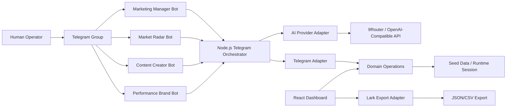

Giai thich:

- Telegram group la giao dien hoi thoai.
- Node.js Telegram Orchestrator la service chay local, lang nghe tin nhan tu Telegram.
- Telegram Adapter chuyen lenh Telegram thanh thao tac nghiep vu.
- AI Provider Adapter tao prompt dung vai tro va goi 9Router.
- Domain Operations xu ly task, agent workflow, dashboard stats.
- Dashboard React hien thi quy trinh va du lieu.
- Lark Adapter tao export de sau nay dua vao Lark Base.

## 7. Quy trinh doanh nghiep de mo phong

Quy trinh duoc thiet ke theo mo hinh **human-in-the-loop marketing operation**.

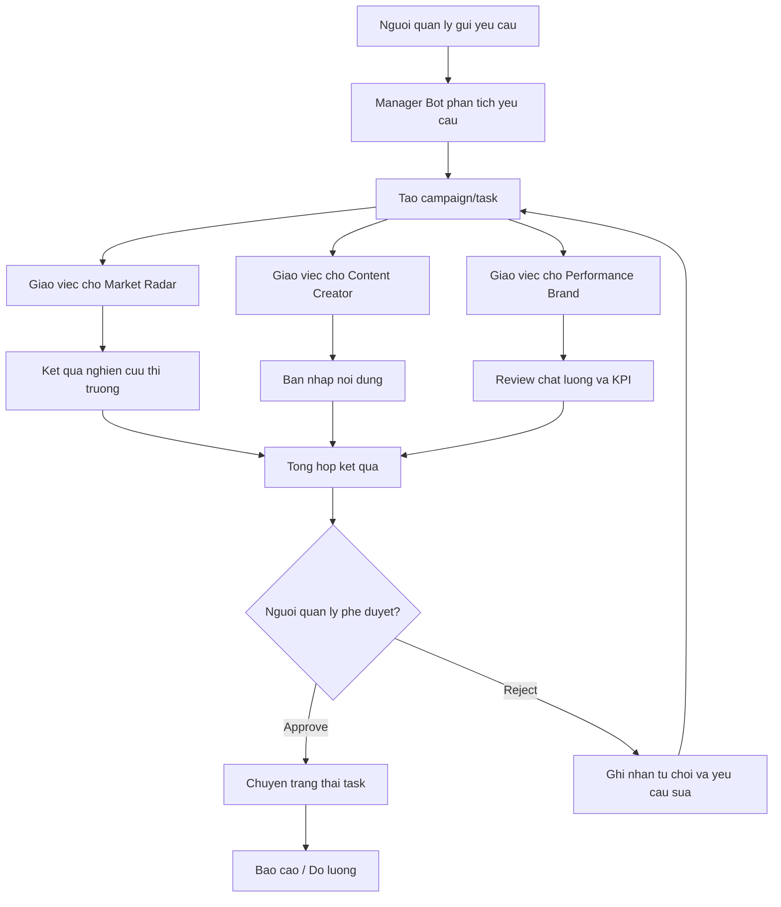

## 8. Sequence diagram: Tao chien dich tu Telegram

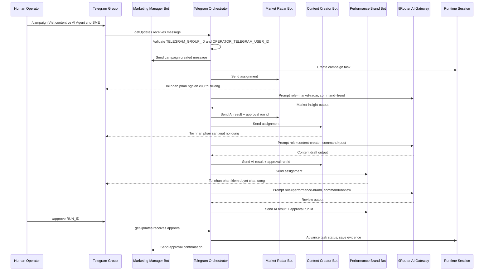

## 9. Sequence diagram: Goi rieng tung bot phong ban

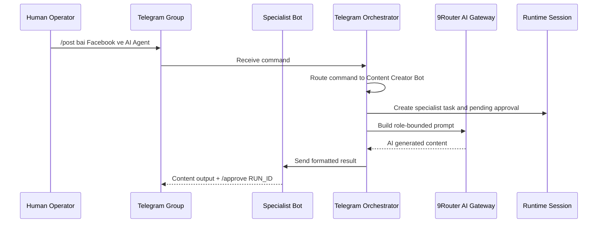

## 10. Sequence diagram: Phe duyet

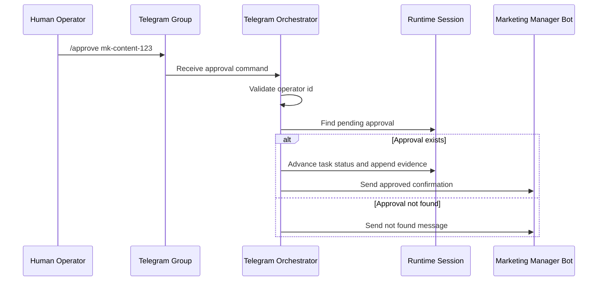

## 11. Data Flow Diagram cap 0

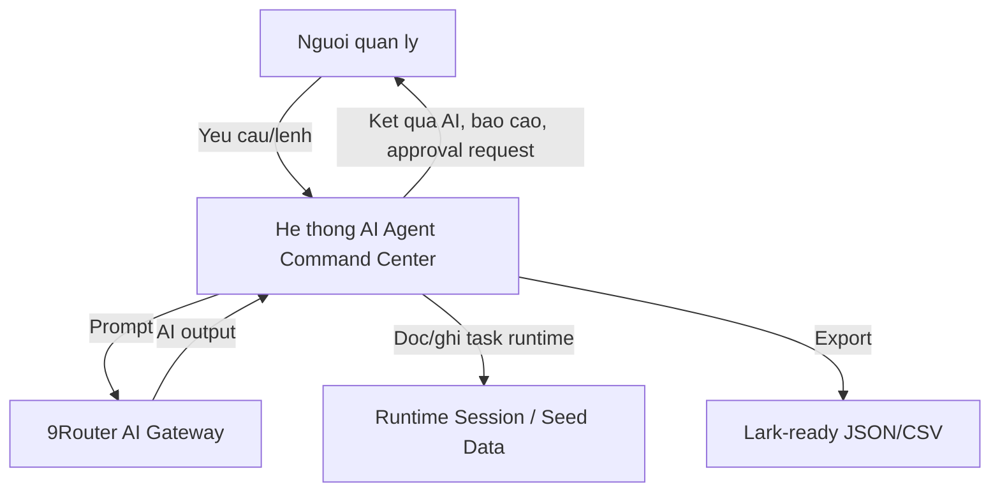

## 12. Data Flow Diagram cap 1

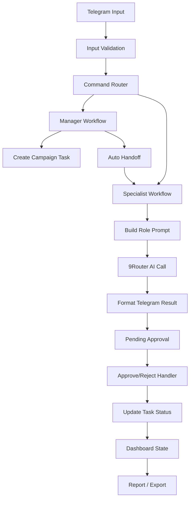

## 13. Data model

### 13.1. Bang Repos

| Truong | Kieu | Mo ta |
|---|---|---|
| id | string | Ma repo |
| name | string | Ten repo |
| provider | GitHub/GitLab | Nen tang luu code |
| url | string | Link repo |
| purpose | string | Muc dich repo |
| business_area | enum | Linh vuc nghiep vu |
| status | enum | idea, active, paused, archived |
| owner_agent | string | Agent phu trach |
| health_score | number | Diem suc khoe |
| last_activity | date | Lan cap nhat gan nhat |
| next_action | string | Viec can lam tiep |

### 13.2. Bang Tasks

| Truong | Kieu | Mo ta |
|---|---|---|
| id | string | Ma task |
| title | string | Ten task |
| repo_id | string | Repo lien quan |
| status | enum | Trang thai pipeline |
| priority | enum | low, medium, high, urgent |
| assigned_agent | string | Agent duoc giao |
| input | string | Dau vao |
| expected_output | string | Dau ra mong doi |
| quality_gate | string | Tieu chi chat luong |
| evidence | string | Bang chung xu ly |
| created_at | date | Ngay tao |
| updated_at | date | Ngay cap nhat |

### 13.3. Bang Agents

| Truong | Kieu | Mo ta |
|---|---|---|
| id | string | Ma agent |
| name | string | Ten agent |
| department | string | Phong ban |
| mission | string | Nhiem vu |
| input_schema | string[] | Dau vao chap nhan |
| output_schema | string[] | Dau ra tao ra |
| current_tasks | string[] | Task dang xu ly |
| status | enum | idle, working, blocked |

### 13.4. Bang Agent Runs

| Truong | Kieu | Mo ta |
|---|---|---|
| id | string | Ma lan chay |
| agent_id | string | Agent thuc hien |
| task_id | string | Task lien quan |
| created_at | datetime | Thoi diem tao |
| output.summary | string | Tom tat |
| output.recommended_next_status | enum | Trang thai de xuat |
| output.handoff_fields | string[] | Du lieu ban giao |
| output.risks | string[] | Rui ro |
| output.requires_human_approval | boolean | Co can phe duyet khong |
| output.approval_note | string | Ghi chu phe duyet |

### 13.5. ERD

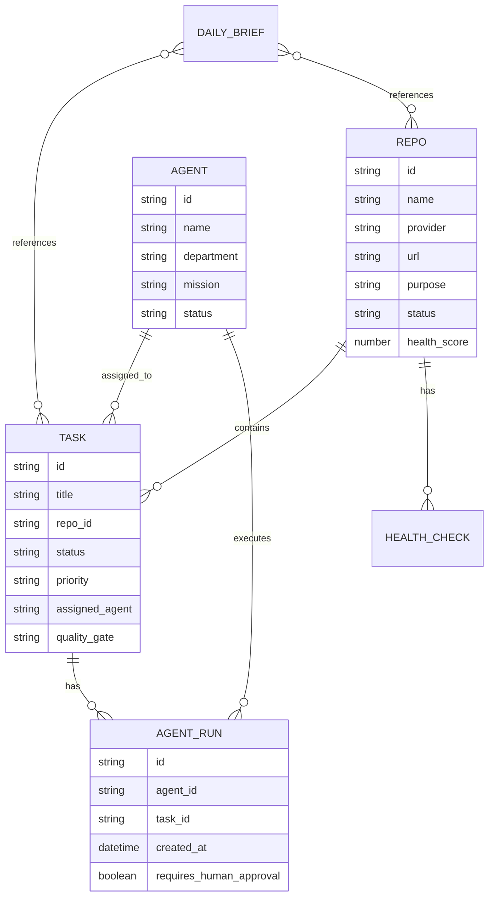

## 14. State machine cua Task

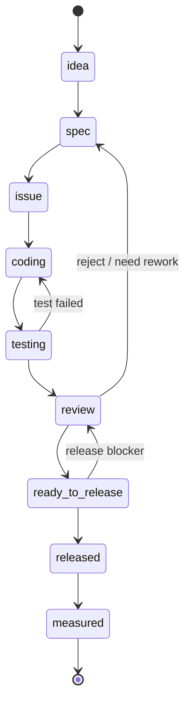

Trang thai chinh:

- idea: y tuong ban dau.
- spec: da ro yeu cau.
- issue: san sang thanh ticket.
- coding: dang trien khai.
- testing: dang kiem thu.
- review: cho review.
- ready_to_release: san sang phat hanh.
- released: da phat hanh.
- measured: da do luong ket qua.

## 15. Thiet ke module

### 15.1. Frontend Dashboard

File chinh:

- `src/App.tsx`
- `src/styles.css`
- `src/main.tsx`

Chuc nang:

- Dashboard tong quan.
- Repo Registry.
- Task Pipeline.
- Agent Department Board.
- Repo Detail.
- Daily Brief.
- Lark Export placeholder.

### 15.2. Domain Layer

File chinh:

- `src/domain/types.ts`
- `src/domain/operations.ts`
- `src/data/seed.ts`

Chuc nang:

- Dinh nghia kieu du lieu.
- Xu ly task status.
- Tao agent run.
- Tao daily brief.
- Lay dashboard stats.
- Lay repo detail.

### 15.3. Telegram Integration

File chinh:

- `src/integrations/telegramAdapter.ts`
- `scripts/telegram-bot.ts`
- `scripts/telegram-setup.ts`

Chuc nang:

- Dinh nghia profile 4 bot.
- Cai menu command Telegram.
- Long polling Telegram Bot API.
- Validate group/operator.
- Route command theo vai tro.
- Gui typing indicator.
- Goi AI output.
- Tao pending approval.

### 15.4. AI Provider

File chinh:

- `src/integrations/aiProvider.ts`

Chuc nang:

- Doc cau hinh 9Router.
- Tao prompt theo tung role.
- Goi OpenAI-compatible `/chat/completions`.
- Fallback sang mock neu khong co API.
- Kiem soat ranh gioi vai tro.

### 15.5. Lark Export

File chinh:

- `src/integrations/larkAdapter.ts`

Chuc nang:

- Chuyen du lieu local thanh schema Lark-ready.
- Xuat JSON/CSV.
- Lam boundary de sau nay noi Lark Base API.

## 16. Yeu cau phi chuc nang

| Nhom | Yeu cau |
|---|---|
| Bao mat | Token bot luu trong `.env`, khong commit len GitHub |
| Kiem soat | Chi dung group id va operator id da cau hinh |
| Human-in-the-loop | Moi output quan trong can approve/reject |
| Tin cay | Co fallback mock khi AI API loi |
| Mo rong | Tach adapter Telegram, AI, Lark |
| Kiem thu | Co test, typecheck, build |
| Demo | Chay local, khong can domain public |

## 17. Tieu chi nghiem thu voi giao vien

1. He thong co mo hinh tac nhan ro rang.
2. Co sequence diagram cho luong chinh.
3. Co data flow diagram.
4. Co data model/ERD.
5. Co state machine cho task.
6. Co dashboard web chay local.
7. Co Telegram group demo voi nhieu bot.
8. Co AI output qua API hoac mock co giai thich.
9. Co human approval gate.
10. Co test/build thanh cong.
11. Co phan mock vs real integration ro rang.
12. Co quy trinh lam viec nhom tren GitHub.

## 18. Phan cong cong viec cho 2 nguoi

### Thanh vien A: Backend/Integration/AI Agent

Phu trach:

- Telegram Bot API.
- 9Router AI integration.
- Agent workflow.
- Approval logic.
- Security `.env`.
- Test cho adapter/provider.
- Tai lieu sequence diagram lien quan backend.

File chinh:

- `scripts/telegram-bot.ts`
- `scripts/telegram-setup.ts`
- `src/integrations/telegramAdapter.ts`
- `src/integrations/aiProvider.ts`
- `tests/telegramAdapter.test.ts`
- `tests/marketingTelegramTeam.test.ts`
- `tests/aiProvider.test.ts`

Task cu the:

- Hoan thien routing theo bot role.
- Chuan hoa prompt tung agent.
- Them typing indicator.
- Them approval/reject flow.
- Them logging an toan.
- Kiem tra 9Router endpoint.
- Viet test API fallback.

### Thanh vien B: Frontend/Dashboard/Data/Report

Phu trach:

- UI Dashboard.
- Repo Registry.
- Task Pipeline.
- Agent Board.
- Daily Brief.
- Lark Export.
- Seed data.
- Tai lieu data model, ERD, DFD.

File chinh:

- `src/App.tsx`
- `src/styles.css`
- `src/domain/types.ts`
- `src/domain/operations.ts`
- `src/data/seed.ts`
- `src/integrations/larkAdapter.ts`
- `tests/domain.test.ts`
- `README.md`

Task cu the:

- Hoan thien UI demo.
- Chuan hoa data model.
- Them data seed cho demo.
- Tao export Lark-ready.
- Viet daily brief.
- Viet README va huong dan demo.
- Tao slide/tai lieu bao cao.

### Viec lam chung

- Chot scope MVP.
- Chot demo script.
- Review pull request cua nhau.
- Chay test/build truoc khi merge.
- Quay video demo.
- Chuan bi cau tra loi khi giao vien hoi.

## 19. Quy trinh GitHub cho 2 nguoi

### 19.1. Cau truc nhanh

- `main`: nhanh on dinh, luon build duoc.
- `dev`: nhanh tong hop tinh nang.
- `feature/telegram-agent-flow`: nhanh cua thanh vien A.
- `feature/dashboard-data-model`: nhanh cua thanh vien B.
- `docs/thesis-system-design`: nhanh tai lieu.

### 19.2. Luong lam viec

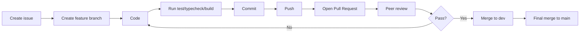

### 19.3. Quy tac commit

Dung Conventional Commits:

- `feat: add telegram campaign auto-run`
- `fix: clean telegram ai output formatting`
- `test: add marketing team routing tests`
- `docs: add system design diagrams`
- `refactor: split ai provider prompt rules`

### 19.4. Quy tac PR

Moi PR can co:

- Mo ta thay doi.
- Anh chup man hinh neu thay doi UI.
- Lenh da chay:
  - `npm run test`
  - `npm run typecheck`
  - `npm run build`
- Rui ro neu co.
- Checklist khong commit `.env`.

## 20. Backlog de hoan thanh khoa luan

### Sprint 1: On dinh MVP

- [ ] Don sach output Telegram.
- [ ] Them logging co kiem soat.
- [ ] Them README tieng Viet chuan.
- [ ] Them diagram vao docs.
- [ ] Chay lai test/build.

### Sprint 2: Hoan thien dashboard

- [ ] UI Task Pipeline ro hon.
- [ ] Agent Board co trang thai lam viec.
- [ ] Daily Brief co mau bao cao.
- [ ] Lark Export co schema hien thi ro.

### Sprint 3: Bao cao khoa luan

- [ ] Viet chuong 1: Mo dau.
- [ ] Viet chuong 2: Co so ly thuyet AI Agent, workflow automation, Telegram Bot API.
- [ ] Viet chuong 3: Phan tich thiet ke he thong.
- [ ] Viet chuong 4: Cai dat va kiem thu.
- [ ] Viet chuong 5: Ket luan va huong phat trien.
- [ ] Tao slide demo.

### Sprint 4: Demo

- [ ] Tao Telegram group sach.
- [ ] Chuan bi 3 kich ban demo.
- [ ] Quay video fallback.
- [ ] Kiem tra 9Router endpoint.
- [ ] Kiem tra dashboard local.

## 21. Cau truc bao cao khoa luan de xuat

### Chuong 1: Mo dau

- Ly do chon de tai.
- Muc tieu.
- Doi tuong va pham vi.
- Phuong phap thuc hien.
- Ket qua mong doi.

### Chuong 2: Co so ly thuyet

- AI Agent la gi.
- Multi-agent system.
- Human-in-the-loop.
- Workflow automation.
- Telegram Bot API.
- LLM API/OpenAI-compatible API.
- Dashboard quan tri.

### Chuong 3: Phan tich va thiet ke

- Yeu cau chuc nang.
- Yeu cau phi chuc nang.
- Tac nhan he thong.
- Use case diagram.
- Sequence diagram.
- Data flow diagram.
- ERD.
- State machine.
- Kien truc module.

### Chuong 4: Cai dat va kiem thu

- Tech stack.
- Cau truc source code.
- Cai dat Telegram bot.
- Cai dat 9Router.
- Demo flow.
- Ket qua kiem thu.
- Han che.

### Chuong 5: Ket luan va huong phat trien

- Ket qua dat duoc.
- Han che MVP.
- Huong phat trien:
  - Noi Lark Base API.
  - Noi GitHub/GitLab.
  - Them database.
  - Them RBAC.
  - Them audit log.
  - Deploy production.

## 22. Use case diagram

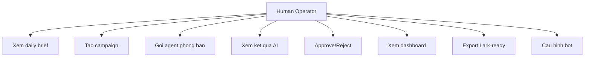

## 23. Demo script cho buoi bao ve

### Buoc 1: Gioi thieu van de

"Doanh nghiep nho thuong khong co du nhan su cho marketing, van hanh va kiem soat chat luong. He thong cua nhom em mo phong mot doi AI Agent nhu cac phong ban ao, trong do con nguoi van giu quyen phe duyet."

### Buoc 2: Mo dashboard

- Mo `http://127.0.0.1:5174/`.
- Gioi thieu Dashboard, Repos, Tasks, Agents, Daily Brief, Export.

### Buoc 3: Mo Telegram group

Gui:

```text
/brief
```

Giai thich: Manager Bot tra ve tinh hinh ngay.

### Buoc 4: Tao campaign

Gui:

```text
/campaign Viet content ban dich vu AI Agent cho doanh nghiep nho
```

Giai thich:

- Manager Bot tao chien dich.
- Radar Bot nghien cuu thi truong.
- Content Bot tao noi dung.
- Performance Bot review.

### Buoc 5: Phe duyet

Gui:

```text
/approve RUN_ID
```

Giai thich: Khong co hanh dong nao duoc su dung neu chua co nguoi phe duyet.

### Buoc 6: Bao cao

Gui:

```text
/report
```

### Buoc 7: Ket luan

"MVP chung minh duoc mo hinh dieu phoi multi-agent qua Telegram, co dashboard, co data model, co sequence diagram, co human approval. Giai doan sau co the noi Lark Base, GitHub/GitLab va database that."

## 24. Rui ro va cach giam thieu

| Rui ro | Anh huong | Giam thieu |
|---|---|---|
| AI tra loi sai | Ket qua kem tin cay | Prompt role-boundary, human approval |
| Lo token bot | Bi dieu khien bot | Luu `.env`, khong commit, regenerate token |
| Telegram bot khong doc tin bot khac | Luong tu dong bi dut | Backend orchestrator goi tung bot bang token |
| API 9Router loi | Demo bi dung | Fallback simulated output |
| Scope qua rong | Khong kip khoa luan | Gioi han MVP, noi API that sau |
| Du lieu local chua that | Thieu tinh san xuat | Giai thich mock va roadmap database/API |

## 25. Ket luan thiet ke

He thong phu hop lam khoa luan vi co day du cac thanh phan:

- Bai toan thuc te.
- Quy trinh doanh nghiep ro.
- Kien truc phan lop.
- Multi-agent workflow.
- Sequence diagram.
- Data flow.
- Data model.
- Human approval.
- Ung dung demo chay duoc.
- Huong mo rong len he thong that.

Trong MVP, Telegram dong vai tro command center nhanh. Dashboard web dong vai tro bang dieu hanh va minh chung du lieu. AI Agent dong vai tro phong ban ao, nhung con nguoi van giu quyen ra quyet dinh cuoi cung. Day la diem quan trong giup he thong vua co tinh tu dong hoa, vua co tinh kiem soat trong moi truong doanh nghiep.
