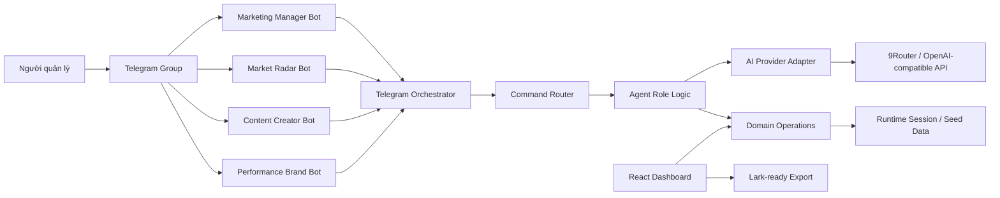
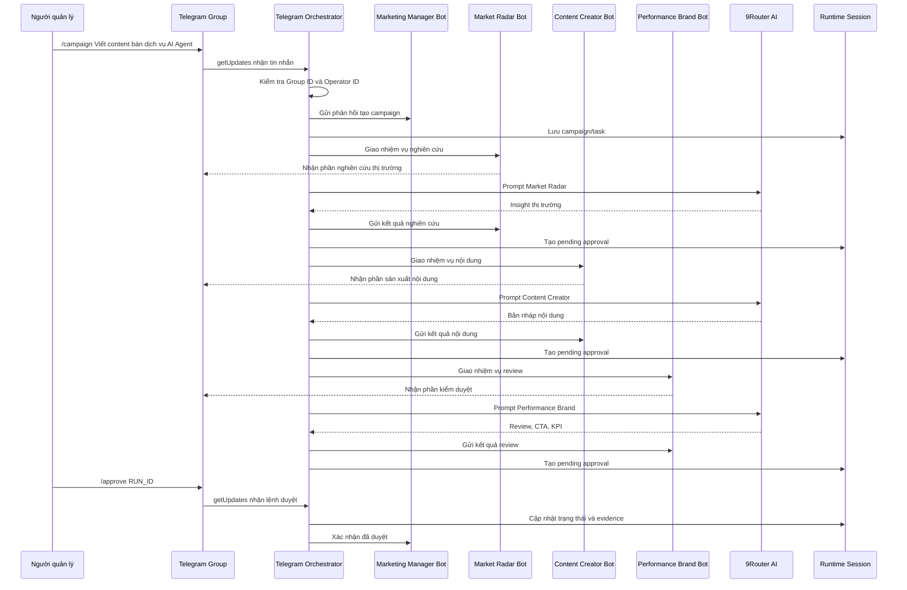
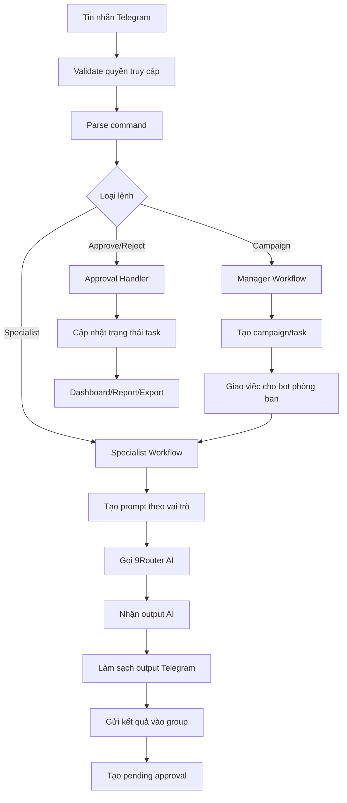
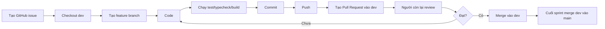

# Luồng hoạt động hệ thống và phân công phát triển Bot Telegram

> **BẢN LƯU TRỮ TRƯỚC NÂNG CẤP 6 AGENT.** Nguồn sự thật hiện hành: `README.md`, `docs/operations/SIX_AGENT_SEQUENCE_DEMO.md` và `docs/operations/PRODUCTION_READINESS_AUDIT.md`.

## 1. Mục tiêu tài liệu

Tài liệu này mô tả chi tiết luồng hoạt động của hệ thống **AI Agent Marketing Command Center qua Telegram**, nhiệm vụ của từng bot, cách cấu hình token an toàn, sequence diagram, quy trình làm việc của 2 thành viên trên GitHub và danh sách công việc cần hoàn thiện để hệ thống vận hành đúng chuẩn doanh nghiệp.

Mục tiêu cuối cùng:

- Người quản lý chỉ cần nhắn yêu cầu trong Telegram group.
- Marketing Manager Bot tiếp nhận yêu cầu và điều phối.
- Các bot phòng ban xử lý đúng vai trò.
- AI gọi qua 9Router/OpenAI-compatible API để tạo output.
- Con người phê duyệt trước khi sử dụng output.
- Dashboard web hiển thị được toàn cảnh quy trình.
- Code được chia việc rõ ràng cho 2 người, làm song song trên GitHub.

## 2. Nguyên tắc thiết kế hệ thống

Hệ thống không được thiết kế như một chatbot đơn lẻ. Hệ thống được thiết kế như một **mô hình doanh nghiệp thu nhỏ**, trong đó mỗi bot là một phòng ban AI.

Các nguyên tắc quan trọng:

1. **Một đầu mối điều phối**
   - Marketing Manager Bot là đầu mối nhận lệnh, chia việc và giữ quyền phê duyệt.

2. **Mỗi bot chỉ làm đúng vai trò**
   - Radar không viết content.
   - Content không tự review KPI.
   - Performance không làm nghiên cứu thị trường thay Radar.

3. **Human-in-the-loop**
   - AI chỉ đề xuất.
   - Người quản lý mới được approve/reject.
   - Không tự đăng bài, không tự chạy quảng cáo, không tự gửi dữ liệu ra ngoài.

4. **Telegram là command surface**
   - Telegram dùng để ra lệnh và xem bot phối hợp.
   - Dashboard dùng để quản trị và trình bày dữ liệu.

5. **Token và thông tin nhạy cảm phải để trong `.env`**
   - Không commit token thật lên GitHub.
   - Không đưa token thật vào README hoặc tài liệu public.

## 3. Sơ đồ kiến trúc tổng thể



## 4. Các bot trong hệ thống

## 4.1. Marketing Manager Bot

### Vai trò

Marketing Manager Bot là bot quản lý trung tâm, tương đương trưởng phòng marketing hoặc giám đốc vận hành.

### Nhiệm vụ chính

- Nhận yêu cầu từ người quản lý.
- Nhận cả câu tự nhiên và lệnh `/campaign`.
- Tạo campaign/task.
- Phân việc cho các bot phòng ban.
- Theo dõi output.
- Giữ quyền phê duyệt.
- Tổng hợp báo cáo.

### Lệnh hỗ trợ

```text
/brief
/flow
/campaign <yêu cầu chiến dịch>
/tasks
/approve RUN_ID
/reject RUN_ID
/report
/whoami
```

### Input

- Mục tiêu chiến dịch.
- Chủ đề content.
- Tệp khách hàng.
- Kênh marketing.
- Yêu cầu về giọng văn.

### Output

- Campaign/task mới.
- Danh sách phân công cho từng bot.
- Báo cáo trạng thái.
- Xác nhận approve/reject.

### Không được làm

- Không tự đăng bài.
- Không tự chạy ads.
- Không tự publish.
- Không tự phê duyệt thay con người.

## 4.2. Market Radar Bot

### Vai trò

Market Radar Bot là phòng nghiên cứu thị trường.

### Nhiệm vụ chính

- Phân tích xu hướng.
- Xác định khách hàng mục tiêu.
- Tìm pain point.
- Phân tích đối thủ hoặc lựa chọn thay thế.
- Đề xuất góc truyền thông.

### Lệnh hỗ trợ

```text
/trend
/competitor
/audience
/insight
/angle
```

### Input

- Chủ đề chiến dịch.
- Sản phẩm/dịch vụ.
- Tệp khách hàng dự kiến.
- Ngành/lĩnh vực.

### Output

- Insight thị trường.
- Audience profile.
- Pain point.
- Competitor angle.
- Communication angle.

### Không được làm

- Không viết bài hoàn chỉnh.
- Không tự tạo CTA cuối.
- Không review thương hiệu thay Performance Brand Bot.

## 4.3. Content Creator Bot

### Vai trò

Content Creator Bot là phòng sáng tạo nội dung.

### Nhiệm vụ chính

- Viết hook.
- Viết bài social.
- Viết caption.
- Viết script video ngắn.
- Đề xuất CTA.
- Tạo biến thể nội dung theo kênh.

### Lệnh hỗ trợ

```text
/post
/caption
/script
/calendar
/hook
```

### Input

- Campaign brief.
- Insight từ Radar.
- Giọng thương hiệu.
- Kênh triển khai.
- Mục tiêu chuyển đổi.

### Output

- Hook.
- Bản nháp bài viết.
- Caption.
- CTA.
- Biến thể nội dung.

### Không được làm

- Không tự nhận nội dung đã đăng.
- Không tự chạy quảng cáo.
- Không bịa số liệu.

## 4.4. Performance Brand Bot

### Vai trò

Performance Brand Bot là phòng kiểm duyệt thương hiệu và hiệu suất.

### Nhiệm vụ chính

- Review tone thương hiệu.
- Kiểm tra claim nhạy cảm.
- Tối ưu CTA.
- Đề xuất KPI.
- Đưa khuyến nghị go/no-go.

### Lệnh hỗ trợ

```text
/review
/brandcheck
/cta
/measure
/report
```

### Input

- Bản nháp content.
- Mục tiêu chiến dịch.
- Kênh triển khai.
- Tiêu chí thương hiệu.

### Output

- Nhận xét chất lượng.
- Rủi ro cần sửa.
- CTA đề xuất.
- KPI nên đo.
- Kết luận có nên dùng hay cần sửa.

### Không được làm

- Không tự publish.
- Không tự approve.
- Không viết lại toàn bộ nếu không cần.

## 5. Luồng hoạt động chuẩn trong Telegram

## 5.1. Luồng tạo chiến dịch

Người quản lý gửi:

```text
/campaign Viết content bán dịch vụ AI Agent cho doanh nghiệp nhỏ, giọng chuyên nghiệp và dễ chốt lịch tư vấn
```

Hệ thống xử lý:

1. Telegram Orchestrator nhận tin nhắn.
2. Kiểm tra đúng group và đúng người vận hành.
3. Marketing Manager Bot tạo campaign/task.
4. Manager Bot gửi thông báo đã nhận yêu cầu.
5. Hệ thống phân việc cho Market Radar Bot.
6. Market Radar Bot phân tích thị trường.
7. Hệ thống phân việc cho Content Creator Bot.
8. Content Creator Bot tạo bản nháp nội dung.
9. Hệ thống phân việc cho Performance Brand Bot.
10. Performance Brand Bot review chất lượng.
11. Mỗi output sinh ra một `RUN_ID`.
12. Người quản lý dùng `/approve RUN_ID` hoặc `/reject RUN_ID`.

## 5.2. Luồng gọi riêng từng bot

Ví dụ gọi Content Creator Bot:

```text
/post Viết bài Facebook giới thiệu dịch vụ AI Agent cho SME
```

Hệ thống xử lý:

1. Telegram Orchestrator nhận lệnh.
2. Router xác định đây là lệnh của Content Creator Bot.
3. AI Provider tạo prompt theo vai trò Content Creator.
4. 9Router trả output.
5. Bot gửi bản nháp vào group.
6. Hệ thống tạo pending approval.

## 5.3. Luồng phê duyệt

Người quản lý gửi:

```text
/approve RUN_ID
```

Hệ thống xử lý:

1. Kiểm tra người gửi có đúng `OPERATOR_TELEGRAM_USER_ID`.
2. Tìm pending approval tương ứng.
3. Cập nhật trạng thái task.
4. Ghi evidence.
5. Gửi xác nhận đã phê duyệt.

Nếu từ chối:

```text
/reject RUN_ID
```

Hệ thống giữ nguyên trạng thái task và ghi nhận cần sửa.

## 6. Sequence diagram tổng thể



## 7. Data flow diagram



## 8. Cấu hình bot và token

## 8.1. Nguyên tắc bảo mật token

Token Telegram bot có thể dùng để điều khiển bot. Vì vậy:

- Không đưa token thật vào GitHub.
- Không đưa token thật vào README.
- Không đưa token thật vào tài liệu public.
- Token thật chỉ để trong file `.env` local.
- Nếu token đã lộ, cần vào BotFather để revoke/regenerate.

## 8.2. File `.env.example`

File `.env.example` dùng để hướng dẫn cấu hình, chỉ chứa placeholder:

```env
TELEGRAM_BOT_TOKEN=
TELEGRAM_MANAGER_BOT_TOKEN=
TELEGRAM_MARKET_RADAR_BOT_TOKEN=
TELEGRAM_CONTENT_CREATOR_BOT_TOKEN=
TELEGRAM_PERFORMANCE_BRAND_BOT_TOKEN=
TELEGRAM_GROUP_ID=
OPERATOR_TELEGRAM_USER_ID=

NINE_ROUTER_ENABLED=true
NINE_ROUTER_BASE_URL=http://localhost:20128/v1
NINE_ROUTER_MODEL=cx/gpt-5.4-mini
NINE_ROUTER_API_KEY=
```

## 8.3. File `.env` local

Mỗi thành viên tự tạo file `.env` từ `.env.example`.

```bash
copy .env.example .env
```

Sau đó điền token thật vào `.env`.

Bạn của bạn có thể dùng lại token bạn đã tạo nếu bạn chia sẻ riêng qua kênh an toàn. Tuy nhiên, không nên gửi token trong group công khai hoặc commit vào repo.

## 8.4. Các biến cấu hình cần có

| Biến | Ý nghĩa | Ai cần điền |
|---|---|---|
| `TELEGRAM_MANAGER_BOT_TOKEN` | Token bot quản lý | Người chạy bot service |
| `TELEGRAM_MARKET_RADAR_BOT_TOKEN` | Token bot nghiên cứu thị trường | Người chạy bot service |
| `TELEGRAM_CONTENT_CREATOR_BOT_TOKEN` | Token bot sáng tạo nội dung | Người chạy bot service |
| `TELEGRAM_PERFORMANCE_BRAND_BOT_TOKEN` | Token bot review thương hiệu/KPI | Người chạy bot service |
| `TELEGRAM_GROUP_ID` | ID Telegram group demo | Người chạy bot service |
| `OPERATOR_TELEGRAM_USER_ID` | ID tài khoản người quản lý | Người chạy bot service |
| `NINE_ROUTER_ENABLED` | Bật/tắt AI provider | Người chạy bot service |
| `NINE_ROUTER_BASE_URL` | Endpoint 9Router | Người chạy bot service |
| `NINE_ROUTER_MODEL` | Model AI | Người chạy bot service |
| `NINE_ROUTER_API_KEY` | API key nếu endpoint yêu cầu | Người chạy bot service |

## 8.5. Lệnh cấu hình và chạy bot

Cài command menu cho bot:

```bash
npm run telegram:setup
```

Chạy bot:

```bash
npm run telegram:bot
```

Chạy dashboard:

```bash
npm run dev
```

Kiểm tra hệ thống:

```bash
npm run test
npm run typecheck
npm run build
```

## 9. Dashboard cần có để hệ thống chuyên nghiệp

## 9.1. Dashboard hiện tại

Dashboard hiện tại đã có:

- Dashboard tổng quan.
- Repo Registry.
- Task Pipeline.
- Agent Board.
- Daily Brief.
- Telegram Setup.
- Lark Export.

## 9.2. Dashboard nên hoàn thiện thêm

Để hệ thống marketing chuyên nghiệp hơn, cần bổ sung:

| Màn hình | Mục đích | Người phụ trách đề xuất |
|---|---|---|
| Marketing Overview | Xem tổng quan campaign, approval, KPI | Người 2 |
| Campaign Board | Quản lý chiến dịch theo pipeline | Người 2 |
| Approval Queue | Duyệt output từ bot | Người 1 + Người 2 |
| Content Calendar | Lịch nội dung theo ngày/kênh | Người 2 |
| KPI Analytics | Đo hiệu quả chiến dịch | Người 2 |
| Audit Log | Lưu lịch sử hành động | Người 1 + Người 2 |
| Bot Status | Xem trạng thái 4 bot | Người 1 + Người 2 |

## 10. Phân công công việc cho 2 người

## 10.1. Người 1: Backend, Telegram, AI Agent

### Phạm vi phụ trách

- Telegram bot service.
- Điều phối nhiều bot.
- AI provider.
- Prompt theo vai trò.
- Approval/reject.
- Group/operator lock.
- Test phần bot.

### File phụ trách chính

```text
scripts/telegram-bot.ts
scripts/telegram-setup.ts
src/integrations/telegramAdapter.ts
src/integrations/aiProvider.ts
tests/telegramAdapter.test.ts
tests/marketingTelegramTeam.test.ts
tests/aiProvider.test.ts
```

### Công việc chi tiết

| Mã việc | Công việc | Kết quả cần đạt |
|---|---|---|
| A1 | Chuẩn hóa routing lệnh Telegram | Đúng bot xử lý đúng lệnh |
| A2 | Auto-run bot phòng ban sau `/campaign` | Manager giao việc xong bot tự xử lý |
| A3 | Thêm typing indicator | Bot có cảm giác đang làm việc |
| A4 | Làm sạch output Telegram | Không raw Markdown, không quá dài |
| A5 | Siết prompt theo vai trò | Bot trả đúng trọng tâm |
| A6 | Xử lý approve/reject | Có pending approval và cập nhật task |
| A7 | Fallback khi AI lỗi | Demo không bị chết |
| A8 | Test bot flow | Test pass |

## 10.2. Người 2: Dashboard, Data, Tài liệu

### Phạm vi phụ trách

- UI dashboard.
- Data model.
- Seed data.
- Lark export.
- Tài liệu khóa luận.
- Diagram.
- README.

### File phụ trách chính

```text
src/App.tsx
src/styles.css
src/domain/types.ts
src/domain/operations.ts
src/data/seed.ts
src/integrations/larkAdapter.ts
tests/domain.test.ts
README.md
docs/*
```

### Công việc chi tiết

| Mã việc | Công việc | Kết quả cần đạt |
|---|---|---|
| B1 | Thiết kế Marketing Overview | Có chỉ số campaign/approval/KPI |
| B2 | Tạo Campaign Board | Có pipeline chiến dịch |
| B3 | Tạo Approval Queue UI | Xem output đang chờ duyệt |
| B4 | Tạo Content Calendar | Có lịch nội dung mẫu |
| B5 | Tạo KPI Analytics | Có chỉ số hiệu quả |
| B6 | Tạo Audit Log | Có lịch sử hành động |
| B7 | Cập nhật data model | Campaign, Approval, ContentDraft |
| B8 | Viết tài liệu khóa luận | Có sequence, DFD, ERD |

## 11. GitHub workflow cho 2 người

## 11.1. Branch model

```text
main
dev
feature/telegram-orchestrator
feature/agent-runtime
feature/ai-provider-prompts
feature/approval-flow
feature/marketing-dashboard
feature/campaign-board
feature/approval-queue-ui
feature/content-calendar
feature/kpi-analytics
docs/system-design
```

## 11.2. Quy trình làm việc



## 11.3. Lệnh bắt buộc trước khi tạo PR

```bash
npm run test
npm run typecheck
npm run build
```

## 11.4. Chuẩn commit

```text
feat: add telegram campaign auto-run
fix: clean telegram output format
test: add approval flow tests
docs: add sequence diagram for agent workflow
refactor: split agent role prompt rules
chore: update env example
```

## 11.5. Quy tắc không được vi phạm

- Không commit `.env`.
- Không đưa token vào GitHub.
- Không merge khi test fail.
- Không sửa file của người khác nếu chưa trao đổi.
- Không làm quá scope issue.
- Không để bot tự publish hoặc tự chạy ads.

## 12. Sprint triển khai nhanh nhất

## Sprint 1: Ổn định Telegram Agent

| Task | Người | Branch | Done khi |
|---|---|---|---|
| Chuẩn hóa 4 bot | Người 1 | `feature/telegram-orchestrator` | Bot chạy đúng role |
| Làm sạch output | Người 1 | `feature/ai-output-format` | Output sạch |
| Prompt theo vai trò | Người 1 | `feature/ai-provider-prompts` | Bot không trả lan man |
| Group/operator lock | Người 1 | `feature/security-lock` | Chỉ đúng group được dùng |
| Tài liệu luồng bot | Người 2 | `docs/system-design` | Có sequence diagram |

## Sprint 2: Dashboard Marketing

| Task | Người | Branch | Done khi |
|---|---|---|---|
| Marketing Overview | Người 2 | `feature/marketing-dashboard` | Có KPI cards |
| Campaign Board | Người 2 | `feature/campaign-board` | Có pipeline |
| Approval Queue | Người 1 + 2 | `feature/approval-queue` | UI xem pending approvals |
| Content Calendar | Người 2 | `feature/content-calendar` | Có lịch nội dung |
| Audit Log | Người 1 + 2 | `feature/audit-log` | Có lịch sử hành động |

## Sprint 3: Báo cáo và demo

| Task | Người | Branch | Done khi |
|---|---|---|---|
| README chuẩn | Người 2 | `docs/readme-update` | Người khác chạy được |
| ERD/Data Flow | Người 2 | `docs/data-model` | Có diagram |
| Demo script | Cả hai | `docs/demo-script` | Có kịch bản bảo vệ |
| Video backup | Cả hai | `docs/demo-video` | Có video dự phòng |
| Final test/build | Cả hai | `release/final-demo` | Build pass |

## 13. Checklist nghiệm thu hệ thống

## 13.1. Telegram

- [ ] 4 bot đã add vào group.
- [ ] Manager nhận `/campaign`.
- [ ] Manager nhận câu tự nhiên.
- [ ] Radar trả insight.
- [ ] Content trả bản nháp.
- [ ] Performance trả review.
- [ ] Có typing indicator.
- [ ] Output sạch.
- [ ] Có `/approve` và `/reject`.
- [ ] Có khóa group/operator.

## 13.2. Dashboard

- [ ] Có overview.
- [ ] Có campaign board.
- [ ] Có task pipeline.
- [ ] Có agent board.
- [ ] Có approval queue.
- [ ] Có content calendar.
- [ ] Có KPI analytics.
- [ ] Có audit log.
- [ ] Có export Lark-ready.

## 13.3. Kỹ thuật

- [ ] `npm run test` pass.
- [ ] `npm run typecheck` pass.
- [ ] `npm run build` pass.
- [ ] Không commit token.
- [ ] `.env.example` đầy đủ.
- [ ] README đầy đủ.

## 13.4. Tài liệu

- [ ] Mô tả hệ thống.
- [ ] Kiến trúc tổng thể.
- [ ] Sequence diagram.
- [ ] Data flow diagram.
- [ ] ERD/data model.
- [ ] Quy trình doanh nghiệp.
- [ ] Phân công nhóm.
- [ ] GitHub workflow.
- [ ] Demo script.

## 14. Kịch bản demo chuẩn

1. Mở dashboard local:

```text
http://127.0.0.1:5174/
```

2. Mở Telegram group.

3. Gửi:

```text
/brief
```

4. Gửi:

```text
/campaign Viết content bán dịch vụ AI Agent cho doanh nghiệp nhỏ, giọng chuyên nghiệp và dễ chốt lịch tư vấn
```

5. Quan sát:

- Manager Bot tạo chiến dịch.
- Market Radar Bot nghiên cứu.
- Content Creator Bot viết nội dung.
- Performance Brand Bot review.

6. Duyệt:

```text
/approve RUN_ID
```

7. Mở dashboard để trình bày task/agent/export.

8. Trình bày sequence diagram và data flow.

## 15. Kết luận

Luồng hoạt động chuẩn của hệ thống là:

```text
Người quản lý
-> Telegram Group
-> Marketing Manager Bot
-> Bot phòng ban
-> 9Router AI
-> Output chuyên môn
-> Human approval
-> Dashboard/Report/Export
```

Hệ thống đạt chuẩn khi:

- Bot đúng vai trò.
- Quy trình marketing rõ ràng.
- Output có thể dùng để ra quyết định.
- Con người giữ quyền phê duyệt.
- Dashboard hiển thị được trạng thái vận hành.
- Code được chia việc rõ ràng cho 2 người.
- GitHub workflow có branch, PR, review và test.

Đây là nền tảng phù hợp để phát triển thành một hệ thống AI Agent trong doanh nghiệp thật, bắt đầu từ Telegram và có thể mở rộng sang Lark, GitHub/GitLab, CRM hoặc database sau này.
