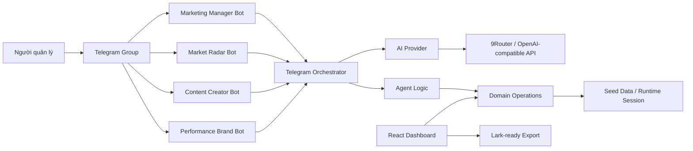
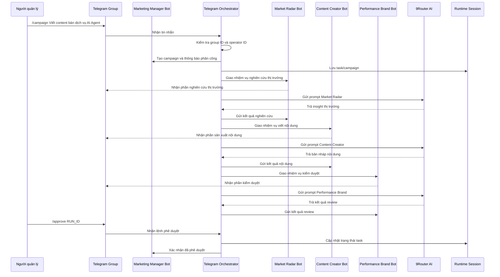
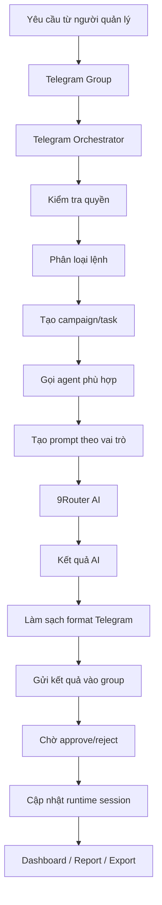

# Mô tả chi tiết hệ thống AI Agent Marketing qua Telegram

## 1. Tổng quan hệ thống

Hệ thống **AI Agent Marketing Command Center qua Telegram** là một nền tảng mô phỏng cách một doanh nghiệp nhỏ hoặc doanh nghiệp một người có thể vận hành đội ngũ marketing bằng các AI Agent chuyên trách.

Thay vì một người phải tự làm toàn bộ quy trình marketing như nghiên cứu thị trường, viết nội dung, kiểm tra chất lượng, đo lường KPI và ra quyết định, hệ thống chia công việc thành các “phòng ban số” dưới dạng Telegram bot. Mỗi bot đại diện cho một vai trò chuyên môn, có nhiệm vụ rõ ràng, có ranh giới trách nhiệm, có đầu vào/đầu ra cụ thể và luôn chịu sự phê duyệt cuối cùng của con người.

Trong giai đoạn hiện tại, Telegram được chọn làm kênh điều phối chính vì:

- Dễ demo, dễ thao tác, không cần xây dựng app chat riêng.
- Phù hợp mô hình làm việc nhóm, nơi nhiều bot cùng xuất hiện trong một group.
- Có thể mô phỏng cảm giác “một người quản lý nhiều nhân sự AI”.
- Dễ mở rộng sau này sang Lark, Slack, Zalo OA hoặc hệ thống nội bộ.

Dashboard web local vẫn giữ vai trò là bảng điều hành, nơi xem dữ liệu tổng quan, task pipeline, agent board, daily brief, repo registry và export dữ liệu.

## 2. Ý tưởng cốt lõi

Ý tưởng cốt lõi của hệ thống là:

> Một người quản lý doanh nghiệp có thể điều hành một đội AI Agent như các phòng ban chuyên môn thông qua Telegram. AI Agent đề xuất, xử lý, tạo nội dung và kiểm tra chất lượng; con người giữ quyền phê duyệt cuối cùng trước mọi hành động quan trọng.

Hệ thống không được thiết kế như một chatbot đơn lẻ. Nó được thiết kế như một **quy trình vận hành doanh nghiệp có nhiều tác nhân**, trong đó:

- Marketing Manager Bot đóng vai trò trưởng phòng.
- Market Radar Bot đóng vai trò bộ phận nghiên cứu thị trường.
- Content Creator Bot đóng vai trò bộ phận sáng tạo nội dung.
- Performance Brand Bot đóng vai trò bộ phận kiểm duyệt thương hiệu và hiệu suất.
- Người dùng đóng vai trò giám đốc/người vận hành, có quyền duyệt hoặc từ chối.

## 3. Mục tiêu của hệ thống

### 3.1. Mục tiêu nghiệp vụ

- Tự động hóa một phần quy trình marketing cho doanh nghiệp nhỏ.
- Giảm thời gian từ lúc có ý tưởng đến lúc có bản nháp nội dung.
- Tăng tính có tổ chức trong quy trình làm marketing.
- Tạo cơ chế phân vai rõ ràng giữa các AI Agent.
- Đảm bảo mọi output quan trọng đều cần con người phê duyệt.
- Tạo nền tảng để sau này kết nối Lark, GitHub/GitLab, CRM hoặc công cụ quản trị thật.

### 3.2. Mục tiêu kỹ thuật

- Xây dựng hệ thống chạy local ổn định.
- Tích hợp Telegram Bot API.
- Tích hợp AI thông qua 9Router/OpenAI-compatible API.
- Có dashboard web để quan sát dữ liệu và quy trình.
- Có data model rõ ràng cho repo, task, agent, agent run, daily brief.
- Có kiểm thử bằng test, typecheck và build.
- Có tài liệu thiết kế đủ dùng cho khóa luận.

## 4. Kiến trúc tổng thể

Hệ thống gồm các lớp chính:

1. **Telegram Interface**
   - Nơi người dùng gửi yêu cầu.
   - Nơi các bot trả lời và phối hợp.

2. **Telegram Orchestrator**
   - Service Node.js chạy local.
   - Lắng nghe tin nhắn Telegram bằng long polling.
   - Phân tuyến lệnh đến đúng bot/agent.
   - Kiểm tra group ID và operator ID.
   - Gọi AI provider.
   - Gửi kết quả về Telegram.

3. **Agent Layer**
   - Chứa logic vai trò của từng bot.
   - Xác định nhiệm vụ, đầu vào, đầu ra, giới hạn vai trò.

4. **AI Provider Layer**
   - Tạo prompt theo vai trò agent.
   - Gọi 9Router hoặc OpenAI-compatible endpoint.
   - Fallback sang simulated output nếu API lỗi.

5. **Domain Layer**
   - Quản lý task status.
   - Tạo agent run.
   - Tạo daily brief.
   - Tính dashboard stats.

6. **Web Dashboard**
   - Hiển thị repo, task, agent, daily brief, export.
   - Dùng để demo trực quan cho giáo viên.

7. **Export/Integration Layer**
   - Chuẩn bị dữ liệu để sau này đưa sang Lark Base.



## 5. Các bot trong hệ thống

### 5.1. Marketing Manager Bot

Marketing Manager Bot là bot trung tâm, đóng vai trò trưởng phòng hoặc giám đốc vận hành marketing.

Nhiệm vụ:

- Nhận yêu cầu từ người quản lý.
- Hiểu yêu cầu dạng tự nhiên hoặc lệnh `/campaign`.
- Tạo campaign/task.
- Phân công công việc cho các bot chuyên môn.
- Giữ cổng phê duyệt.
- Tổng hợp báo cáo.
- Không tự đăng bài, không tự chạy quảng cáo, không tự đưa output ra ngoài.

Lệnh chính:

- `/brief`: xem tình hình hiện tại.
- `/flow`: xem luồng demo chuẩn.
- `/campaign <yêu cầu>`: tạo chiến dịch.
- `/tasks`: xem pipeline task.
- `/approve RUN_ID`: phê duyệt kết quả.
- `/reject RUN_ID`: từ chối kết quả.
- `/report`: xem báo cáo.
- `/whoami`: xem thông tin group/user để khóa quyền.

### 5.2. Market Radar Bot

Market Radar Bot là bộ phận nghiên cứu thị trường.

Nhiệm vụ:

- Phân tích xu hướng.
- Xác định chân dung khách hàng.
- Tìm nỗi đau khách hàng.
- Phân tích đối thủ.
- Đề xuất góc truyền thông.

Không làm:

- Không viết bài hoàn chỉnh.
- Không review thương hiệu thay Performance Brand Bot.
- Không đưa số liệu chắc chắn nếu không có nguồn.

Lệnh chính:

- `/trend`
- `/competitor`
- `/audience`
- `/insight`
- `/angle`

### 5.3. Content Creator Bot

Content Creator Bot là bộ phận sản xuất nội dung.

Nhiệm vụ:

- Viết hook.
- Viết bài social.
- Viết caption.
- Viết kịch bản video ngắn.
- Tạo CTA.
- Đề xuất biến thể nội dung.

Không làm:

- Không bịa số liệu thị trường.
- Không tự nhận nội dung đã được đăng.
- Không tự chạy quảng cáo.

Lệnh chính:

- `/post`
- `/caption`
- `/script`
- `/calendar`
- `/hook`

### 5.4. Performance Brand Bot

Performance Brand Bot là bộ phận kiểm duyệt chất lượng, thương hiệu và hiệu suất.

Nhiệm vụ:

- Kiểm tra tone thương hiệu.
- Kiểm tra rủi ro claim.
- Tối ưu CTA.
- Đề xuất KPI.
- Kiểm tra nội dung trước khi sử dụng.

Không làm:

- Không viết lại toàn bộ nội dung nếu không cần.
- Không tự duyệt output.
- Không tự launch/chạy ads.

Lệnh chính:

- `/review`
- `/brandcheck`
- `/cta`
- `/measure`
- `/report`

## 6. Quy trình marketing chuẩn trong doanh nghiệp

Quy trình marketing được mô phỏng theo các bước sau:

### Bước 1: Nhận yêu cầu kinh doanh

Người quản lý gửi yêu cầu vào Telegram group.

Ví dụ:

```text
/campaign Viết content bán dịch vụ AI Agent cho doanh nghiệp nhỏ, giọng chuyên nghiệp và dễ chốt lịch tư vấn
```

Hoặc gửi câu tự nhiên:

```text
Viết cho tôi chiến dịch giới thiệu dịch vụ AI Agent cho doanh nghiệp nhỏ
```

### Bước 2: Manager Bot phân tích và tạo campaign

Marketing Manager Bot tạo campaign/task, xác định đây là yêu cầu marketing, sau đó phân công cho các phòng ban AI.

Output của Manager gồm:

- Campaign ID/task ID.
- Chủ đề chiến dịch.
- Các phòng ban cần xử lý.
- Nhắc lại cổng phê duyệt.

### Bước 3: Market Radar nghiên cứu thị trường

Market Radar Bot xử lý trước để tạo nền tảng chiến lược.

Output cần có:

- Chân dung khách hàng.
- Nỗi đau chính.
- Insight.
- Đối thủ hoặc lựa chọn thay thế.
- Góc truyền thông nên dùng.

### Bước 4: Content Creator tạo nội dung

Content Creator Bot dựa trên yêu cầu và insight để tạo bản nháp.

Output cần có:

- Hook.
- Bài social.
- Caption hoặc CTA.
- Biến thể nếu cần.
- Ghi chú chờ duyệt.

### Bước 5: Performance Brand kiểm duyệt

Performance Brand Bot rà soát chất lượng.

Output cần có:

- Điểm mạnh.
- Rủi ro claim.
- CTA cần tối ưu.
- KPI nên đo.
- Khuyến nghị có nên dùng hay cần sửa.

### Bước 6: Người quản lý phê duyệt hoặc từ chối

Nếu output đạt yêu cầu:

```text
/approve RUN_ID
```

Nếu chưa đạt:

```text
/reject RUN_ID
```

### Bước 7: Báo cáo

Người quản lý xem báo cáo:

```text
/report
```

## 7. Sequence diagram luồng campaign



## 8. Luồng dữ liệu



## 9. Cấu trúc dữ liệu chính

### Task

Mỗi task cần có:

- `id`
- `title`
- `repo_id`
- `status`
- `priority`
- `assigned_agent`
- `input`
- `expected_output`
- `quality_gate`
- `evidence`
- `created_at`
- `updated_at`

### Agent

Mỗi agent cần có:

- `id`
- `name`
- `department`
- `mission`
- `input_schema`
- `output_schema`
- `current_tasks`
- `status`

### Agent Run

Mỗi lần agent xử lý cần có:

- `id`
- `agent_id`
- `task_id`
- `created_at`
- `summary`
- `recommended_next_status`
- `risks`
- `requires_human_approval`
- `approval_note`

## 10. Nguyên tắc vận hành để hệ thống “xịn” và đúng chuẩn

### 10.1. Bot phải đúng vai trò

- Radar chỉ nghiên cứu.
- Content chỉ viết nội dung.
- Performance chỉ review/tối ưu.
- Manager chỉ điều phối và phê duyệt.

### 10.2. Không để AI tự ý hành động ngoài hệ thống

AI không được:

- Tự đăng bài.
- Tự chạy quảng cáo.
- Tự gửi email.
- Tự merge code.
- Tự deploy.
- Tự chi tiền.

### 10.3. Mỗi output phải có giá trị ra quyết định

Output không nên dài lan man. Mỗi bot cần trả lời theo cấu trúc:

- Tóm tắt.
- Đề xuất.
- Cần kiểm tra.
- Rủi ro.
- Chờ duyệt.

### 10.4. Telegram output phải sạch

Không nên có:

- Markdown thô như `**`, `###`, `[]`.
- Output quá dài.
- Từ ngữ kỹ thuật lộ như debug.
- Nội dung lặp lại giữa các bot.

### 10.5. Có dấu hiệu bot đang làm việc

Bot nên có:

- Typing indicator.
- Tin nhắn nhận nhiệm vụ ngắn.
- Kết quả chuyên môn.
- Lệnh approve/reject rõ ràng.

## 11. Cấu trúc mã nguồn hiện tại

```text
src/
  App.tsx
  main.tsx
  styles.css
  data/
    seed.ts
  domain/
    types.ts
    operations.ts
  integrations/
    aiProvider.ts
    larkAdapter.ts
    telegramAdapter.ts

scripts/
  telegram-bot.ts
  telegram-setup.ts
  smoke-agent-flow.cjs

tests/
  aiProvider.test.ts
  domain.test.ts
  marketingTelegramTeam.test.ts
  telegramAdapter.test.ts
```

## 12. Chia công việc cho 2 người

### Người 1: Phụ trách Telegram, AI Agent và backend orchestration

Phạm vi:

- Telegram Bot API.
- Điều phối nhiều bot.
- Gọi 9Router AI.
- Prompt từng agent.
- Approval/reject flow.
- Kiểm tra quyền group/user.
- Test cho bot và AI provider.

File phụ trách chính:

- `scripts/telegram-bot.ts`
- `scripts/telegram-setup.ts`
- `src/integrations/telegramAdapter.ts`
- `src/integrations/aiProvider.ts`
- `tests/telegramAdapter.test.ts`
- `tests/marketingTelegramTeam.test.ts`
- `tests/aiProvider.test.ts`

Nhánh GitHub đề xuất:

```text
feature/telegram-agent-flow
feature/ai-provider-role-prompts
feature/approval-gate
```

### Người 2: Phụ trách dashboard, data model và tài liệu

Phạm vi:

- Dashboard web.
- Task pipeline.
- Agent board.
- Repo registry.
- Daily brief.
- Lark export.
- Seed data.
- Tài liệu khóa luận, diagram, README.

File phụ trách chính:

- `src/App.tsx`
- `src/styles.css`
- `src/domain/types.ts`
- `src/domain/operations.ts`
- `src/data/seed.ts`
- `src/integrations/larkAdapter.ts`
- `tests/domain.test.ts`
- `README.md`
- `docs/*`

Nhánh GitHub đề xuất:

```text
feature/dashboard-workflow-ui
feature/data-model-lark-export
docs/thesis-system-design
```

### Việc cả hai cùng làm

- Chốt scope MVP.
- Review code cho nhau.
- Chạy test trước khi merge.
- Viết demo script.
- Chuẩn bị slide báo cáo.
- Quay video demo phòng trường hợp lúc bảo vệ mạng/API lỗi.

## 13. Quy trình làm việc trên GitHub

### 13.1. Branch model

```text
main
dev
feature/telegram-agent-flow
feature/dashboard-workflow-ui
feature/ai-provider-role-prompts
feature/data-model-lark-export
docs/thesis-system-design
```

Ý nghĩa:

- `main`: bản ổn định để nộp/bảo vệ.
- `dev`: bản tích hợp đang phát triển.
- `feature/*`: nhánh làm tính năng.
- `docs/*`: nhánh tài liệu.

### 13.2. Quy trình commit

1. Tạo issue trên GitHub.
2. Tạo branch từ `dev`.
3. Code theo phạm vi issue.
4. Chạy kiểm tra:

```bash
npm run test
npm run typecheck
npm run build
```

5. Commit theo chuẩn:

```text
feat: add telegram campaign orchestration
fix: clean telegram ai output format
test: add approval flow tests
docs: add sequence diagram for campaign flow
refactor: split agent prompt boundaries
```

6. Push branch lên GitHub.
7. Tạo Pull Request vào `dev`.
8. Người còn lại review.
9. Sửa nếu có comment.
10. Merge vào `dev`.
11. Cuối sprint merge `dev` vào `main`.

### 13.3. Quy tắc Pull Request

Mỗi PR cần có:

- Mục tiêu thay đổi.
- File đã sửa.
- Ảnh chụp nếu đổi UI.
- Lệnh đã chạy.
- Kết quả test.
- Rủi ro còn lại.
- Checklist không commit `.env`.

Mẫu PR:

```markdown
## Mục tiêu
Hoàn thiện luồng Telegram campaign auto-run cho 3 agent marketing.

## Thay đổi chính
- Manager Bot nhận yêu cầu campaign.
- Tự giao việc cho Radar, Content, Performance.
- Mỗi bot gọi 9Router AI theo vai trò.
- Output Telegram được làm sạch format.

## Kiểm tra
- npm run test: passed
- npm run typecheck: passed
- npm run build: passed

## Rủi ro
- Hiện dùng long polling local, chưa deploy production.
- Chưa có database server.
```

## 14. Checklist hoàn thiện để đáp ứng giáo viên

### Về hệ thống

- [ ] Telegram group có 4 bot.
- [ ] Manager Bot nhận yêu cầu tự nhiên hoặc `/campaign`.
- [ ] Các bot phòng ban phản hồi đúng vai trò.
- [ ] AI output sạch, không raw Markdown.
- [ ] Có approve/reject.
- [ ] Dashboard local chạy được.
- [ ] Có data model rõ.
- [ ] Có export Lark-ready.

### Về kỹ thuật

- [ ] `npm run test` pass.
- [ ] `npm run typecheck` pass.
- [ ] `npm run build` pass.
- [ ] `.env` không commit.
- [ ] README hướng dẫn chạy.
- [ ] Có tài liệu thiết kế trong `docs`.

### Về báo cáo

- [ ] Có mô tả bài toán.
- [ ] Có kiến trúc hệ thống.
- [ ] Có sequence diagram.
- [ ] Có data flow diagram.
- [ ] Có ERD/data model.
- [ ] Có quy trình doanh nghiệp.
- [ ] Có phân công nhóm.
- [ ] Có kết quả demo.
- [ ] Có hạn chế và hướng phát triển.

## 15. Kịch bản demo chuẩn

### Mở đầu

“Hệ thống của nhóm em mô phỏng một doanh nghiệp nhỏ sử dụng đội AI Agent như các phòng ban marketing. Người quản lý chỉ cần nhắn yêu cầu trong Telegram, hệ thống sẽ tự điều phối các bot chuyên môn, tạo kết quả và chờ con người phê duyệt.”

### Demo Telegram

Gửi:

```text
/brief
```

Sau đó gửi:

```text
/campaign Viết content bán dịch vụ AI Agent cho doanh nghiệp nhỏ, giọng chuyên nghiệp và dễ chốt lịch tư vấn
```

Trình bày:

- Manager Bot tạo chiến dịch.
- Market Radar Bot phân tích thị trường.
- Content Creator Bot viết nội dung.
- Performance Brand Bot kiểm duyệt.
- Người quản lý approve/reject.

### Demo Dashboard

Mở:

```text
http://127.0.0.1:5174/
```

Trình bày:

- Dashboard tổng quan.
- Task pipeline.
- Agent board.
- Repo registry.
- Daily brief.
- Export Lark-ready.

## 16. Hướng phát triển sau khóa luận

- Kết nối Lark Base API thật.
- Kết nối GitHub/GitLab để đọc issue, pull request, workflow status.
- Thêm database PostgreSQL hoặc Supabase.
- Thêm đăng nhập và phân quyền.
- Thêm audit log.
- Thêm lịch sử hội thoại.
- Thêm vector database để agent nhớ tài liệu doanh nghiệp.
- Deploy lên cloud.
- Thêm nhiều phòng ban AI khác: Sales, CSKH, HR, Finance, Legal.

## 17. Kết luận

Hệ thống AI Agent Marketing qua Telegram không chỉ là một chatbot, mà là một mô hình điều phối quy trình doanh nghiệp bằng nhiều AI Agent có vai trò rõ ràng. Điểm mạnh của hệ thống là kết hợp được tự động hóa với kiểm soát của con người.

Trong khóa luận, hệ thống có thể chứng minh được:

- Có bài toán thực tế.
- Có kiến trúc hệ thống.
- Có quy trình nghiệp vụ.
- Có sequence diagram.
- Có data flow.
- Có data model.
- Có sản phẩm demo chạy được.
- Có hướng mở rộng rõ ràng.

Đây là nền tảng phù hợp để phát triển thành một command center thật cho doanh nghiệp nhỏ trong tương lai.
