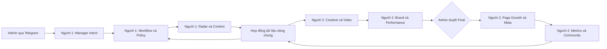
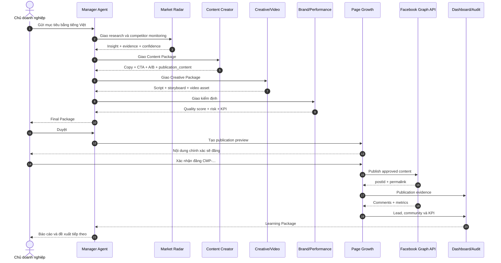

# Phân công 2 người phát triển Phòng AI Agent Marketing

## 1. Mục tiêu tài liệu

Tài liệu này là nguồn phân công chính để hai thành viên cùng dùng AI hỗ trợ lập trình, phát triển song song và tích hợp an toàn hệ thống **Phòng Marketing Intelligence & Growth vận hành bằng AI Agent**.

Sản phẩm hoàn chỉnh phải thực hiện được chu trình:

```text
Nhận yêu cầu -> Nghiên cứu thị trường và đối thủ -> Lập chiến dịch
-> Tạo nội dung và video -> Kiểm định chất lượng -> Người quản lý duyệt
-> Đăng Facebook -> Chăm sóc khách hàng -> Đo lường -> Tự cải tiến
```

Phạm vi hiện tại là Telegram-first và Facebook-first. Không đưa Lark vào luồng triển khai này.

## 2. Phạm vi chức năng đã chốt

| Mã | Chức năng | Đầu ra bắt buộc |
|---|---|---|
| F01 | Nhận yêu cầu tiếng Việt | Brief có mục tiêu, khách hàng, kênh, ràng buộc và KPI |
| F02 | Nghiên cứu thị trường | Insight có nguồn, bằng chứng, độ tin cậy và thời gian thu thập |
| F03 | Theo dõi đối thủ | Thay đổi giá, khuyến mãi, sản phẩm, nội dung và mức ảnh hưởng |
| F04 | Lập chiến dịch | Kế hoạch, thông điệp, lịch nội dung, KPI và người chịu trách nhiệm |
| F05 | Tạo nội dung | Bài Facebook, CTA, biến thể A/B và nội dung xuất bản chính xác |
| F06 | Tạo video sản phẩm | Kịch bản, storyboard, giọng đọc, phụ đề, video và metadata |
| F07 | Kiểm định chất lượng | Điểm chất lượng, claim/rủi ro, quyết định và yêu cầu sửa |
| F08 | Phê duyệt | Agent tự bàn giao nội bộ; Admin chỉ duyệt Final Package |
| F09 | Đăng Facebook | Preview, xác nhận cuối, `postId`, permalink và audit evidence |
| F10 | Chăm sóc khách hàng | Phân loại bình luận/inbox/lead/khiếu nại và đề xuất phản hồi |
| F11 | Đo lường | Reach, engagement, click, lead, conversion và so sánh KPI |
| F12 | Tự cải tiến | Bài học chiến dịch và đề xuất hành động/chiến dịch tiếp theo |

## 3. Đội Agent và quyền sở hữu

Hệ thống giữ đúng 6 agent. Không tạo thêm bot trong giai đoạn này.

| Agent | Vai trò doanh nghiệp | Người phát triển chính | Người review |
|---|---|---|---|
| Marketing Manager Agent | Trưởng phòng, nhận yêu cầu và điều phối | Người 1 | Người 2 |
| Market Radar Agent | Nghiên cứu thị trường và đối thủ | Người 1 | Người 2 |
| Content Creator Agent | Copywriter và Content Marketer | Người 1 | Người 2 |
| Strategy & Creative Agent | Chiến lược nội dung và sản xuất video | Người 2 | Người 1 |
| Brand & Performance Agent | Kiểm định thương hiệu, KPI và hiệu quả | Người 2 | Người 1 |
| Page Growth & Community Agent | Xuất bản, cộng đồng và lead | Người 2 | Người 1 |

Nguyên tắc cân bằng:

- Người 1 sở hữu **đầu vào, trí tuệ điều phối và nửa đầu pipeline**.
- Người 2 sở hữu **tài sản sáng tạo, hành động ra bên ngoài và vòng phản hồi**.
- Mỗi người có 40 điểm công việc chính; phần tích hợp 20 điểm được làm chung.

## 4. Kiến trúc trách nhiệm



## 5. Phân công Người 1: Agent Core, Telegram và Intelligence

### 5.1. Trách nhiệm chính

1. Nhận và hiểu yêu cầu tiếng Việt tự nhiên.
2. Chuẩn hóa yêu cầu thành Campaign Brief.
3. Điều phối trạng thái và bàn giao giữa các agent.
4. Quản lý policy tự duyệt nội bộ và Final Approval.
5. Tích hợp AI provider và output schema.
6. Xây Market Radar và chức năng theo dõi đối thủ.
7. Xây Content Creator và Content Package.
8. Bảo đảm state persistence, idempotency và audit nghiệp vụ.

### 5.2. Hạng mục chi tiết

| ID | Hạng mục | Điểm | Tiêu chí hoàn thành |
|---|---|---:|---|
| A01 | Vietnamese Intent Router | 4 | Hiểu tạo chiến dịch, duyệt, từ chối, sửa, trạng thái và xác nhận bằng câu tự nhiên |
| A02 | Campaign Brief Builder | 3 | Không tạo campaign khi thiếu mục tiêu; biết hỏi bổ sung đúng một câu |
| A03 | Workflow State Machine | 5 | Không nhảy stage; có retry giới hạn; không tạo run trùng |
| A04 | Agent Orchestrator | 4 | Tự bàn giao nội bộ và chỉ hỏi Admin ở Final Gate |
| A05 | Structured AI Output | 4 | Mỗi output có summary, evidence, risks, next action và quality score |
| A06 | Market Research Skill | 3 | Insight có nguồn, thời gian, confidence và liên hệ với campaign |
| A07 | Competitor Monitoring | 5 | Phát hiện thay đổi giá, chương trình, sản phẩm và nội dung; chống cảnh báo trùng |
| A08 | Content Generation | 4 | Có bài Facebook, CTA, A/B variant và `publication_content` riêng |
| A09 | Runtime Persistence | 3 | Khởi động lại không mất campaign; file lỗi được quarantine |
| A10 | Core Tests | 5 | Unit/integration tests cho intent, workflow, policy, radar và content |
| **Tổng** |  | **40** |  |

### 5.3. File sở hữu chính

- `scripts/telegram-bot.ts`
- `scripts/telegram-setup.ts`
- `src/integrations/managerIntent.ts`
- `src/integrations/marketingWorkflow.ts`
- `src/integrations/workflowApproval.ts`
- `src/integrations/approvalPolicy.ts`
- `src/integrations/telegramAdapter.ts`
- `src/integrations/telegramRuntime.ts`
- `src/integrations/telegramStateStore.ts`
- `src/integrations/aiProvider.ts`
- `src/integrations/agentWorkProduct.ts`
- Các test tương ứng trong `tests/`.

### 5.4. Module mới dự kiến

- `src/integrations/competitorMonitor.ts`
- `src/integrations/marketResearch.ts`
- `src/domain/competitorTypes.ts`
- `tests/competitorMonitor.test.ts`
- `tests/marketResearch.test.ts`

## 6. Phân công Người 2: Creative, Facebook, Community và Analytics

### 6.1. Trách nhiệm chính

1. Nhận Content Package và tạo Creative Package.
2. Xây pipeline Product-to-Video có adapter thay thế được nhà cung cấp.
3. Kiểm định thương hiệu, claim, CTA và KPI.
4. Tạo preview và xuất bản Facebook có xác nhận.
5. Phân loại bình luận, inbox, lead và khiếu nại.
6. Thu thập chỉ số, so sánh KPI và tạo Learning Package.
7. Hiển thị realtime toàn bộ hoạt động trên dashboard.
8. Bảo đảm mọi hành động bên ngoài có audit evidence.

### 6.2. Hạng mục chi tiết

| ID | Hạng mục | Điểm | Tiêu chí hoàn thành |
|---|---|---:|---|
| B01 | Creative Brief | 3 | Có content pillar, format, visual direction và asset checklist |
| B02 | Product-to-Video Pipeline | 6 | Tạo script, storyboard, voice, subtitle, video job và trạng thái |
| B03 | Media Provider Adapter | 3 | Có mock provider và có thể thay bằng API thật qua cấu hình |
| B04 | Brand Quality Gate | 4 | Kiểm tra tone, claim, thông tin, CTA và quyết định có cấu trúc |
| B05 | Performance Plan | 3 | Có KPI, UTM, A/B test và điều kiện thành công |
| B06 | Meta Publishing | 5 | Chỉ đăng đúng preview đã xác nhận; lưu `postId`; không retry mù |
| B07 | Community Triage | 4 | Phân loại FAQ, lead, spam, khiếu nại và dữ liệu nhạy cảm |
| B08 | Metrics & Learning Loop | 4 | Thu chỉ số, so KPI, tạo bài học và đề xuất campaign tiếp theo |
| B09 | Realtime Dashboard | 5 | Hiển thị agent, campaign, audit, approval, publication và metrics |
| B10 | External Tests | 3 | Contract tests cho media, Meta, community, analytics và dashboard |
| **Tổng** |  | **40** |  |

### 6.3. File sở hữu chính

- `src/integrations/metaGraphAdapter.ts`
- `src/integrations/customerCarePolicy.ts`
- `src/integrations/controlApi.ts`
- `scripts/control-api.ts`
- `scripts/smoke-agent-flow.cjs`
- `src/App.tsx`
- `src/styles.css`
- Các test tương ứng trong `tests/`.

### 6.4. Module mới dự kiến

- `src/integrations/videoGenerationAdapter.ts`
- `src/integrations/campaignAnalytics.ts`
- `src/integrations/communityInbox.ts`
- `src/domain/mediaTypes.ts`
- `src/domain/analyticsTypes.ts`
- `tests/videoGenerationAdapter.test.ts`
- `tests/campaignAnalytics.test.ts`
- `tests/communityInbox.test.ts`

## 7. Phần làm chung: 20 điểm tích hợp

| ID | Công việc chung | Người thực hiện | Người xác nhận | Điểm |
|---|---|---|---|---:|
| S01 | Chốt schema Campaign, Run, Evidence, Media Asset và Metric | Cả hai | Cả hai | 4 |
| S02 | Golden Sequence end-to-end | Người 1 chạy Telegram | Người 2 đối soát Dashboard/Meta | 4 |
| S03 | Security review và xoay token | Người 1 kiểm tra Telegram/AI | Người 2 kiểm tra Meta/media | 3 |
| S04 | Performance và chi phí API | Người 2 đo | Người 1 tối ưu orchestration | 2 |
| S05 | README, sequence diagram và tài liệu khóa luận | Mỗi người viết phần mình | Review chéo | 3 |
| S06 | Demo rehearsal và dữ liệu mẫu | Cả hai | Cả hai | 2 |
| S07 | Release checklist | Người tạo release | Người còn lại duyệt | 2 |
| **Tổng** |  |  |  | **20** |

## 8. Hợp đồng dữ liệu dùng chung

Hai người phải chốt schema trước khi phát triển module phụ thuộc. Không sửa schema dùng chung trong feature branch mà chưa có sự đồng ý của người còn lại.

### 8.1. Agent Work Product

```ts
interface AgentWorkProduct {
  campaignId: string;
  runId: string;
  agentRole: string;
  summary: string;
  deliverables: string[];
  evidence: Array<{ source: string; capturedAt: string; note: string }>;
  risks: string[];
  qualityScore: number;
  recommendation: "approve" | "approve_with_conditions" | "revise" | "escalate";
  nextAction: string;
}
```

### 8.2. Media Asset

```ts
interface MediaAsset {
  id: string;
  campaignId: string;
  type: "image" | "video" | "audio" | "subtitle" | "storyboard";
  status: "queued" | "processing" | "ready" | "failed";
  provider: string;
  localPath?: string;
  externalUrl?: string;
  checksum?: string;
  createdAt: string;
}
```

### 8.3. Publication Evidence

```ts
interface PublicationEvidence {
  campaignId: string;
  channel: "facebook";
  previewHash: string;
  postId: string;
  permalink?: string;
  publishedAt: string;
  confirmedBy: string;
}
```

### 8.4. Nguyên tắc contract

- Mọi thời gian dùng ISO 8601.
- Mọi ID phải ổn định và duy nhất.
- `publication_content` tách khỏi báo cáo nội bộ.
- Không lưu token hoặc dữ liệu cá nhân vào evidence.
- Module gọi API phải trả lỗi có cấu trúc, không nuốt lỗi.
- Dashboard chỉ đọc dữ liệu đã được redacted.

## 9. Kế hoạch phát triển song song

### Sprint 0 - Chuẩn hóa nền tảng

**Người 1**

- Chốt intent, workflow stages và Agent Work Product.
- Tạo test fixture cho một campaign chuẩn.

**Người 2**

- Chốt Media Asset, Publication Evidence và Metric schema.
- Tạo mock dashboard state từ cùng fixture.

**Điểm tích hợp**

- Cùng chạy fixture và xác nhận cùng một `campaignId` xuất hiện ở Telegram, runtime và dashboard.

### Sprint 1 - Research và Creative

**Người 1**

- Xây Market Research và Competitor Monitoring.
- Hoàn thiện Content Package.

**Người 2**

- Xây Creative Brief và video adapter mock.
- Hiển thị asset pipeline trên dashboard.

**Điểm tích hợp**

- Content Package của Người 1 phải tạo được video job của Người 2 mà không chuyển đổi thủ công.

### Sprint 2 - Quality và Publication

**Người 1**

- Hoàn thiện policy engine, Final Gate và intent duyệt/từ chối.
- Kiểm tra idempotency và phục hồi runtime.

**Người 2**

- Hoàn thiện Brand Gate, preview và Meta publishing.
- Lưu publication evidence và hiển thị audit.

**Điểm tích hợp**

- Chỉ `publication_content` đã duyệt và có xác nhận cuối mới được gửi tới Meta.

### Sprint 3 - Community và Learning

**Người 1**

- Bổ sung intent quản lý community và campaign follow-up.
- Cho Manager tạo chiến dịch tiếp theo từ Learning Package.

**Người 2**

- Xây community triage, metrics và Learning Package.
- Hoàn thiện KPI dashboard.

**Điểm tích hợp**

- Metrics của bài đã đăng phải quay lại đúng campaign và tạo được đề xuất tiếp theo.

### Sprint 4 - Hoàn thiện khóa luận và demo

**Cả hai**

- Chạy Golden Sequence.
- Chụp bằng chứng từng stage.
- Hoàn thiện sequence diagram, ERD, DFD và test report.
- Diễn tập demo lỗi AI, lỗi Meta và khởi động lại runtime.

## 10. Quy trình GitHub bắt buộc

Nhánh tích hợp hiện tại: `codex/six-agent-meta-office`.

### 10.1. Quy tắc branch

```text
feature/a-<issue>-<ten-ngan>   # Người 1
feature/b-<issue>-<ten-ngan>   # Người 2
fix/a-<issue>-<ten-ngan>
fix/b-<issue>-<ten-ngan>
docs/<issue>-<ten-ngan>
```

Ví dụ:

```text
feature/a-21-competitor-monitor
feature/b-22-product-video
```

### 10.2. Một vòng làm việc

1. Tạo GitHub Issue có owner và acceptance criteria.
2. Đồng bộ nhánh tích hợp mới nhất.
3. Tạo một feature branch cho đúng một Issue.
4. Gửi Issue và tài liệu này cho AI đọc.
5. Yêu cầu AI inspect trước khi sửa.
6. Viết test thất bại trước đối với logic mới.
7. Code đúng phạm vi file sở hữu.
8. Chạy test, typecheck, build và smoke liên quan.
9. Commit theo Conventional Commits.
10. Push branch và tạo Pull Request.
11. Người còn lại review contract, bảo mật và regression.
12. Chỉ merge khi CI đạt và không có token trong diff.

### 10.3. Commit chuẩn

```text
feat(radar): detect competitor price changes
feat(video): add product video job adapter
fix(meta): prevent duplicate publication retries
test(workflow): cover final approval sequence
docs(thesis): update agent collaboration diagram
```

Không gom Telegram, video, dashboard và tài liệu vào cùng một commit.

## 11. Prompt dùng cho AI code

Mỗi người mở phiên AI mới và gửi prompt sau:

```text
Bạn đang làm việc trong repo AI_Agent_marketing.

Hãy đọc:
1. docs/PHAN_CONG_2_NGUOI_PHAT_TRIEN_PHONG_AI_AGENT_MARKETING.md
2. README.md
3. GitHub Issue được giao
4. Các file liên quan và test hiện có

Vai trò của tôi: [NGƯỜI 1 hoặc NGƯỜI 2].
Issue: [LINK HOẶC NỘI DUNG ISSUE].

Yêu cầu:
- Chỉ sửa phạm vi thuộc Issue và quyền sở hữu file của tôi.
- Không xóa hoặc revert thay đổi có sẵn.
- Không đưa token hoặc .env vào code, log, test, tài liệu.
- Tôn trọng hợp đồng dữ liệu dùng chung.
- Viết test trước cho logic mới.
- Chạy test, typecheck và build trước khi báo hoàn thành.
- Không tự merge, deploy, đăng Facebook hoặc chi tiền.
- Cuối cùng báo file đã sửa, lệnh kiểm tra, kết quả và commit đề xuất.
```

## 12. Tiêu chí hoàn thành từng Pull Request

- [ ] Issue có acceptance criteria rõ ràng.
- [ ] Không sửa file ngoài phạm vi nếu chưa giải thích.
- [ ] Có test cho happy path và failure path.
- [ ] Không có secret trong code, ảnh, log hoặc fixture.
- [ ] Output đúng schema.
- [ ] Không tạo hành động bên ngoài khi chưa có approval.
- [ ] `npm run test` đạt.
- [ ] `npm run typecheck` đạt.
- [ ] `npm run build` đạt.
- [ ] Smoke test liên quan đạt.
- [ ] PR có ảnh hoặc log bằng chứng khi thay đổi UI/runtime.
- [ ] Người còn lại đã review.

## 13. Golden Sequence nghiệm thu

### 13.1. Yêu cầu kiểm thử

```text
Hãy tạo chiến dịch Facebook 7 ngày cho một sản phẩm ứng dụng AI trong doanh nghiệp.
Khách hàng là chủ doanh nghiệp 5-30 nhân sự. Mục tiêu là tạo lead tư vấn.
Hãy nghiên cứu hai đối thủ, đề xuất thông điệp, tạo bài Facebook, kịch bản video
30 giây, CTA, KPI và phương án đo lường. Không dùng tuyên bố phóng đại.
```

### 13.2. Kết quả mong đợi

1. Manager tạo một campaign duy nhất.
2. Radar trả insight và bằng chứng đối thủ.
3. Content trả bài Facebook và A/B variant.
4. Creative trả video package hoặc video job hoàn chỉnh.
5. Brand trả quality score, risk và KPI.
6. Manager trình Final Package đúng một lần.
7. Admin nhắn `Duyệt`.
8. Page Growth gửi đúng preview.
9. Admin nhắn `Xác nhận đăng CMP-...`.
10. Meta trả `postId` hoặc lỗi có cấu trúc.
11. Community phân loại tương tác mới.
12. Analytics cập nhật KPI và Learning Package.
13. Dashboard và audit phản ánh cùng một campaign.

### 13.3. Sequence diagram tích hợp



## 14. Ma trận test

| Nhóm test | Người 1 | Người 2 | Bắt buộc |
|---|---:|---:|---:|
| Intent tiếng Việt | Chính | Review | Có |
| Workflow/state/idempotency | Chính | Review | Có |
| AI structured output | Chính | Review | Có |
| Competitor monitoring | Chính | Review | Có |
| Video generation adapter | Review | Chính | Có |
| Brand quality gate | Review | Chính | Có |
| Meta publish guard | Review | Chính | Có |
| Community policy | Review | Chính | Có |
| Dashboard/control API | Review | Chính | Có |
| Golden Sequence | Cùng chạy | Cùng chạy | Có |

Các failure path tối thiểu:

- AI timeout hoặc trả output sai schema.
- Đối thủ không truy cập được hoặc thay đổi HTML.
- Video provider timeout.
- Final Package thiếu `publication_content`.
- Admin xác nhận sai campaign.
- Meta API từ chối hoặc timeout.
- Bot nhận trùng Telegram update.
- Runtime state bị hỏng.
- Bình luận chứa dữ liệu nhạy cảm hoặc khiếu nại.

## 15. Quy tắc bảo mật và vận hành

- Token Telegram, AI, Meta và media provider chỉ nằm trong `.env` local.
- Token đã xuất hiện trong ảnh/chat phải được thu hồi và tạo lại.
- Không tự động đăng, chạy ads, thay đổi giá hoặc gửi tin hàng loạt.
- Final Approval và Publication Confirmation là hai hành động khác nhau.
- Không tự retry publish khi chưa đối soát Page để tránh bài trùng.
- Log phải che token, dữ liệu cá nhân và nội dung nhạy cảm.
- Chỉ Operator ID và Group ID được cấu hình mới có quyền điều khiển.
- Mọi hành động ra bên ngoài phải có actor, timestamp và evidence.

## 16. Definition of Done toàn dự án

Dự án được coi là hoàn thành khi:

1. Sáu agent hoạt động đúng vai trò và không trả lời lẫn nhiệm vụ.
2. Mười hai chức năng F01-F12 có test hoặc bằng chứng chạy thật.
3. Agent tự bàn giao nội bộ; Admin chỉ duyệt Final và xác nhận đăng.
4. Facebook chỉ nhận nội dung trùng khớp preview đã xác nhận.
5. Video pipeline tạo được asset thật hoặc mock có contract tương đương.
6. Competitor monitoring có snapshot, change event và evidence.
7. Community xử lý FAQ an toàn và chuyển escalation đúng trường hợp.
8. Metrics quay lại đúng campaign và tạo Learning Package.
9. Dashboard hiển thị realtime campaign, agent, audit, approval và KPI.
10. Toàn bộ test, typecheck, build và smoke đều đạt.
11. Git history thể hiện rõ đóng góp của cả hai thành viên.
12. README và tài liệu khóa luận đủ để giảng viên tái hiện demo.

## 17. Việc đầu tiên của hai người

**Người 1 bắt đầu Issue A01:** thiết kế `CompetitorChangeEvent` và triển khai Competitor Monitor bằng dữ liệu fixture trước.

**Người 2 bắt đầu Issue B01:** thiết kế `MediaAsset` và triển khai Product-to-Video adapter bằng mock provider trước.

Sau khi hai Issue đầu tiên được merge, cả hai chạy Golden Sequence đến bước Creative Package để xác nhận hợp đồng dữ liệu trước khi phát triển API thật.
