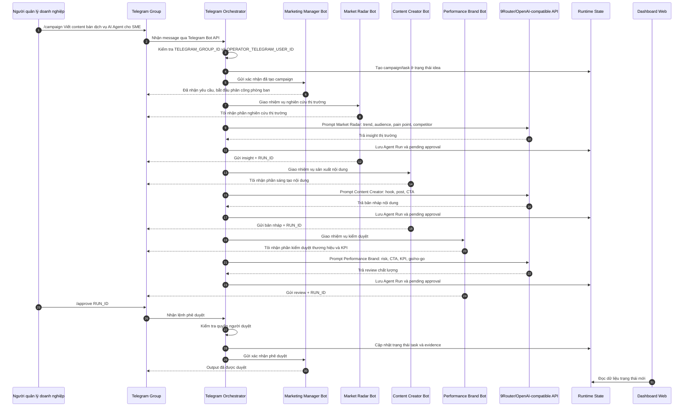
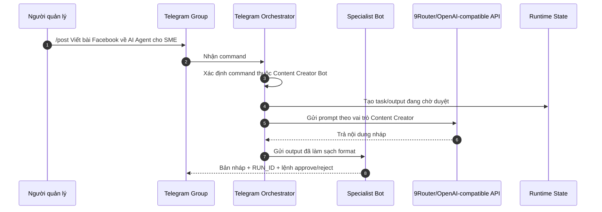
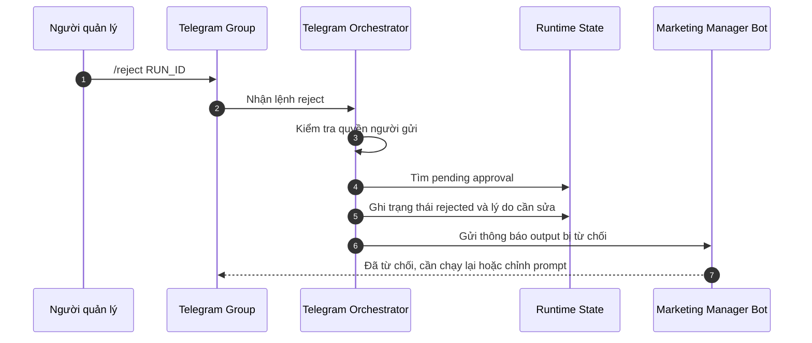
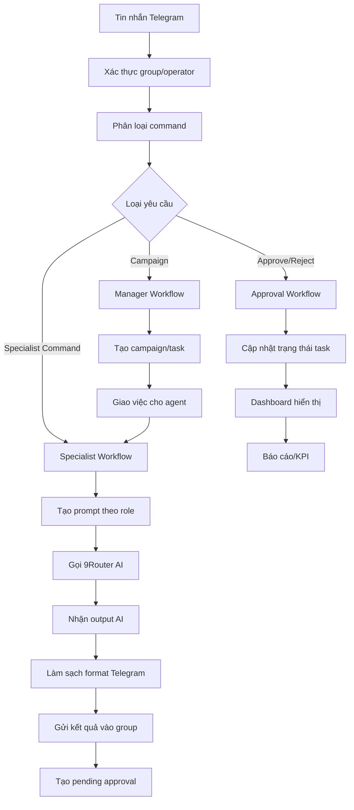
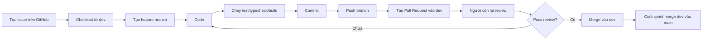
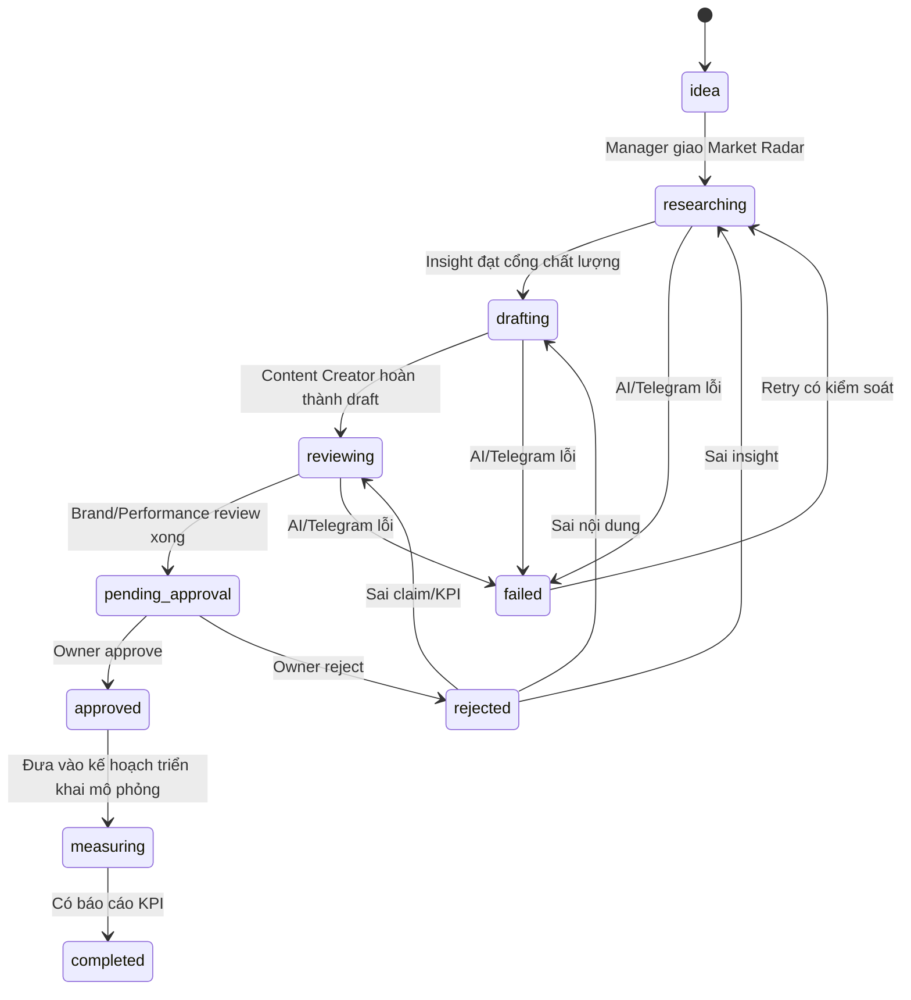

# Phân công 2 người phát triển hệ thống AI Agent Marketing qua Telegram

## 1. Mục tiêu tài liệu

Tài liệu này mô tả lại phạm vi dự án sau khi bỏ Lark ra khỏi quy trình MVP. Hệ thống hiện tập trung vào **Telegram-first AI Agent Marketing Command Center**: một người quản lý điều phối đội AI Agent marketing thông qua Telegram group, có dashboard web hỗ trợ quản trị, có AI xử lý qua 9Router/OpenAI-compatible API, có cơ chế phê duyệt của con người và có tài liệu thiết kế phù hợp cho khóa luận tốt nghiệp.

Phân công chính:

- **Bạn:** phụ trách Telegram, bot, AI Agent runtime, orchestration, prompt, approval flow.
- **Bạn còn lại:** phụ trách dashboard, data model, UI quản trị, tài liệu báo cáo, kiểm thử phần domain/UI.

Nguyên tắc: hai người làm song song, dùng GitHub issue/branch/PR để không giẫm chân nhau, mỗi người có phạm vi rõ ràng nhưng vẫn review chéo.

## 2. Phạm vi dự án hiện tại

### 2.1. Có trong phạm vi

- Telegram group làm nơi điều phối chính.
- 4 bot marketing:
  - Marketing Manager Bot.
  - Market Radar Bot.
  - Content Creator Bot.
  - Performance Brand Bot.
- AI Agent xử lý output qua 9Router hoặc OpenAI-compatible API.
- Dashboard web local để quản lý chiến dịch, task, agent, approval, content, KPI.
- Human approval: AI chỉ đề xuất, con người duyệt.
- GitHub workflow cho 2 người.
- Tài liệu khóa luận: sequence diagram, data flow, data model, phân tích thiết kế.

### 2.2. Không nằm trong phạm vi hiện tại

- Không tích hợp Lark.
- Không cần Lark Base.
- Không cần Lark approval.
- Không cần Lark export trong quy trình chính.
- Không tự động đăng bài.
- Không tự động chạy quảng cáo.
- Không tự động gửi email.
- Không tự động triển khai production nếu chưa được yêu cầu.

## 3. Mô hình hệ thống chuẩn trong doanh nghiệp

Hệ thống được thiết kế theo mô hình **Marketing Operations with Human-in-the-loop AI Agents**.

Trong một doanh nghiệp thật, quy trình marketing thường có các vai trò:

1. Người quản lý/Marketing Lead nhận mục tiêu kinh doanh.
2. Bộ phận Research nghiên cứu thị trường.
3. Bộ phận Content tạo nội dung.
4. Bộ phận Brand/Performance review chất lượng và KPI.
5. Người quản lý phê duyệt.
6. Sau phê duyệt mới được dùng nội dung cho kênh thật.
7. Kết quả được đo lường và đưa vào báo cáo.

Hệ thống của dự án mô phỏng đúng quy trình đó bằng Telegram bot:

| Vai trò doanh nghiệp | Bot tương ứng | Nhiệm vụ |
|---|---|---|
| Marketing Lead / Manager | Marketing Manager Bot | Nhận yêu cầu, tạo campaign, phân công, phê duyệt |
| Market Research | Market Radar Bot | Phân tích thị trường, khách hàng, đối thủ, insight |
| Content Team | Content Creator Bot | Tạo hook, bài viết, caption, script, CTA |
| Brand & Performance | Performance Brand Bot | Review tone, claim, CTA, KPI, rủi ro |
| Business Owner | Người dùng | Ra lệnh, duyệt, từ chối, quyết định cuối |

## 4. Luồng vận hành chuẩn

### 4.1. Luồng tổng quát

```text
Người quản lý
-> Telegram Group
-> Marketing Manager Bot
-> Market Radar Bot
-> Content Creator Bot
-> Performance Brand Bot
-> Người quản lý approve/reject
-> Dashboard ghi nhận trạng thái
-> Báo cáo/KPI
```

### 4.2. Luồng chi tiết

1. Người quản lý gửi yêu cầu vào Telegram group.
2. Marketing Manager Bot nhận yêu cầu.
3. Hệ thống xác thực group và người vận hành.
4. Manager Bot tạo campaign/task.
5. Manager Bot phân công cho Market Radar Bot.
6. Market Radar Bot gọi AI để tạo insight.
7. Manager Bot phân công cho Content Creator Bot.
8. Content Creator Bot gọi AI để tạo nội dung.
9. Manager Bot phân công cho Performance Brand Bot.
10. Performance Brand Bot gọi AI để review chất lượng/KPI.
11. Mỗi output tạo một `RUN_ID`.
12. Người quản lý dùng `/approve RUN_ID` hoặc `/reject RUN_ID`.
13. Dashboard cập nhật trạng thái task/campaign.
14. Kết quả được đưa vào báo cáo demo.

## 5. Sequence diagram chuẩn doanh nghiệp

### 5.1. Sequence diagram: tạo chiến dịch marketing



### 5.2. Sequence diagram: người dùng gọi riêng một bot



### 5.3. Sequence diagram: từ chối output và yêu cầu làm lại



## 6. Data flow diagram



## 7. Công việc của từng bot

| Bot | Công việc chính | Input | Output | Tiêu chí đạt |
|---|---|---|---|---|
| Marketing Manager Bot | Nhận yêu cầu, tạo campaign, phân công, giữ approval gate | Mục tiêu, chủ đề, kênh, yêu cầu người dùng | Campaign/task, phân công, báo cáo, xác nhận duyệt | Giao đúng bot, có bước tiếp theo, không tự publish |
| Market Radar Bot | Nghiên cứu thị trường | Chủ đề, sản phẩm, khách hàng mục tiêu | Insight, pain point, audience, competitor, angle | Cụ thể, đúng thị trường, không bịa số liệu |
| Content Creator Bot | Tạo nội dung | Brief, insight, giọng thương hiệu, kênh | Hook, post, caption, CTA, script | Dễ đọc, đúng mục tiêu, có CTA |
| Performance Brand Bot | Review chất lượng/KPI | Bản nháp, mục tiêu, kênh | Rủi ro, CTA tối ưu, KPI, go/no-go | Không overclaim, có khuyến nghị rõ |

## 8. Phân công cho 2 người

## 8.1. Bạn: phụ trách Telegram và AI Agent runtime

Bạn phụ trách toàn bộ phần vận hành bot Telegram và logic AI Agent.

### File chính bạn phụ trách

```text
scripts/telegram-bot.ts
scripts/telegram-setup.ts
src/integrations/telegramAdapter.ts
src/integrations/aiProvider.ts
tests/telegramAdapter.test.ts
tests/marketingTelegramTeam.test.ts
tests/aiProvider.test.ts
```

### Công việc chi tiết của bạn

| Mã | Việc cần làm | Mục tiêu | Branch đề xuất |
|---|---|---|---|
| A1 | Chuẩn hóa Telegram bot service | 4 bot chạy ổn định trong group | `feature/telegram-orchestrator` |
| A2 | Cấu hình command menu bot | Bot có menu rõ ràng | `feature/telegram-setup` |
| A3 | Route command theo vai trò | Lệnh nào bot đó xử lý | `feature/bot-routing` |
| A4 | Nhận câu tự nhiên từ người dùng | Manager hiểu yêu cầu không cần slash command | `feature/natural-command-routing` |
| A5 | Auto-run 3 bot phòng ban | Sau `/campaign`, bot tự phối hợp | `feature/campaign-auto-run` |
| A6 | Tạo typing indicator | Bot có cảm giác đang soạn tin | `feature/telegram-typing` |
| A7 | Làm sạch output Telegram | Không raw Markdown, không debug | `feature/clean-telegram-output` |
| A8 | Thiết kế prompt theo role | Bot trả đúng trọng tâm | `feature/agent-role-prompts` |
| A9 | Tích hợp 9Router AI | Gọi model AI thật | `feature/ai-provider` |
| A10 | Fallback khi AI lỗi | Demo không bị chết | `feature/ai-fallback` |
| A11 | Xử lý approve/reject | Human-in-the-loop chuẩn | `feature/approval-flow` |
| A12 | Test luồng bot | Đảm bảo không lỗi khi demo | `test/telegram-agent-flow` |

### Checklist riêng của bạn

- [ ] `.env.example` đủ biến Telegram/9Router.
- [ ] `.env` local có token thật nhưng không commit.
- [ ] `npm run telegram:setup` chạy được.
- [ ] `npm run telegram:bot` chạy được.
- [ ] `/brief` trả lời đúng.
- [ ] `/campaign` tạo campaign và auto-run bot.
- [ ] `/trend`, `/post`, `/review` gọi đúng bot.
- [ ] `/approve RUN_ID` hoạt động.
- [ ] `/reject RUN_ID` hoạt động.
- [ ] Output sạch và chuyên nghiệp.
- [ ] Test liên quan Telegram/AI pass.

## 8.2. Bạn còn lại: phụ trách Dashboard, Data Model và tài liệu

Bạn còn lại phụ trách phần giao diện quản trị, dữ liệu, báo cáo và tài liệu khóa luận.

### File chính bạn còn lại phụ trách

```text
src/App.tsx
src/styles.css
src/domain/types.ts
src/domain/operations.ts
src/data/seed.ts
tests/domain.test.ts
README.md
docs/*
```

### Công việc chi tiết của bạn còn lại

| Mã | Việc cần làm | Mục tiêu | Branch đề xuất |
|---|---|---|---|
| B1 | Thiết kế Marketing Overview | Nhìn được toàn cảnh hệ thống | `feature/marketing-overview` |
| B2 | Tạo Campaign Board | Quản lý chiến dịch theo pipeline | `feature/campaign-board` |
| B3 | Tạo Approval Queue UI | Xem output chờ duyệt | `feature/approval-queue-ui` |
| B4 | Tạo Content Calendar | Quản lý lịch nội dung | `feature/content-calendar` |
| B5 | Tạo KPI Analytics | Đo hiệu quả chiến dịch | `feature/kpi-analytics` |
| B6 | Tạo Audit Log | Lưu lịch sử hành động | `feature/audit-log` |
| B7 | Chuẩn hóa data model | Campaign, Approval, ContentDraft, AuditLog | `feature/marketing-data-model` |
| B8 | Seed data marketing | Demo nhìn thật hơn | `feature/marketing-seed-data` |
| B9 | Viết tài liệu khóa luận | Có sequence, DFD, data model | `docs/thesis-system-design` |
| B10 | Viết README demo | Người khác chạy được | `docs/readme-demo` |

### Checklist riêng của bạn còn lại

- [ ] Dashboard có trang tổng quan marketing.
- [ ] Có Campaign Board.
- [ ] Có Approval Queue.
- [ ] Có Content Calendar.
- [ ] Có KPI Analytics.
- [ ] Có Audit Log.
- [ ] Có Agent Department Board cho 4 bot.
- [ ] Data model có Campaign/Approval/ContentDraft/AuditLog.
- [ ] Tài liệu có diagram đầy đủ.
- [ ] Test domain/UI pass.

## 9. Kế hoạch làm song song nhanh nhất

## Sprint 1: Chốt luồng Telegram và dashboard khung

| Ngày | Bạn | Bạn còn lại |
|---|---|---|
| Ngày 1 | Chuẩn hóa bot service, command menu, token `.env` | Tạo khung dashboard marketing |
| Ngày 2 | Route command, auto-run bot phòng ban | Tạo data model Campaign/Approval |
| Ngày 3 | Tích hợp 9Router, prompt theo role | Tạo Campaign Board |
| Ngày 4 | Làm sạch output, typing indicator | Tạo Approval Queue UI |
| Ngày 5 | Approve/reject, test bot | Tạo docs diagram và README |

## Sprint 2: Hoàn thiện demo chuyên nghiệp

| Ngày | Bạn | Bạn còn lại |
|---|---|---|
| Ngày 1 | Cải thiện prompt và fallback | Tạo Content Calendar |
| Ngày 2 | Thêm log an toàn cho bot | Tạo KPI Analytics |
| Ngày 3 | Test end-to-end Telegram | Tạo Audit Log |
| Ngày 4 | Fix lỗi demo Telegram | Hoàn thiện UI và seed data |
| Ngày 5 | Cùng chạy tổng duyệt | Cùng quay video backup |

## 10. GitHub workflow

## 10.1. Branch model

```text
main
dev
feature/telegram-orchestrator
feature/bot-routing
feature/campaign-auto-run
feature/agent-role-prompts
feature/approval-flow
feature/marketing-overview
feature/campaign-board
feature/approval-queue-ui
feature/content-calendar
feature/kpi-analytics
feature/audit-log
docs/thesis-system-design
```

## 10.2. Quy trình làm việc



## 10.3. Lệnh kiểm tra bắt buộc

```bash
npm run test
npm run typecheck
npm run build
```

## 10.4. Chuẩn commit

```text
feat: add telegram campaign auto run
feat: add approval queue dashboard
fix: clean telegram output format
test: add telegram routing tests
docs: add business sequence diagram
refactor: split agent role prompts
chore: update env example
```

## 10.5. Quy tắc bảo mật khi làm GitHub

- Không commit `.env`.
- Không commit token bot.
- Không đưa token vào issue/PR.
- Không chụp ảnh màn hình có token.
- Nếu token bị lộ, tạo token mới bằng BotFather.
- `.env.example` chỉ để placeholder.

## 11. Cấu hình token cho người làm Telegram

Bạn phụ trách Telegram nên cần cấu hình local:

```env
TELEGRAM_MANAGER_BOT_TOKEN=
TELEGRAM_MARKET_RADAR_BOT_TOKEN=
TELEGRAM_CONTENT_CREATOR_BOT_TOKEN=
TELEGRAM_PERFORMANCE_BRAND_BOT_TOKEN=
TELEGRAM_GROUP_ID=
OPERATOR_TELEGRAM_USER_ID=

NINE_ROUTER_ENABLED=true
NINE_ROUTER_BASE_URL=http://localhost:20128/v1
NINE_ROUTER_MODEL=cx/gpt-5.4-mini
NINE_ROUTER_API_KEY=
```

Bạn còn lại nếu không chạy bot thì chưa cần token Telegram. Nếu bạn còn lại cần test bot, bạn có thể chia sẻ riêng file `.env` qua kênh an toàn, không đưa lên GitHub.

## 12. Tiêu chí bản hoàn thiện

Hệ thống được xem là hoàn thiện khi:

- Telegram group có 4 bot hoạt động.
- Manager Bot nhận yêu cầu và phân công.
- 3 bot phòng ban tự xử lý đúng vai trò.
- Output sạch, không thô, không lan man.
- Có human approval.
- Dashboard có Campaign Board, Approval Queue, KPI, Audit Log.
- Có sequence diagram và data flow.
- Có phân công GitHub rõ ràng.
- `npm run test`, `npm run typecheck`, `npm run build` đều pass.
- Có kịch bản demo bảo vệ.

## 13. Kịch bản demo chuẩn cho khóa luận

1. Mở dashboard local.
2. Giới thiệu hệ thống là AI Agent Marketing Command Center.
3. Mở Telegram group.
4. Gửi:

```text
/campaign Viết content bán dịch vụ AI Agent cho doanh nghiệp nhỏ, giọng chuyên nghiệp và dễ chốt lịch tư vấn
```

5. Trình bày:
   - Marketing Manager Bot tạo chiến dịch.
   - Market Radar Bot nghiên cứu insight.
   - Content Creator Bot tạo nội dung.
   - Performance Brand Bot review chất lượng.
6. Dùng:

```text
/approve RUN_ID
```

7. Quay lại dashboard để xem trạng thái.
8. Trình bày sequence diagram.
9. Trình bày human-in-the-loop và lý do hệ thống an toàn.

## 14. Kết luận

Sau khi bỏ Lark khỏi phạm vi hiện tại, dự án trở nên tập trung hơn:

- Telegram là trung tâm điều phối.
- 4 bot là 4 phòng ban marketing.
- 9Router cung cấp năng lực AI.
- Dashboard là bảng quản trị.
- GitHub là nơi 2 người phối hợp phát triển.

Bạn phụ trách Telegram là hợp lý nhất vì đây là phần linh hồn của demo: bot phải phản hồi đúng, phối hợp đúng, output đẹp và có phê duyệt rõ ràng. Bạn còn lại phụ trách dashboard và tài liệu sẽ giúp dự án có hình thức chuyên nghiệp, có dữ liệu, có báo cáo và đáp ứng yêu cầu khóa luận.

---

## 15. Cách sử dụng tài liệu này với hai AI

Từ phần này trở đi, tài liệu đóng vai trò là **nguồn sự thật chung** cho cả hai thành viên và hai AI hỗ trợ lập trình. Trước mỗi phiên làm việc, mỗi người phải gửi cho AI:

1. Toàn bộ tài liệu này.
2. Nội dung GitHub Issue đang thực hiện.
3. Cấu trúc và trạng thái hiện tại của workspace.
4. Pull Request hoặc biên bản bàn giao gần nhất có liên quan.

AI phải đọc tài liệu trước khi đề xuất hoặc sửa file. Nếu yêu cầu trong Issue mâu thuẫn với tài liệu, AI phải dừng và nêu rõ điểm mâu thuẫn; không tự thay đổi kiến trúc hoặc mở rộng phạm vi.

### 15.1. Thứ tự ưu tiên khi có thông tin khác nhau

```text
Quyết định mới nhất đã được hai thành viên thống nhất
> GitHub Issue đã được duyệt
> Tài liệu nguồn sự thật này
> Hợp đồng dữ liệu trong src/domain/types.ts
> README
> Suy luận của AI
```

Không AI nào được lấy suy luận của mình để ghi đè quyết định đã thống nhất.

### 15.2. Những việc AI được phép làm

- Đọc toàn bộ repository và lịch sử thay đổi liên quan.
- Sửa file nằm trong phạm vi Issue và quyền sở hữu của người giao việc.
- Viết test, chạy test, typecheck và build.
- Đề xuất thay đổi hợp đồng dữ liệu bằng văn bản.
- Chuẩn bị nội dung commit và Pull Request.
- Báo cáo rủi ro, giới hạn và phần chưa xác minh.

### 15.3. Những việc AI không được tự làm

- Không commit hoặc đưa token, API key, `.env` lên GitHub.
- Không tự merge Pull Request.
- Không tự push vào `main` hoặc `dev`.
- Không tự đăng nội dung, chạy quảng cáo hoặc deploy production.
- Không sửa file do người còn lại sở hữu nếu Issue chưa cho phép.
- Không thay đổi schema/hợp đồng dùng chung mà chưa có xác nhận của cả hai người.
- Không tuyên bố hoàn thành nếu chưa chạy các kiểm tra bắt buộc.

## 16. Danh tính và quyền sở hữu công việc

Để tài liệu không phụ thuộc tên thật, nhóm sử dụng hai định danh cố định:

| Định danh | Người phụ trách | Phạm vi sở hữu chính |
|---|---|---|
| `OWNER-A` | Bạn | Telegram Bot, AI Provider, orchestration, prompt, approval runtime |
| `OWNER-B` | Bạn còn lại | Dashboard, domain/data, UI, báo cáo, tài liệu |

### 16.1. Ma trận quyền sửa file

| Khu vực | OWNER-A | OWNER-B | Quy tắc |
|---|---:|---:|---|
| `scripts/telegram-*.ts` | Chính | Review | OWNER-B không sửa nếu chưa có Issue chung |
| `src/integrations/telegramAdapter.ts` | Chính | Review | Thay đổi interface phải báo OWNER-B |
| `src/integrations/aiProvider.ts` | Chính | Review | Không ghi API key vào code |
| `tests/*telegram*`, `tests/aiProvider.test.ts` | Chính | Review | OWNER-A cung cấp bằng chứng test |
| `src/App.tsx`, `src/styles.css` | Review | Chính | OWNER-A không chỉnh UI ngoài Issue |
| `src/data/seed.ts` | Review | Chính | Seed phải khớp contract domain |
| `tests/domain.test.ts` | Review | Chính | OWNER-B cung cấp bằng chứng test |
| `src/domain/types.ts` | Đồng sở hữu | Đồng sở hữu | Bắt buộc hai người duyệt |
| `src/domain/operations.ts` | Đồng sở hữu | Đồng sở hữu | Bắt buộc test regression |
| `README.md`, `docs/*` | Góp ý kỹ thuật | Chính | Tài liệu runtime cần OWNER-A xác minh |
| `.env.example`, `package.json` | Đồng sở hữu | Đồng sở hữu | Bắt buộc review chéo |

## 17. Prompt khởi động dùng chung cho mọi AI

Mỗi người bắt đầu phiên làm việc bằng cách gửi prompt sau cho AI, sau đó đính kèm tài liệu và Issue:

```text
Bạn là AI Software Engineer hỗ trợ dự án khóa luận "AI Agent Marketing Command Center qua Telegram".

Trước khi làm việc, hãy:
1. Đọc toàn bộ tài liệu PHAN_CONG_2_NGUOI_TELEGRAM_AGENT_MARKETING_KHOA_LUAN.md.
2. Đọc GitHub Issue được giao và kiểm tra trạng thái workspace hiện tại.
3. Xác định tôi là OWNER-A hay OWNER-B.
4. Liệt kê mục tiêu, file được phép sửa, file dùng chung cần xin review và tiêu chí nghiệm thu.
5. Kiểm tra thay đổi hiện có; không xóa hoặc hoàn tác thay đổi không phải do bạn tạo.
6. Chỉ thực hiện đúng phạm vi Issue.
7. Không hiển thị, ghi log hoặc commit token/API key/.env.
8. Sau khi sửa phải chạy test liên quan, npm run typecheck và npm run build.
9. Không tự merge, deploy, đăng bài hoặc thực hiện hành động bên ngoài.

Trước khi sửa file, hãy trả về "Bản xác nhận nhiệm vụ" gồm:
- Owner đang hỗ trợ.
- Issue và mục tiêu.
- File dự kiến sửa.
- Hợp đồng dùng chung bị ảnh hưởng hay không.
- Các kiểm tra sẽ chạy.
- Rủi ro hoặc điểm cần phối hợp.

Nếu tài liệu, Issue và code mâu thuẫn, hãy dừng và mô tả mâu thuẫn thay vì tự đoán.
```

## 18. Prompt riêng cho OWNER-A: Telegram và AI Agent runtime

```text
Tôi là OWNER-A, phụ trách Telegram và AI Agent runtime.

Phạm vi mặc định của bạn:
- scripts/telegram-bot.ts
- scripts/telegram-setup.ts
- src/integrations/telegramAdapter.ts
- src/integrations/aiProvider.ts
- tests/telegramAdapter.test.ts
- tests/marketingTelegramTeam.test.ts
- tests/aiProvider.test.ts

Mục tiêu kỹ thuật:
- Manager Bot nhận lệnh tự nhiên và command.
- Manager phân công đúng Market Radar, Content Creator và Performance Brand.
- Mỗi bot chỉ trả lời đúng vai trò, tiếng Việt rõ ràng, có RUN_ID và bước tiếp theo.
- Mọi output quan trọng dừng ở pending approval.
- Chỉ OPERATOR_TELEGRAM_USER_ID được approve/reject.
- Khi AI API lỗi phải có timeout, thông báo dễ hiểu và fallback demo an toàn.
- Không để một update Telegram được xử lý lặp.
- Không đưa token vào source, log, test snapshot hoặc Pull Request.

Trước khi code, hãy đọc contract trong src/domain/types.ts và các test hiện có. Nếu cần sửa contract dùng chung, chỉ viết đề xuất contract và chờ OWNER-B đồng ý.

Kết thúc phiên, trả về:
1. File đã sửa.
2. Hành vi đã hoàn thành.
3. Kết quả từng lệnh kiểm tra.
4. Contract/API có thay đổi hay không.
5. Cách OWNER-B dùng dữ liệu mới.
6. Rủi ro còn lại.
7. Commit message đề xuất.
```

## 19. Prompt riêng cho OWNER-B: Dashboard, Data và tài liệu

```text
Tôi là OWNER-B, phụ trách Dashboard, Data Model, UI quản trị và tài liệu khóa luận.

Phạm vi mặc định của bạn:
- src/App.tsx
- src/styles.css
- src/domain/types.ts
- src/domain/operations.ts
- src/data/seed.ts
- tests/domain.test.ts
- README.md
- docs/*

Mục tiêu kỹ thuật:
- Dashboard thể hiện Campaign Board, Approval Queue, Agent Status, Content Calendar, KPI và Audit Log.
- Trạng thái và nhãn hiển thị phải khớp dữ liệu runtime.
- Mọi hành động approve/reject trên UI phải minh bạch và không giả vờ đã publish.
- UI có empty/loading/error state và hoạt động trên desktop/mobile.
- Seed data hỗ trợ kịch bản demo nhưng phải được gắn rõ là dữ liệu mẫu.
- Tài liệu phản ánh đúng code đã chạy, không mô tả tính năng chưa có như đã hoàn thành.

Trước khi code, hãy kiểm tra contract trong src/domain/types.ts và adapter Telegram. Nếu thay đổi contract dùng chung, phải mô tả migration, ảnh hưởng tới OWNER-A và yêu cầu review chéo.

Kết thúc phiên, trả về:
1. File đã sửa.
2. Màn hình/data flow đã hoàn thành.
3. Kết quả từng lệnh kiểm tra.
4. Contract/schema có thay đổi hay không.
5. Dữ liệu OWNER-A cần cung cấp.
6. Ảnh hoặc mô tả bằng chứng UI.
7. Commit message đề xuất.
```

## 20. Quy trình từng bước cho một phiên làm việc

### Bước 1: Chọn một đơn vị công việc

- Chọn đúng một GitHub Issue có owner và acceptance criteria rõ ràng.
- Không đưa nhiều tính năng không liên quan vào cùng một Issue.
- Gắn nhãn `owner-a`, `owner-b` hoặc `shared-contract`.
- Gắn nhãn loại việc: `feature`, `bug`, `test`, `docs`.

### Bước 2: Đồng bộ nhánh tích hợp

```bash
git switch dev
git pull origin dev
git status
```

Kết quả mong đợi: đang ở `dev`, đã nhận code mới nhất và biết rõ các file local đang thay đổi. Nếu có thay đổi chưa commit, không được xóa; phải xử lý hoặc bàn giao trước khi đổi nhánh.

### Bước 3: Tạo feature branch

```bash
git switch -c feature/issue-<SO_ISSUE>-<ten-ngan>
```

Ví dụ:

```bash
git switch -c feature/issue-12-telegram-approval-flow
git switch -c feature/issue-13-dashboard-approval-queue
```

### Bước 4: Giao việc cho AI

Gửi cho AI theo thứ tự:

1. Prompt khởi động dùng chung.
2. Prompt của OWNER-A hoặc OWNER-B.
3. Toàn bộ nội dung Issue.
4. Yêu cầu AI kiểm tra code hiện tại trước khi sửa.

Chỉ cho phép AI bắt đầu sau khi “Bản xác nhận nhiệm vụ” đúng với phạm vi.

### Bước 5: Thực hiện theo vòng lặp nhỏ

```text
Đọc code -> viết/điều chỉnh test -> thực hiện thay đổi nhỏ
-> chạy test liên quan -> xem diff -> tiếp tục bước kế tiếp
```

Không để AI sửa hàng loạt module ngoài Issue. Sau mỗi hành vi quan trọng, yêu cầu AI giải thích đầu vào, đầu ra và failure mode.

### Bước 6: Kiểm tra trước commit

```bash
npm run test
npm run typecheck
npm run build
git diff --check
git status
```

Ngoài các lệnh trên, OWNER-A chạy thử bot bằng `npm run telegram:bot`; OWNER-B chạy dashboard bằng `npm run dev` và kiểm tra luồng bằng browser.

### Bước 7: Kiểm tra bí mật

Trước commit, xác nhận:

- Không có `.env` trong staged files.
- Không có token Telegram hoặc API key trong diff.
- Không có screenshot chứa token.
- Không có log chứa toàn bộ request header hoặc secret.

### Bước 8: Commit nhỏ, có ý nghĩa

```bash
git add <danh-sach-file-dung-pham-vi>
git commit -m "feat(telegram): add operator approval gate"
git push -u origin feature/issue-12-telegram-approval-flow
```

Không dùng `git add .` khi workspace đang có thay đổi không liên quan.

### Bước 9: Mở Pull Request vào `dev`

Pull Request phải dùng mẫu `.github/PULL_REQUEST_TEMPLATE.md`, liên kết Issue và ghi đầy đủ bằng chứng test. Người còn lại review; tác giả không tự merge PR của mình.

### Bước 10: Bàn giao

Điền `docs/templates/AI_HANDOFF_TEMPLATE.md` vào mô tả PR hoặc comment bàn giao. AI của reviewer phải đọc bàn giao trước khi review code.

### Bước 11: Merge và đồng bộ

Sau khi review pass và CI/test pass, reviewer merge vào `dev`. Cả hai người sau đó cập nhật nhánh của mình từ `dev` trước Issue tiếp theo.

## 21. Giao thức phối hợp giữa hai AI

Hai AI không trực tiếp tin tưởng output của nhau. Chúng phối hợp qua bốn artifact có thể kiểm tra:

1. GitHub Issue: mô tả việc phải làm.
2. Hợp đồng dữ liệu: định nghĩa đầu vào/đầu ra.
3. Pull Request: thay đổi thực tế và bằng chứng test.
4. Biên bản bàn giao: bối cảnh cho người tiếp theo.

### 21.1. Khi OWNER-A cần dữ liệu từ OWNER-B

OWNER-A tạo Issue hoặc comment contract request gồm:

```text
Tên dữ liệu:
Mục đích sử dụng:
Type/interface hiện tại:
Field cần thêm hoặc thay đổi:
Ví dụ payload:
Ảnh hưởng tương thích ngược:
Test mong đợi:
Thời điểm cần:
```

### 21.2. Khi OWNER-B cần sự kiện từ OWNER-A

OWNER-B yêu cầu rõ:

```text
Tên sự kiện:
Khi nào phát sinh:
Payload:
Trạng thái trước/sau:
RUN_ID/TASK_ID/CAMPAIGN_ID liên quan:
Trường hợp lỗi:
Dashboard hiển thị thế nào:
```

### 21.3. Quy tắc thay đổi hợp đồng dùng chung

1. Tạo Issue có nhãn `shared-contract`.
2. Viết interface cũ và interface đề xuất.
3. Cung cấp payload ví dụ.
4. Mô tả migration và tương thích ngược.
5. OWNER-A xác nhận runtime đọc/ghi được.
6. OWNER-B xác nhận dashboard hiển thị được.
7. Viết test contract trước khi merge.

## 22. Hợp đồng dữ liệu tích hợp tối thiểu

Mọi luồng Telegram và Dashboard phải quy về các định danh ổn định:

```ts
type MarketingStatus =
  | "idea"
  | "researching"
  | "drafting"
  | "reviewing"
  | "pending_approval"
  | "approved"
  | "rejected"
  | "measuring"
  | "completed"
  | "failed";

interface MarketingCampaign {
  id: string;
  title: string;
  objective: string;
  targetAudience: string;
  channels: string[];
  status: MarketingStatus;
  ownerId: string;
  createdAt: string;
  updatedAt: string;
}

interface AgentRun {
  id: string;
  campaignId: string;
  taskId: string;
  agentRole: "manager" | "market_radar" | "content_creator" | "performance_brand";
  input: string;
  output: string;
  status: "running" | "pending_approval" | "approved" | "rejected" | "failed";
  evidence: string[];
  errorCode?: string;
  createdAt: string;
  updatedAt: string;
}

interface ApprovalDecision {
  id: string;
  runId: string;
  decision: "approved" | "rejected";
  decidedBy: string;
  reason?: string;
  decidedAt: string;
}

interface AuditEvent {
  id: string;
  campaignId?: string;
  taskId?: string;
  runId?: string;
  actorType: "human" | "agent" | "system";
  actorId: string;
  action: string;
  summary: string;
  createdAt: string;
}
```

Đây là hợp đồng mục tiêu cho tích hợp. Trước khi đưa vào code, hai người phải đối chiếu với `src/domain/types.ts`, tạo Issue `shared-contract` và triển khai migration có test; không sao chép mù nếu code hiện tại dùng tên khác.

## 23. State machine của chiến dịch marketing



MVP không tự động publish. Trạng thái `approved` chỉ có nghĩa output được con người duyệt để sử dụng tiếp, không có nghĩa đã đăng lên kênh thật.

## 24. Definition of Ready và Definition of Done

### 24.1. Definition of Ready: Issue được phép bắt đầu khi

- Có vấn đề hoặc giá trị người dùng rõ ràng.
- Có owner duy nhất.
- Có phạm vi file dự kiến.
- Có acceptance criteria đo được.
- Có test cần chạy.
- Nêu rõ có ảnh hưởng shared contract hay không.
- Không cần token thật trong Issue.
- Dependency đã sẵn sàng hoặc được ghi rõ.

### 24.2. Definition of Done: Issue chỉ hoàn thành khi

- Acceptance criteria đều đạt.
- Có test cho hành vi mới hoặc lý do hợp lý nếu chỉ sửa tài liệu.
- `npm run test` pass.
- `npm run typecheck` pass.
- `npm run build` pass.
- Không có secret trong diff.
- Tài liệu/README được cập nhật nếu hành vi người dùng thay đổi.
- Có bằng chứng UI hoặc transcript Telegram nếu liên quan.
- Có biên bản bàn giao.
- Reviewer còn lại approve.
- Đã merge vào `dev`, chưa mặc định coi là production.

## 25. Ma trận kiểm thử bắt buộc

| Mã test | Cấp độ | Người chính | Kịch bản | Kết quả mong đợi |
|---|---|---|---|---|
| UT-A01 | Unit | OWNER-A | Route `/trend` | Chỉ Market Radar xử lý |
| UT-A02 | Unit | OWNER-A | User không có quyền `/approve` | Từ chối và không đổi state |
| UT-A03 | Unit | OWNER-A | AI timeout/lỗi | Có lỗi dễ hiểu và fallback an toàn |
| UT-A04 | Unit | OWNER-A | Làm sạch output | Không còn Markdown thô/debug/secret |
| UT-B01 | Unit | OWNER-B | Chuyển campaign status | Chỉ transition hợp lệ được chấp nhận |
| UT-B02 | Unit | OWNER-B | Approval Queue | Hiển thị đúng run pending approval |
| UT-B03 | Unit | OWNER-B | Audit event | Giữ actor, action và timestamp |
| IT-01 | Integration | Cả hai | `/campaign` tạo 3 specialist run | Chung campaignId, mỗi run đúng role |
| IT-02 | Integration | Cả hai | `/approve RUN_ID` | Run approved, audit log và dashboard cập nhật |
| IT-03 | Integration | Cả hai | `/reject RUN_ID` | Run rejected, có reason và đường rework |
| IT-04 | Integration | Cả hai | Restart bot | Không xử lý lặp update cũ trong phạm vi thiết kế |
| E2E-01 | End-to-end | Cả hai | Campaign hoàn chỉnh | Telegram và dashboard cùng một trạng thái |
| E2E-02 | End-to-end | Cả hai | API AI không sẵn sàng | Demo không treo, thông báo đúng và có fallback |
| SEC-01 | Security | Cả hai | Người ngoài group/operator gửi lệnh nhạy cảm | Không được approve/reject |
| SEC-02 | Security | Cả hai | Quét staged diff | Không có token hoặc `.env` |

## 26. Kịch bản kiểm thử tích hợp chuẩn

### Chuẩn bị

1. Cả hai checkout `dev` mới nhất.
2. OWNER-A cấu hình `.env` local và khởi động 9Router nếu dùng AI thật.
3. OWNER-A chạy `npm run telegram:bot`.
4. OWNER-B chạy `npm run dev`.
5. Mở Telegram group và dashboard.

### Thực thi

1. Gửi `/whoami` và xác nhận group/operator đúng.
2. Gửi `/brief` và xác nhận bot hoạt động.
3. Gửi một `/campaign` có mục tiêu, audience, channel và CTA.
4. Ghi lại `CAMPAIGN_ID`, `TASK_ID` và các `RUN_ID`.
5. Kiểm tra ba bot chuyên môn trả đúng nhiệm vụ, không lẫn vai trò.
6. Kiểm tra output có insight, draft, review, KPI và bước phê duyệt.
7. Mở dashboard, đối chiếu ID và trạng thái.
8. Approve một run bằng đúng operator.
9. Reject một run khác kèm lý do, sau đó chạy lại phần liên quan.
10. Kiểm tra Approval Queue, Audit Log và KPI/brief.
11. Tắt AI endpoint để kiểm tra fallback/error handling.
12. Chạy lại toàn bộ kiểm tra tự động.

### Bằng chứng cần lưu cho khóa luận

- Ảnh Telegram theo từng phòng ban, che token và thông tin nhạy cảm.
- Ảnh dashboard có campaign/approval/audit tương ứng.
- Transcript rút gọn chứa ID và thời điểm.
- Kết quả test/typecheck/build.
- Sequence diagram và giải thích human-in-the-loop.
- Bảng Expected/Actual cho E2E-01 và E2E-02.

## 27. Quy trình review chéo bằng AI

Reviewer gửi Pull Request và tài liệu này cho AI của mình với prompt:

```text
Bạn đang review Pull Request của dự án khóa luận AI Agent Marketing qua Telegram.
Không sửa code ngay. Hãy kiểm tra theo thứ tự:
1. PR có đúng Issue và phạm vi owner không.
2. Có thay đổi ngoài phạm vi hoặc ghi đè công việc người khác không.
3. Contract input/output có tương thích không.
4. Human approval và bảo mật secret có được giữ không.
5. Test có kiểm tra hành vi và failure mode không.
6. Tài liệu có mô tả đúng code thực tế không.
7. Phân loại phát hiện theo Critical/High/Medium/Low và dẫn file/dòng.
8. Nếu không có lỗi, nêu rõ test gap hoặc rủi ro còn lại.

Chỉ đề xuất APPROVE khi acceptance criteria, test, typecheck và build có bằng chứng pass.
```

Reviewer chịu trách nhiệm cuối cùng; không approve chỉ vì AI nói “ổn”.

## 28. Xử lý xung đột và sự cố

### 28.1. Hai người sửa cùng một file

1. Dừng merge.
2. Xác định Issue nào thay đổi hành vi nguồn.
3. Người sở hữu file giải quyết conflict.
4. Người còn lại review kết quả sau conflict.
5. Chạy lại toàn bộ test liên quan và build.

### 28.2. Contract thay đổi làm nhánh còn lại lỗi

1. Không sửa tạm bằng `any` hoặc bỏ validation.
2. Tạo/ cập nhật Issue `shared-contract`.
3. Chốt schema và payload ví dụ.
4. Merge contract + compatibility layer trước.
5. Rebase/merge `dev` vào các nhánh phụ và chạy lại test.

### 28.3. Token bị lộ

1. Thu hồi token ngay trong BotFather hoặc provider tương ứng.
2. Tạo token mới.
3. Kiểm tra Git history, PR, Issue, log và screenshot.
4. Không chỉ xóa token khỏi commit mới rồi tiếp tục dùng token cũ.
5. Ghi sự cố vào tài liệu nội bộ nhưng không ghi giá trị token.

### 28.4. Demo lỗi ngay trước bảo vệ

- Dùng seed data/dashboard local làm đường demo dự phòng.
- Có transcript và video demo đã quay trước.
- Giải thích rõ đâu là AI thật, đâu là fallback mô phỏng.
- Không giả vờ API đang hoạt động nếu đang dùng fallback.

## 29. Biểu mẫu và đường dẫn dùng hằng ngày

| Mục đích | File |
|---|---|
| Issue tính năng | `.github/ISSUE_TEMPLATE/feature.md` |
| Báo lỗi | `.github/ISSUE_TEMPLATE/bug_report.md` |
| Pull Request | `.github/PULL_REQUEST_TEMPLATE.md` |
| Bàn giao giữa hai người/AI | `docs/templates/AI_HANDOFF_TEMPLATE.md` |
| Quy tắc đóng góp ngắn gọn | `CONTRIBUTING.md` |
| Thiết kế quy trình cộng tác | `docs/superpowers/specs/2026-07-14-two-person-ai-collaboration-design.md` |
| Kế hoạch triển khai tài liệu | `docs/superpowers/plans/2026-07-14-two-person-ai-collaboration-plan.md` |

## 30. Lộ trình triển khai đồng đều cho hai người

| Thứ tự | OWNER-A | OWNER-B | Điểm đồng bộ |
|---:|---|---|---|
| 1 | Chốt command và event Telegram | Chốt entity và state machine | Review `shared-contract` |
| 2 | Test routing và authorization | Test domain transition | Ghép test contract |
| 3 | Agent prompt và AI provider | Campaign Board và Agent Board | Dùng cùng campaign/run ID |
| 4 | Approval command và audit event | Approval Queue và Audit Log | Test approve/reject E2E |
| 5 | Retry, timeout và fallback | Error/empty/loading UI | Test AI endpoint lỗi |
| 6 | Transcript và runtime evidence | Screenshot và tài liệu | Hoàn thiện báo cáo khóa luận |
| 7 | Tổng duyệt Telegram | Tổng duyệt Dashboard | E2E + video dự phòng |

Phân công được coi là đồng đều theo **trách nhiệm và độ khó**, không nhất thiết theo số file. OWNER-A chịu độ phức tạp tích hợp Telegram/API/runtime; OWNER-B chịu độ phức tạp UI/data/documentation. Mỗi người đều phải viết test và review người còn lại.

## 31. Tiêu chí sẵn sàng bảo vệ khóa luận

Hệ thống chỉ được gắn nhãn `THESIS_DEMO_READY` khi toàn bộ điều kiện sau đạt:

- Hai người clone repository mới và chạy được theo README.
- Không cần trao đổi token qua GitHub.
- Một câu lệnh campaign tạo đúng chuỗi hoạt động của bốn bot.
- Bot trả lời tiếng Việt đúng vai trò và có typing indicator.
- Approval/reject chỉ thuộc người vận hành.
- Dashboard phản ánh cùng dữ liệu và trạng thái với Telegram.
- AI endpoint lỗi không làm hệ thống treo.
- Có audit trail cho các quyết định chính.
- Test, typecheck và build pass trên commit demo.
- Có sequence diagram, data flow, state machine và data model thống nhất.
- Có video/transcript demo dự phòng.
- Hai thành viên đều giải thích được kiến trúc, phần mình làm và điểm tích hợp.

## 32. Câu lệnh giao việc mẫu cho hai AI

### Giao OWNER-A một Issue

```text
Hãy đọc tài liệu nguồn sự thật và Issue #12. Tôi là OWNER-A.
Thực hiện approval gate cho Telegram trong đúng phạm vi file của OWNER-A.
Trước khi sửa, trả Bản xác nhận nhiệm vụ. Không sửa domain contract nếu chưa có đồng thuận.
Viết test cho operator hợp lệ, người không có quyền và RUN_ID không tồn tại.
Sau khi hoàn thành, chạy test, typecheck, build và tạo biên bản bàn giao cho OWNER-B.
Không commit/push/merge cho đến khi tôi yêu cầu.
```

### Giao OWNER-B một Issue

```text
Hãy đọc tài liệu nguồn sự thật và Issue #13. Tôi là OWNER-B.
Xây Approval Queue từ AgentRun pending_approval trong đúng phạm vi file của OWNER-B.
Trước khi sửa, trả Bản xác nhận nhiệm vụ và đối chiếu contract hiện tại.
Thêm empty/loading/error state, test domain liên quan và bằng chứng UI desktop/mobile.
Sau khi hoàn thành, chạy test, typecheck, build và tạo biên bản bàn giao cho OWNER-A.
Không commit/push/merge cho đến khi tôi yêu cầu.
```

## 33. Kết luận vận hành

Hai bạn không cần yêu cầu hai AI “tự nói chuyện” trực tiếp. Cách chuyên nghiệp và kiểm soát được là để chúng trao đổi qua Issue, contract, Pull Request, test evidence và handoff. Nhờ vậy mọi quyết định đều có dấu vết, dễ giải thích với giảng viên, dễ tái hiện lỗi và không phụ thuộc vào lịch sử chat riêng của từng người.

Quy trình chuẩn là:

```text
Tài liệu chung
-> Issue rõ ràng
-> AI xác nhận phạm vi
-> Feature branch
-> Code + test nhỏ
-> Handoff
-> Pull Request
-> Người và AI còn lại review
-> Merge dev
-> E2E
-> Gắn mốc THESIS_DEMO_READY
```
