# TÀI LIỆU THIẾT KẾ VÀ TRÌNH BÀY HỆ THỐNG AI AGENT MARKETING COMMAND CENTER

**Phiên bản:** 1.0 - 15/07/2026

**Đề tài:** Xây dựng hệ thống đa tác nhân AI hỗ trợ vận hành phòng Marketing doanh nghiệp qua Telegram

**Phạm vi hiện hành:** Telegram-first, Dashboard realtime, 9Router/LLM, Meta Graph API, Human-in-the-loop

**Repository:** `Harry-Kien/AI_Agent_marketing`

**Nhánh tích hợp:** `codex/six-agent-meta-office`

---

## 1. Tóm tắt đề tài

Hệ thống AI Agent Marketing Command Center mô phỏng một phòng Marketing hiện đại cho doanh nghiệp nhỏ hoặc doanh nghiệp một người. Người quản lý không cần thao tác trên nhiều công cụ hay sử dụng câu lệnh kỹ thuật; họ giao mục tiêu bằng tiếng Việt tự nhiên trong Telegram. Marketing Manager tiếp nhận yêu cầu, khởi tạo chiến dịch và điều phối năm bộ phận chuyên môn. Mỗi bộ phận tạo một gói bàn giao có cấu trúc, được kiểm tra bằng cổng chất lượng và chính sách rủi ro trước khi chuyển sang bộ phận tiếp theo.

Khác với chatbot hỏi đáp đơn lẻ, hệ thống có trạng thái nghiệp vụ, mã chiến dịch, mã lần chạy, đầu vào/đầu ra, bằng chứng, điểm chất lượng, lịch sử sửa, audit trail và hai cổng phê duyệt của con người. Các agent được phép tự phối hợp trong nội bộ; con người giữ quyền quyết định đối với Final Package và hành động xuất bản ra Facebook.

Hệ thống hiện gồm sáu danh tính Telegram, một orchestrator TypeScript làm nguồn sự thật, 9Router làm cổng truy cập mô hình AI, Meta Graph API làm cổng Fanpage và dashboard React làm phòng điều hành trực quan. Kiến trúc tránh dùng Telegram làm message bus bot-to-bot vì Telegram không bảo đảm bot nhận tin của bot khác; mọi bàn giao được thực hiện trong orchestrator rồi hiển thị bằng đúng danh tính bot chịu trách nhiệm.

## 2. Bối cảnh và bài toán

Doanh nghiệp nhỏ thường không đủ nguồn lực duy trì đầy đủ các vị trí nghiên cứu thị trường, chiến lược nội dung, copywriting, creative, brand, performance, vận hành Page và quản trị dữ liệu. Khi sử dụng AI theo kiểu chat rời rạc, doanh nghiệp gặp năm vấn đề:

1. Kết quả không có quy trình và không rõ ai chịu trách nhiệm.
2. Các lần trao đổi không tạo thành tài sản dữ liệu có thể kiểm toán.
3. AI dễ lặp nội dung, vượt phạm vi vai trò hoặc đưa ra claim thiếu căn cứ.
4. Tự động hóa đăng bài trực tiếp tạo rủi ro thương hiệu và pháp lý.
5. Người quản lý phải duyệt quá nhiều bước, làm mất lợi ích của tự động hóa.

Đề tài giải quyết bài toán bằng mô hình **Enterprise Risk-Based Approval**: agent tự chuyển giao các công việc nội bộ khi đạt chính sách; người quản lý chỉ tham gia khi có rủi ro hoặc khi cần quyết định cuối cùng. Cách tiếp cận này cân bằng giữa tốc độ, khả năng kiểm soát và tính giải thích được.

## 3. Mục tiêu

### 3.1. Mục tiêu nghiệp vụ

- Cho phép chủ doanh nghiệp giao mục tiêu Marketing bằng ngôn ngữ tự nhiên.
- Mô phỏng đầy đủ chuỗi nghiên cứu, nội dung, sáng tạo, kiểm định, tổng hợp và xuất bản.
- Giảm số lần con người phải duyệt nhưng không làm mất quyền kiểm soát cuối.
- Tách biệt trách nhiệm giữa các agent như các vị trí trong doanh nghiệp.
- Chỉ đăng đúng nội dung Final Package đã được phê duyệt.
- Cung cấp dashboard để theo dõi agent, chiến dịch, audit và trạng thái tích hợp.

### 3.2. Mục tiêu kỹ thuật

- Xây dựng orchestrator có state machine rõ ràng, kiểm thử được và phục hồi sau restart.
- Chuẩn hóa output AI bằng schema Zod nghiêm ngặt.
- Tích hợp API tương thích OpenAI qua 9Router, có timeout, retry và fallback.
- Tích hợp sáu Telegram bot bằng long polling, kiểm tra group và operator.
- Tích hợp Meta Graph API với feature flag và xác nhận hai bước.
- Cung cấp Control API/SSE cho dashboard realtime.
- Lưu audit trail và bằng chứng xuất bản mà không đưa secret vào Git.

### 3.3. Câu hỏi nghiên cứu

1. Làm thế nào để biến tương tác với LLM thành quy trình đa tác nhân có trạng thái và trách nhiệm rõ ràng?
2. Làm thế nào để agent tự phối hợp mà vẫn duy trì quyền phê duyệt của con người?
3. Làm thế nào để ngăn output không hợp lệ hoặc thiếu bằng chứng đi vào bước xuất bản?
4. Làm thế nào để chứng minh một hành động Facebook đã được phê duyệt và thực hiện đúng nội dung?

## 4. Phạm vi và giới hạn

### 4.1. Trong phạm vi

- Sáu agent Marketing có danh tính Telegram độc lập.
- Nhận lệnh tiếng Việt tự nhiên qua Manager Bot hoặc group được cấp quyền.
- Quy trình campaign có năm stage chuyên môn và một stage xuất bản.
- Policy Engine tự duyệt, tự sửa hoặc escalation theo rủi ro.
- Dashboard realtime hiển thị phòng làm việc agent.
- AI thật qua 9Router và output có cấu trúc.
- Đọc thông tin Page, quyền ứng dụng và đăng bài qua Meta Graph API.
- Audit, persistence local, chống xử lý trùng Telegram update.
- Test unit, integration, golden sequence, smoke và system audit.

### 4.2. Ngoài phạm vi phiên bản hiện tại

- Không tự chạy quảng cáo hoặc tự chi ngân sách.
- Không tự xóa bình luận, chặn người dùng hay xử lý khiếu nại nhạy cảm.
- Không thay thế hoàn toàn người phụ trách thương hiệu/pháp lý.
- Chưa có PostgreSQL, workflow engine phân tán và secret manager cloud.
- Chưa triển khai Meta Webhook production để nhận bình luận/inbox realtime.
- Không sử dụng Lark trong quy trình hiện hành.

## 5. Các bên liên quan

| Bên liên quan | Mục tiêu | Quyền hạn |
|---|---|---|
| Chủ doanh nghiệp/Operator | Giao mục tiêu, xem kết quả, quyết định cuối | Duyệt/từ chối Final, xác nhận xuất bản |
| Marketing Manager Agent | Điều phối và tổng hợp | Tạo campaign, chia stage, tạo Final Package |
| Các agent chuyên môn | Tạo gói công việc theo vai trò | Không tự xuất bản hoặc thay đổi hệ thống ngoài |
| Policy Engine | Kiểm soát chất lượng/rủi ro | Auto-handoff, auto-revision hoặc escalation |
| Quản trị hệ thống | Vận hành hạ tầng | Quản lý token, model, backup và monitoring |
| Khách hàng Fanpage | Nhận nội dung và tương tác | Không truy cập dashboard nội bộ |

## 6. Use case tổng thể

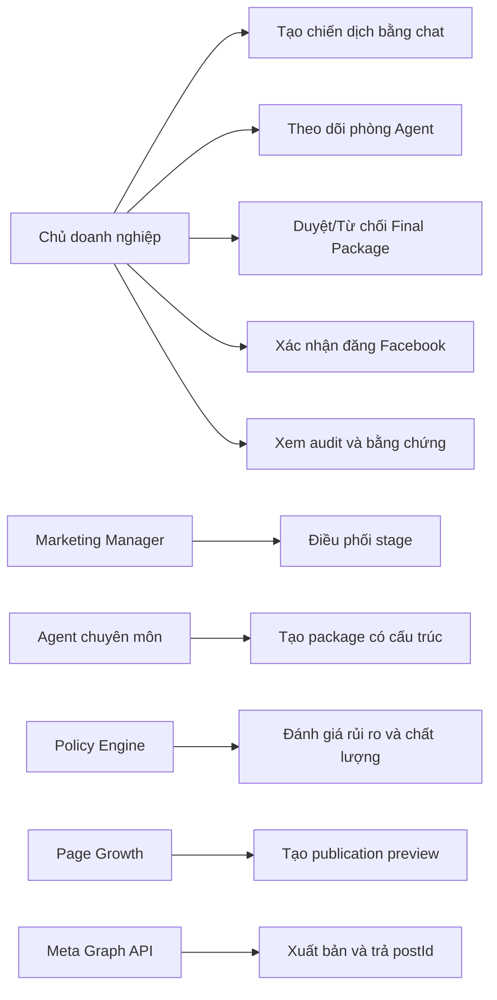

### 6.1. Use case UC-01: Tạo chiến dịch

| Thuộc tính | Nội dung |
|---|---|
| Actor chính | Operator |
| Tiền điều kiện | Bot đang chạy; group/user hợp lệ; 9Router có thể truy cập hoặc fallback sẵn sàng |
| Kích hoạt | Operator gửi yêu cầu có ý định tạo chiến dịch |
| Luồng chính | Xác thực → nhận diện ý định → tạo Campaign/Research Run → chạy các stage |
| Hậu điều kiện | Campaign có ID, run có ID, audit `campaign_created` và `task_assigned` |
| Ngoại lệ | Tin nhắn mơ hồ được hỏi lại; người lạ/group sai bị từ chối |

### 6.2. Use case UC-02: Duyệt Final Package

| Thuộc tính | Nội dung |
|---|---|
| Actor chính | Operator |
| Tiền điều kiện | Final Run ở `pending_approval` và có `publication_content` |
| Luồng chính | Operator xem Final → gửi “Duyệt” → workflow tự tạo publication preview |
| Quy tắc | “Duyệt” chỉ tự chọn khi có đúng một run chờ; nếu nhiều run phải chỉ rõ ID |
| Hậu điều kiện | Final run `approved`, audit ghi người duyệt và thời điểm |

### 6.3. Use case UC-03: Đăng Facebook

| Thuộc tính | Nội dung |
|---|---|
| Actor chính | Operator |
| Actor phụ | Page Growth, Meta Graph API |
| Tiền điều kiện | Final đã duyệt, feature flag bật, Page token có quyền `pages_manage_posts` |
| Luồng chính | Tạo preview chính xác → Operator xác nhận → gọi Meta → lưu postId/permalink |
| Ngoại lệ | Meta lỗi: chuyển `failed`, ghi `publication_failed`, không auto-retry |
| Hậu điều kiện | Chỉ khi có postId mới chuyển `published` |

## 7. Mô hình tổ chức sáu Agent

| Agent | Vai trò nhân sự tương ứng | Nhiệm vụ | Đầu vào | Đầu ra | Không được làm |
|---|---|---|---|---|---|
| AI Marketing Manager | Marketing Lead/CMO | Nhận mục tiêu, ưu tiên, điều phối, tổng hợp | Brief, package đã duyệt, risk note | Campaign, Final Package, publication content | Không tự đăng hoặc bỏ qua duyệt cuối |
| Market Intelligence | Market Researcher | Audience, pain point, đối thủ, trend, angle | Brief chiến dịch | Research Package, evidence, giả định | Không viết bài hoàn chỉnh |
| Content Creator | Copywriter | Hook, thông điệp, bài social, CTA | Brief + Research Package | Content Package | Không bịa dữ liệu hoặc tuyên bố đã đăng |
| Content Strategy & Creative | Strategist/Creative Director | Creative direction, visual brief, storyboard | Content Package | Creative Package, asset checklist | Không tự thay đổi chiến lược gốc |
| Brand & Performance | Brand/Performance Lead | Tone, claim, compliance, CTA, KPI | Toàn bộ package trước | Brand Package, quality gate, risk | Không tự phát hành nội dung |
| Page Growth & Community | Page/Community Executive | Preview, lịch, đăng có xác nhận, metrics | Final đã duyệt | Preview, postId, permalink, báo cáo | Không tự đăng, chi tiền hoặc xử lý nhạy cảm |

### 7.1. Hợp đồng output chung

Mỗi kết quả AI phải thỏa schema:

```text
summary: string
deliverables: string[2..8]
checks: string[1..8]
risks: string[1..6]
evidence: string[1..8]
recommendation: approve | approve_with_conditions | revise | reject
approval_question: string
quality_score: integer 60..100
publication_content?: string
```

`publication_content` là bắt buộc ở Final Package. Đây là nguyên văn bài Facebook sẽ xuất hiện trong preview và được gửi đến Meta. Workflow từ chối tạo preview nếu trường này thiếu.

## 8. Kiến trúc tổng thể

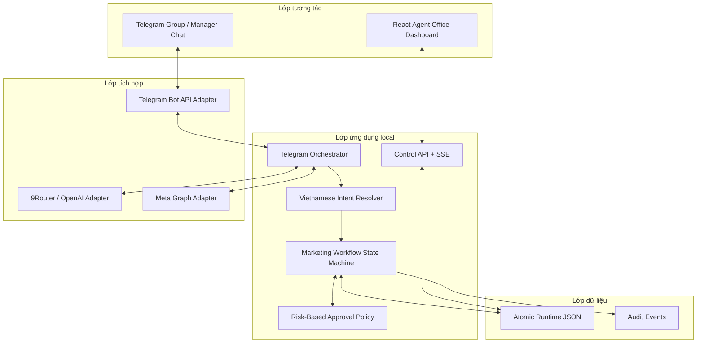

### 8.1. Nguyên tắc kiến trúc

- **Single source of truth:** orchestrator và runtime state quyết định trạng thái; tin nhắn Telegram chỉ là giao diện.
- **Role isolation:** mỗi prompt có mission, skill, quality gate và ranh giới riêng.
- **Deterministic workflow:** state machine quyết định stage tiếp theo, không giao quyền điều phối hoàn toàn cho LLM.
- **Structured AI:** output phải qua Zod trước khi ảnh hưởng workflow.
- **Human control:** Final và publication luôn là cổng con người.
- **Fail closed:** thiếu credential, thiếu content hoặc lỗi Meta thì không đánh dấu published.

## 9. Kiến trúc thành phần

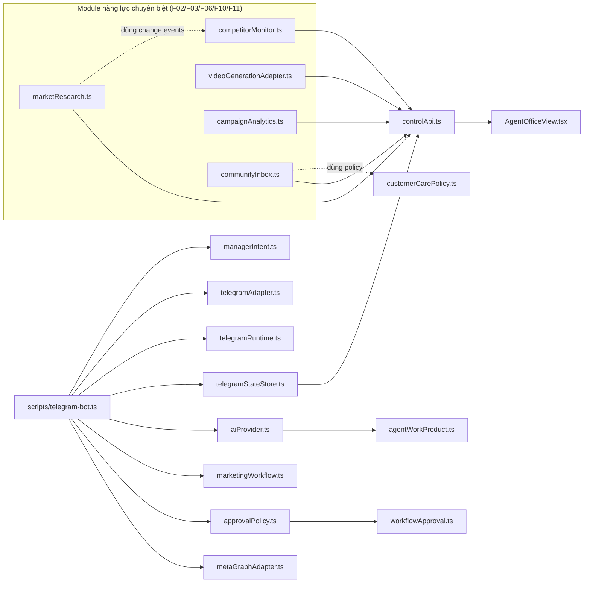

### 9.1. Module năng lực chuyên biệt và read model

Ngoài lõi workflow, hệ thống có năm module năng lực thuần hàm, mỗi module có domain type (Zod), logic xác định (deterministic) và một read model đã redacted phơi qua Control API:

| Module | Chức năng | Domain type | Endpoint read-only |
|---|---|---|---|
| `competitorMonitor.ts` | Diff hai snapshot đối thủ, khử trùng bằng `dedupKey` (F03) | `competitorTypes.ts` | `GET /api/competitors` |
| `marketResearch.ts` | Tổng hợp insight có nguồn/bằng chứng/độ tin cậy (F02) | `marketResearchTypes.ts` | `GET /api/market-research` |
| `videoGenerationAdapter.ts` | Guarded video job, fallback mock có contract tương đương (F06) | `mediaTypes.ts` | `GET /api/video-studio` |
| `campaignAnalytics.ts` | So sánh KPI và sinh Learning Package (F11/F12) | `analyticsTypes.ts` | `GET /api/analytics` |
| `communityInbox.ts` | Phân loại lead/FAQ/khiếu nại/spam, che PII (F10) | `communityTypes.ts` | `GET /api/community` |

## 10. Quy trình nghiệp vụ end-to-end

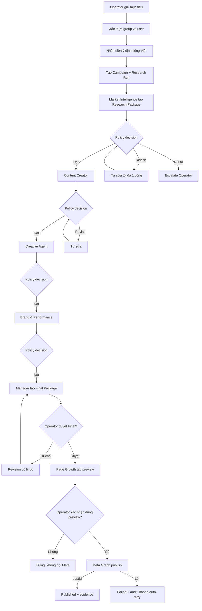

## 11. Sequence diagram chiến dịch chuẩn

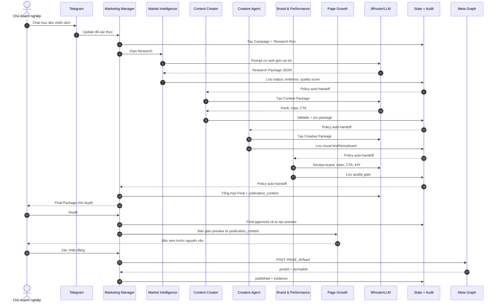

## 12. Sequence auto-revision và escalation

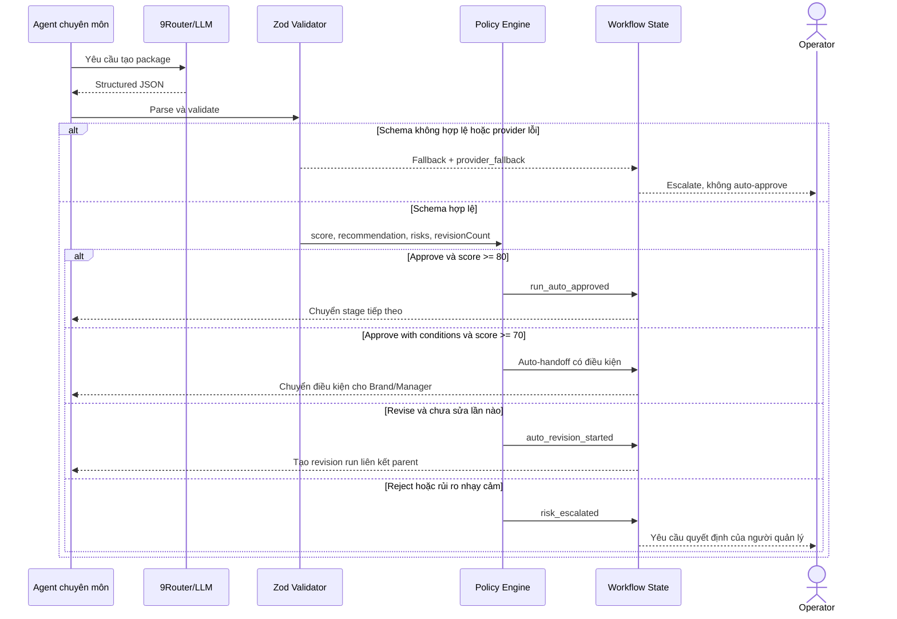

## 13. Sequence xuất bản Facebook an toàn

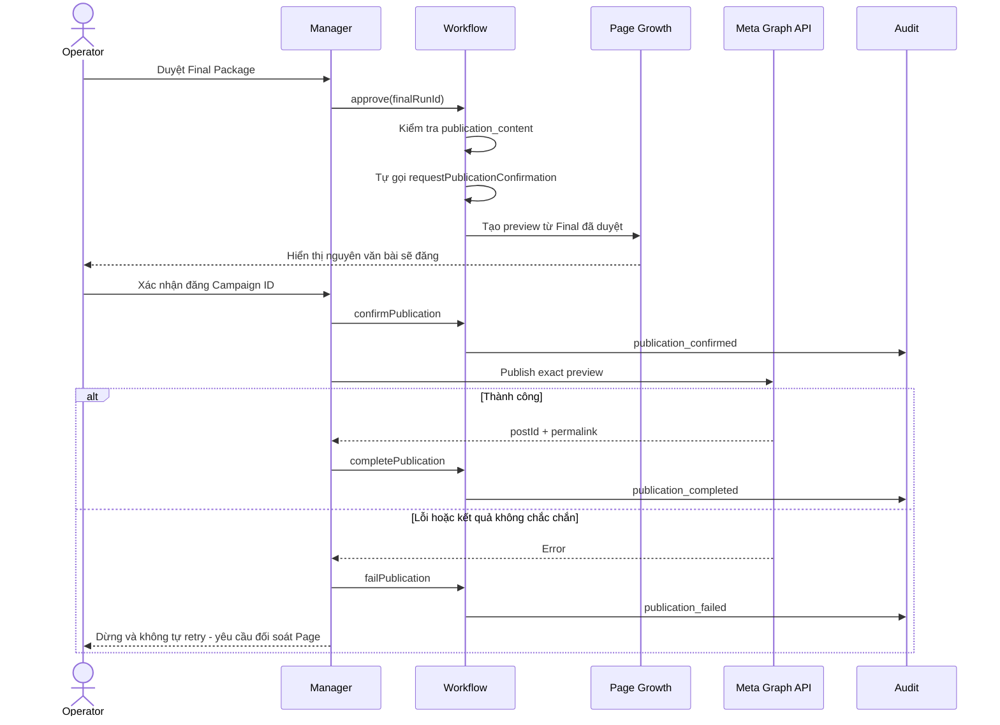

## 14. Luồng chăm sóc khách hàng

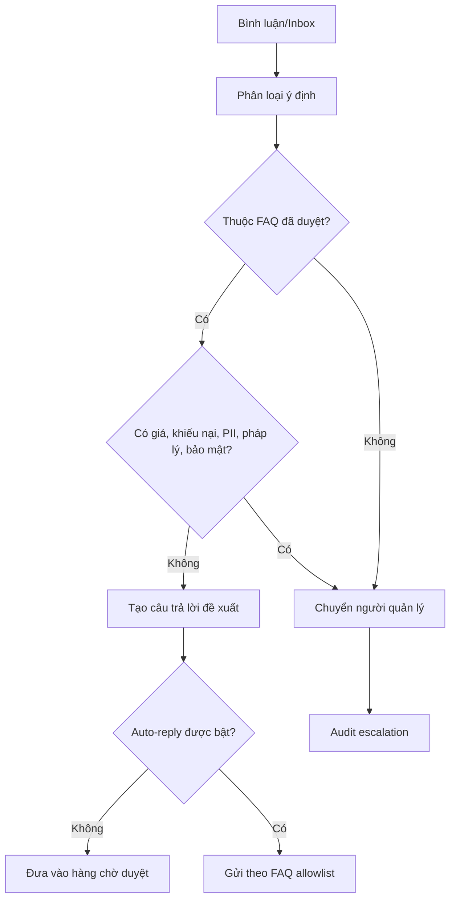

Auto-reply hiện mặc định tắt. Đây là lựa chọn chủ động vì dữ liệu khách hàng, báo giá và khiếu nại cần ngữ cảnh doanh nghiệp và người chịu trách nhiệm.

## 15. Data Flow Diagram

### 15.1. DFD mức ngữ cảnh

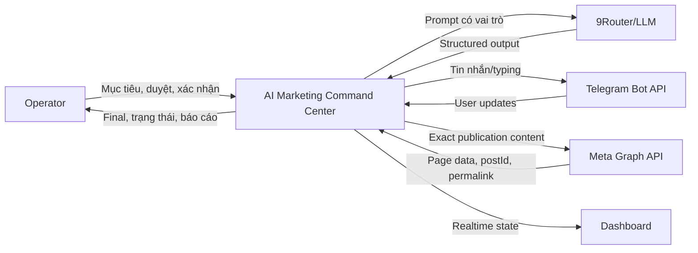

### 15.2. DFD mức 1

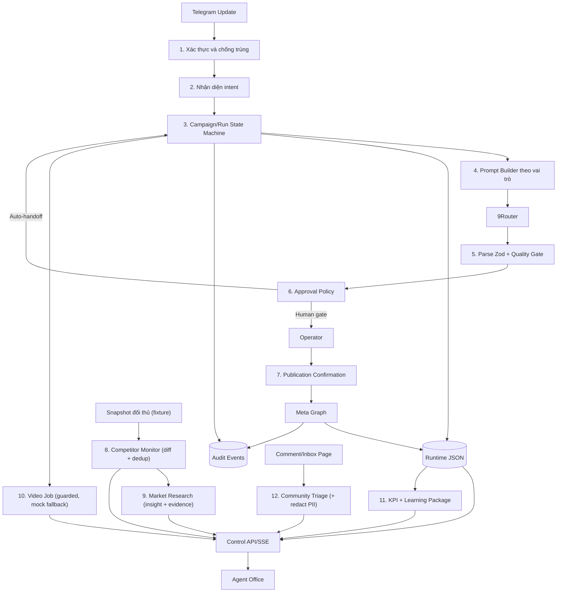

## 16. Mô hình dữ liệu

### 16.1. Thực thể chính

| Thực thể | Trường quan trọng | Ý nghĩa |
|---|---|---|
| Campaign | id, brief, stage, activeRunId, approvedRunIds, publicationPreview, evidence | Vòng đời một chiến dịch |
| AgentRun | id, campaignId, stage, role, status, input, output, parentRunId, fallbackReason, publicationContent | Một lần agent thực hiện công việc |
| AuditEvent | id, campaignId, runId, actorType, actorId, action, summary, createdAt | Bằng chứng truy vết |
| RuntimeSnapshot | workflow, processedUpdateIds, botOffsets, updatedAt | Trạng thái phục hồi sau restart |
| AgentWorkProduct | summary, deliverables, checks, risks, evidence, recommendation, score | Hợp đồng output AI |
| PublicationEvidence | postId, permalink, publishedAt | Chứng minh xuất bản thành công |
| CompetitorChangeEvent | id, dedupKey, competitorId, type, changeKind, impact, confidence, detectedAt | Thay đổi đối thủ đã khử trùng (F03) |
| MarketInsight | id, campaignId, category, statement, sourceType, confidence, score, mediaAngle | Insight có nguồn và độ tin cậy (F02) |
| MediaAsset | id, campaignId, type, status, provider, checksum, createdAt | Asset video/storyboard/audio/subtitle theo hợp đồng (F06) |
| MetricSnapshot / KpiTarget | campaignId, values, targets, capturedAt | Chỉ số thực tế và mục tiêu KPI (F11) |
| LearningPackage | campaignId, lessons, recommendedActions, nextCampaignHypothesis | Bài học tự cải tiến (F12) |
| CommunityMessage | id, channel, category, priority, leadScore, action | Tương tác cộng đồng đã phân loại (F10) |

### 16.2. ERD

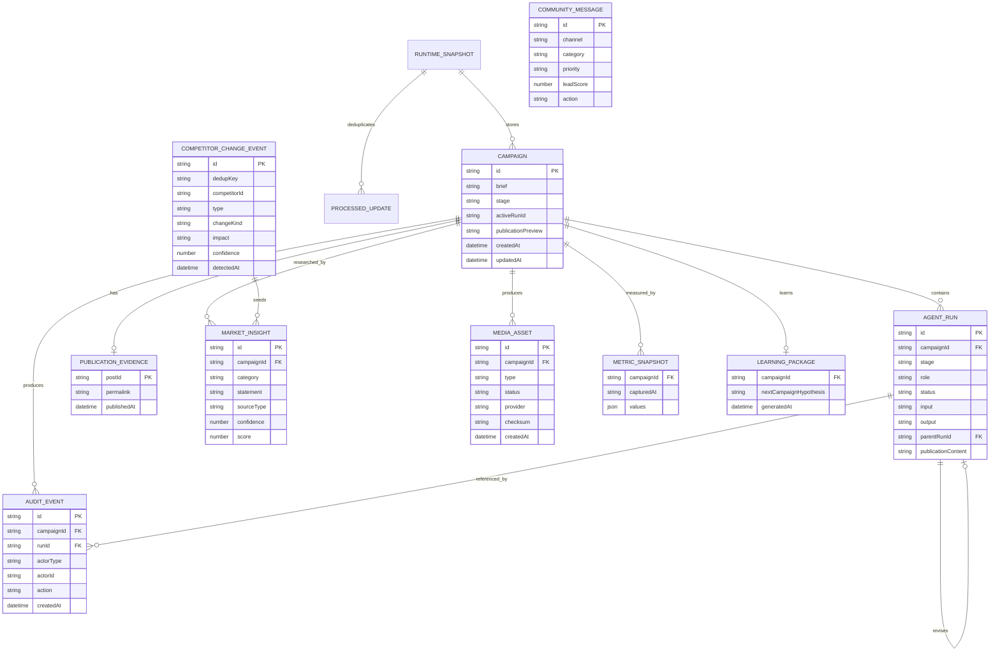

## 17. State machine của Campaign

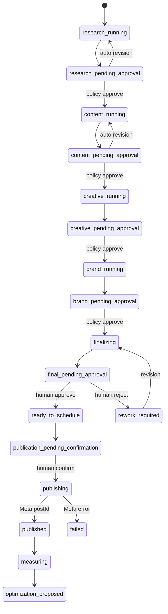

## 18. Chính sách phê duyệt theo rủi ro

| Điều kiện | Quyết định | Người cần tham gia |
|---|---|---|
| Internal stage, recommendation `approve`, score >= 80 | Auto approve và handoff | Không |
| Internal stage, `approve_with_conditions`, score >= 70 | Handoff có điều kiện | Brand/Manager xử lý điều kiện |
| Recommendation `revise`, chưa quá một lần | Auto revision | Không |
| Schema lỗi, provider fallback | Escalate | Operator |
| Risk pháp lý, PII, bảo mật, tài chính, khiếu nại/khủng hoảng | Escalate | Operator/chuyên gia |
| Recommendation `reject` | Escalate | Operator |
| Final Package | Human approval | Operator |
| Publication | Human confirmation | Operator |

Policy Engine không đánh giá bằng lời nói tự do. Nó nhận `recommendation`, `quality_score`, danh sách risk, output mode và số vòng revision rồi trả một action xác định: `auto_approve`, `auto_revise`, `escalate` hoặc `human_approval`.

## 19. Bảo mật và quản trị

### 19.1. Kiểm soát truy cập

- Chỉ `TELEGRAM_GROUP_ID` đã cấu hình được điều khiển group.
- Chỉ `OPERATOR_TELEGRAM_USER_ID` có quyền phê duyệt và xác nhận.
- Tin nhắn bot khác không được coi là lệnh của người quản lý.
- Update ID đã xử lý được lưu để chống thực thi trùng.

### 19.2. Quản lý secret

- Token Telegram, 9Router và Meta chỉ nằm trong `.env` local.
- `.env` bị Git ignore; `.env.example` chỉ chứa tên biến.
- Audit và lỗi không được in token.
- Token từng xuất hiện trong ảnh/chat phải được rotate trước production.

### 19.3. Kiểm soát xuất bản

- Feature flag `META_PUBLISH_ENABLED` là lớp khóa vận hành.
- Final approval và publication confirmation là hai sự kiện độc lập.
- Nội dung gửi Meta phải bằng đúng preview đã xác nhận.
- Chỉ `postId` hợp lệ mới tạo trạng thái `published`.
- Lỗi Meta không auto-retry để tránh bài trùng khi outcome không chắc chắn.

## 20. Persistence, đồng thời và phục hồi

Runtime được lưu trong JSON theo phương thức atomic write: ghi file tạm rồi thay thế file chính. Mutation được tuần tự hóa bằng hàng đợi trong tiến trình để tránh hai Telegram update ghi đè nhau. Snapshot lưu offset của từng bot và danh sách update đã xử lý. Nếu file lỗi, hệ thống có thể quarantine dữ liệu hỏng thay vì âm thầm tiếp tục với trạng thái sai.

Giải pháp local phù hợp demo và khóa luận. Khi triển khai nhiều instance, cần thay bằng PostgreSQL cùng transaction, unique constraint cho update ID, queue và workflow engine bền vững.

## 21. Dashboard phòng điều hành Agent

Dashboard tại `http://127.0.0.1:5174/` gồm:

- Campaign Control Room và stage rail.
- Sáu agent card: trạng thái, task hiện tại và độ trễ.
- Activity stream thể hiện giao việc, handoff, revision, approval và publication.
- Approval queue chỉ hiển thị việc cần con người.
- Service health cho Telegram, 9Router, Meta, runtime và human approval.
- Control API/SSE để cập nhật realtime mà không cần tải lại trang.
- Các màn hình Dashboard, Repos, Tasks, Agents, Daily Brief, Telegram và Data Export phục vụ phần trình bày mở rộng.

Dashboard không trực tiếp quyết định workflow. Nó đọc read model từ Control API, vì vậy trạng thái Telegram và trạng thái trình bày dùng cùng nguồn dữ liệu.

## 22. Deployment diagram

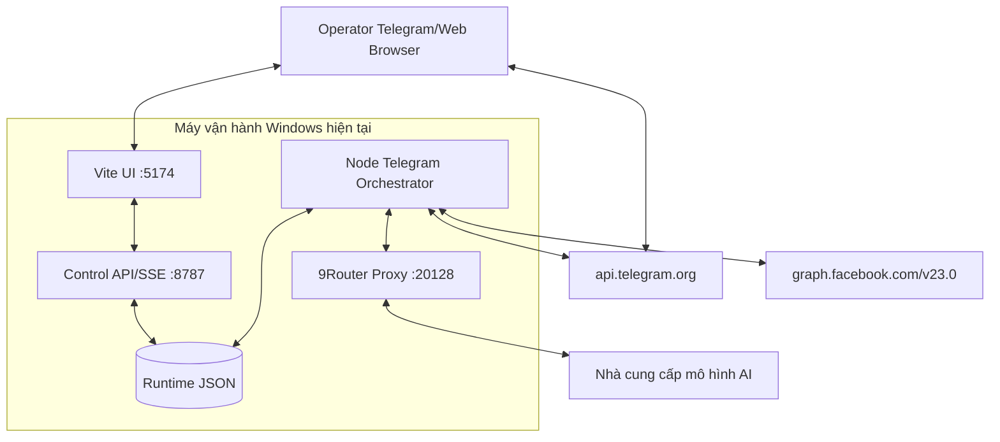

## 23. Công nghệ sử dụng

| Nhóm | Công nghệ | Lý do lựa chọn |
|---|---|---|
| Frontend | React 18, Vite 6, TypeScript | Nhanh, dễ demo local, type-safe |
| UI | CSS vận hành, Lucide React | Giao diện command center nhất quán |
| Bot | Telegram Bot API long polling | Dễ chạy local, không cần webhook public trong demo |
| AI | 9Router, OpenAI-compatible Chat Completions | Đổi model/provider mà không sửa workflow |
| Validation | Zod strict schema | Chặn output thiếu hoặc thừa trường |
| Meta | Graph API v23.0 | Đọc Page, quyền và đăng bài có bằng chứng |
| State | Atomic JSON | Đơn giản, quan sát được, phù hợp một tiến trình local |
| Realtime | HTTP + Server-Sent Events | Dashboard cập nhật một chiều, nhẹ |
| Test | Vitest, jsdom, Playwright | Unit, integration và browser smoke |

## 24. Kiểm thử và bằng chứng

### 24.1. Chiến lược kiểm thử

- **Unit test:** intent resolver, schema, policy, Meta guard, Telegram authorization.
- **Workflow test:** stage transition, revision, idempotency, publication confirmation.
- **Module năng lực:** competitor diff + dedup, market insight, video guard/fallback, KPI + learning, community triage + redact PII (F02/F03/F06/F10/F11).
- **Golden sequence:** chạy toàn bộ chuỗi từ natural-language intake đến publication evidence.
- **Enterprise sequence:** chứng minh bốn stage nội bộ tự handoff và Final dừng chờ người.
- **Browser smoke:** tám bước điều hướng, không page error.
- **System audit:** kiểm tra live sáu bot, AI provider, Meta permission và Control API.

### 24.2. Kết quả kiểm tra tại thời điểm tài liệu

| Kiểm tra | Kết quả |
|---|---|
| Vitest | 21 test files, 126/126 test passed |
| TypeScript typecheck | Passed |
| Production build | Passed, 1.587 modules transformed |
| Browser smoke | 8 bước, 0 page error |
| Browser console | 0 error, 0 warning |
| npm audit | 0 vulnerability |
| Telegram live | 6/6 bot xác thực |
| AI provider live | Structured output, không fallback trong lần audit cuối |
| Meta | Kết nối đúng Page, có quyền manage posts/engagement/messaging |
| System audit | `demo_ready=true`, `publication_ready=true`, `production_ready=true` cho cấu hình local hiện tại |

`production_ready=true` ở đây có nghĩa là chuỗi local đã đủ cấu hình để thử xuất bản có kiểm soát. Nó không thay thế các yêu cầu vận hành cloud như App Review, webhook HTTPS, database, secret manager, backup và monitoring.

## 25. Kịch bản demo trước hội đồng

### 25.1. Chuẩn bị

1. Mở dashboard `http://127.0.0.1:5174/`.
2. Mở Telegram group có sáu bot.
3. Chạy `npm run audit:system` và lưu ảnh kết quả.
4. Chuẩn bị một chiến dịch mới, có nhãn `[BÀI KIỂM THỬ HỆ THỐNG]`.
5. Chuẩn bị video dự phòng trong trường hợp Internet/provider lỗi.

### 25.2. Lời dẫn đề xuất

“Hệ thống của nhóm em không chỉ gọi nhiều chatbot. Nhóm em xây dựng một workflow engine xác định, trong đó mỗi AI Agent có vai trò, hợp đồng output, quality gate và audit trail. AI được tự động hóa ở các bước nội bộ, nhưng con người giữ hai quyết định có tác động ra bên ngoài: duyệt sản phẩm cuối và xác nhận đăng Facebook.”

### 25.3. Tin nhắn demo

```text
Hãy tạo một chiến dịch kiểm thử Facebook giới thiệu giải pháp AI Agent giúp doanh nghiệp 5-30 nhân sự chuẩn hóa hoạt động marketing. Mục tiêu là thu hút khách đăng ký tư vấn. Giọng điệu chuyên nghiệp, thực tế, không phóng đại. Bài cuối phải giữ nhãn [BÀI KIỂM THỬ HỆ THỐNG] và không dùng số liệu chưa có nguồn. Các phòng ban tự phối hợp và chỉ gửi tôi duyệt Final Package.
```

### 25.4. Điểm cần chỉ trên màn hình

1. Manager tạo Campaign ID và Research Run.
2. Từng bot hiện typing, nhận việc và tạo output đúng vai trò.
3. Dashboard chuyển stage và ghi AUTO-HANDOFF.
4. Final Package có `NỘI DUNG XUẤT BẢN`.
5. Operator nhắn “Duyệt”.
6. Page Growth tự hiển thị exact preview ngay sau khi Final được duyệt.
7. Chỉ khi Operator nhắn “Xác nhận đăng” Meta mới được gọi.
8. Bot trả postId/permalink; dashboard hiển thị evidence.

## 26. Tiêu chí chấp nhận

- [ ] Người ngoài group/operator không thể điều khiển workflow.
- [ ] Một yêu cầu tự nhiên tạo đúng một campaign và research run.
- [ ] Mỗi stage có đúng role chịu trách nhiệm.
- [ ] Output thiếu schema không được auto-approve.
- [ ] Internal stage tự handoff theo policy; Final luôn chờ người.
- [ ] Revision có parent run và feedback.
- [ ] Preview lấy đúng `publication_content`, không lấy brief.
- [ ] Publish cần Final approval và confirmation riêng.
- [ ] Chỉ postId thành công mới chuyển published.
- [ ] Meta lỗi không auto-retry và có audit.
- [ ] Dashboard phản ánh cùng runtime state với Telegram.
- [ ] Secret không xuất hiện trong Git hoặc log.
- [ ] Test, typecheck, build, smoke và audit đạt.

## 27. Phân công hai thành viên

| Hạng mục | Thành viên A - Telegram/Orchestration | Thành viên B - Dashboard/Data/Documentation |
|---|---|---|
| Bot API và authorization | Chủ trì | Review |
| Intent tiếng Việt | Chủ trì | Viết test tình huống |
| Workflow/approval policy | Chủ trì | Review model nghiệp vụ |
| 9Router và prompt role | Chủ trì | Kiểm thử chất lượng output |
| Meta Graph/publish guard | Chủ trì | Kiểm thử UI/evidence |
| Dashboard Agent Office | Review API contract | Chủ trì |
| Data model/read model | Đồng thiết kế | Chủ trì |
| Test tích hợp | Golden sequence | Browser/UI smoke |
| Tài liệu/diagram | Cung cấp flow thật | Chủ trì biên soạn |
| Demo | Điều khiển Telegram | Trình bày dashboard và slide |

Quy trình GitHub: mỗi hạng mục có issue → branch `feature/*` hoặc `docs/*` → commit Conventional Commits → chạy test/typecheck/build → Pull Request vào nhánh tích hợp → thành viên còn lại review → merge khi CI đạt. Không commit trực tiếp `.env`, runtime JSON hoặc token.

## 28. Hạn chế và lộ trình nâng cấp

### 28.1. Hạn chế

- Runtime JSON chỉ phù hợp một tiến trình.
- Long polling cần tiến trình local luôn chạy.
- Chất lượng chiến dịch phụ thuộc model và dữ liệu brief.
- Chưa có knowledge base thương hiệu và lịch sử khách hàng dài hạn.
- Metrics sau đăng chưa được tự động hóa đầy đủ.
- Meta customer care chưa nhận webhook production.

### 28.2. Lộ trình

- **Giai đoạn 1 - Bền vững hóa:** PostgreSQL, migration, transaction, queue, idempotency key và backup.
- **Giai đoạn 2 - Triển khai cloud:** HTTPS webhook, secret manager, process supervisor, CI/CD và staging.
- **Giai đoạn 3 - Quan sát:** OpenTelemetry, Sentry, dashboard latency/cost/token và alert.
- **Giai đoạn 4 - Tri thức doanh nghiệp:** brand guideline, product catalog, FAQ, vector search và versioned knowledge base.
- **Giai đoạn 5 - Tối ưu Marketing:** lịch nội dung, A/B testing, metrics ingestion, attribution và đề xuất cải tiến.
- **Giai đoạn 6 - Workflow động:** cân nhắc Temporal/Trigger.dev cho durable execution; LangGraph khi thật sự cần graph agent động.

## 29. Câu hỏi phản biện và trả lời gợi ý

### “Tại sao cần nhiều bot thay vì một chatbot?”

Bot là danh tính và trách nhiệm giao tiếp; orchestrator mới là nguồn sự thật. Việc tách vai trò giúp prompt chuyên môn rõ, output không chồng chéo, audit xác định ai chịu trách nhiệm và dashboard mô phỏng đúng cơ cấu doanh nghiệp.

### “Các bot có thật sự chat trực tiếp với nhau không?”

Không dùng bot-to-bot message làm message bus vì Telegram không bảo đảm cơ chế đó. Orchestrator bàn giao dữ liệu có cấu trúc giữa các run, sau đó gửi thông báo bằng danh tính bot tương ứng. Người dùng vẫn thấy cuộc phối hợp, còn hệ thống giữ được tính xác định và kiểm toán.

### “Vì sao không để LLM tự quyết định toàn bộ?”

LLM phù hợp tạo và đánh giá nội dung nhưng không nên quyết định trạng thái quan trọng. State machine và policy code kiểm soát transition; LLM chỉ cung cấp work product có schema.

### “Làm sao chứng minh bài đăng đúng nội dung đã duyệt?”

Final Run lưu `publication_content`. Preview được tạo trực tiếp từ trường này. Operator xác nhận preview, adapter gửi chính chuỗi đó đến Meta và lưu postId/permalink. Thiếu content hoặc thiếu xác nhận thì workflow từ chối publish.

### “Nếu Meta timeout sau khi đã đăng thì sao?”

Workflow đánh dấu `failed`, ghi audit và không tự retry để tránh tạo bài trùng. Operator phải đối soát Fanpage. Production tiếp theo nên thêm idempotency/outbox và reconciliation job.

### “Hệ thống có phải production hoàn chỉnh chưa?”

Chuỗi local hiện production-ready cho thử nghiệm có kiểm soát. Triển khai doanh nghiệp thật còn cần database, webhook HTTPS, App Review, secret manager, monitoring, backup và quy trình vận hành sự cố.

## 30. Kết luận

Đề tài chứng minh có thể tổ chức LLM thành một đội ngũ AI Agent vận hành theo quy trình doanh nghiệp, thay vì chỉ tạo nhiều chatbot. Giá trị cốt lõi nằm ở sự kết hợp giữa chuyên môn hóa vai trò, workflow xác định, output có cấu trúc, chính sách phê duyệt theo rủi ro, human-in-the-loop và audit end-to-end.

Phiên bản hiện tại đủ để trình bày một chuỗi hoàn chỉnh: tạo mục tiêu bằng chat, agent tự phối hợp, tự sửa nội bộ, con người duyệt Final, Page Growth tạo preview, con người xác nhận và Meta trả bằng chứng xuất bản. Dashboard làm rõ trạng thái của từng agent và mỗi lần bàn giao, giúp hệ thống có tính trực quan, giải thích được và phù hợp với yêu cầu khóa luận.

## Phụ lục A. Lệnh vận hành

```powershell
npm install
npm run dev -- --port 5174
npm run control:api
npm run telegram:bot
npm run audit:system
npm run test
npm run typecheck
npm run build
npm run smoke
```

## Phụ lục B. Biến môi trường

```text
TELEGRAM_*_BOT_TOKEN
TELEGRAM_GROUP_ID
OPERATOR_TELEGRAM_USER_ID
NINE_ROUTER_ENABLED
NINE_ROUTER_BASE_URL
NINE_ROUTER_MODEL
MARKETING_APPROVAL_MODE
META_PAGE_ID
META_PAGE_ACCESS_TOKEN
META_GRAPH_API_VERSION
META_PUBLISH_ENABLED
META_AUTO_REPLY_ENABLED
```

Không đưa giá trị thật của các biến trên vào báo cáo, ảnh chụp, commit hoặc slide.

## Phụ lục C. Cấu trúc nguồn chính

```text
scripts/telegram-bot.ts                  Orchestrator sáu bot
scripts/system-audit.ts                  Kiểm tra live toàn hệ thống
src/integrations/managerIntent.ts        Nhận diện ý định tiếng Việt
src/integrations/marketingWorkflow.ts    State machine và audit
src/integrations/approvalPolicy.ts       Chính sách rủi ro
src/integrations/workflowApproval.ts     Áp dụng policy decision
src/integrations/agentWorkProduct.ts     Zod schema output AI
src/integrations/aiProvider.ts           Prompt và 9Router adapter
src/integrations/metaGraphAdapter.ts     Meta read/publish guard
src/integrations/telegramStateStore.ts   Persistence và deduplication
src/integrations/competitorMonitor.ts    Diff + dedup đối thủ (F03)
src/integrations/marketResearch.ts       Insight có nguồn/độ tin cậy (F02)
src/integrations/videoGenerationAdapter.ts  Guarded video job (F06)
src/integrations/campaignAnalytics.ts    KPI + Learning Package (F11/F12)
src/integrations/communityInbox.ts       Triage cộng đồng + redact PII (F10)
src/domain/*Types.ts                     Domain type + Zod schema
src/integrations/controlApi.ts           Read model và SSE (9 endpoint)
src/features/agent-office/               Dashboard trực quan
tests/                                   Unit/integration/golden sequence (126 test)
```
