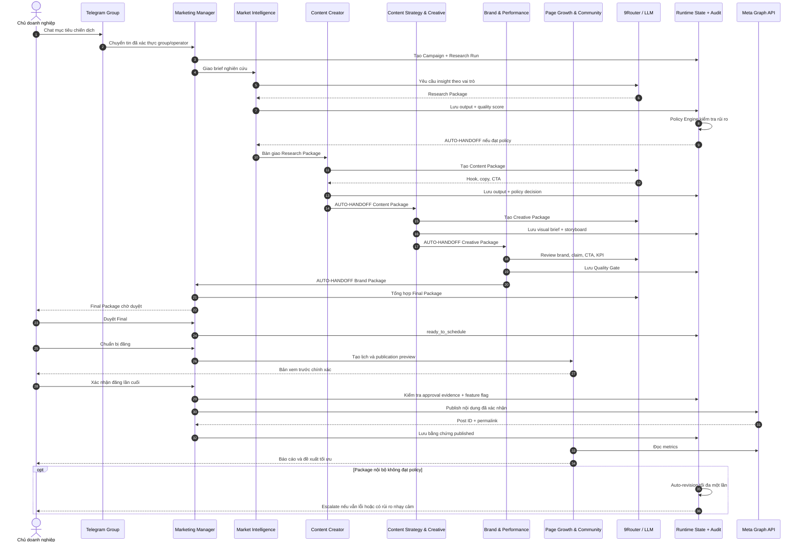

# Kịch bản kiểm thử Sequence Diagram - Phòng Marketing AI

## 1. Sequence chuẩn



## 2. Ví dụ test bằng chat tự nhiên

Gửi cho `@kien_mkt_manager_bot` trong group đã cấu hình:

```text
Hãy tạo chiến dịch giới thiệu giải pháp AI Agent cho doanh nghiệp SME trên Facebook. Khách hàng là chủ doanh nghiệp 5-50 nhân sự, mục tiêu là đặt lịch tư vấn, giọng điệu thực tế và không phóng đại.
```

Kết quả mong đợi:

1. Manager tạo `CMP-...` và `RUN-...-RSH-1`.
2. Market Intelligence trả Research Package và thông báo `AUTO-HANDOFF`.
3. Content Creator, Content Strategy & Creative và Brand & Performance tự chạy nối tiếp khi đạt policy.
4. Manager chỉ dừng ở Final Package để chờ Admin duyệt.

Khi Final Package xuất hiện, chat:

```text
Có gì đang chờ tôi duyệt?
Duyệt
```

Không cần duyệt Research, Content, Creative hoặc Brand. Nếu một package có điểm thấp, Policy Engine tự revision một lần; điều kiện chưa giải quyết sẽ được chuyển cho Brand/Manager và đưa vào Final. Chỉ recommendation `reject`, lỗi provider hoặc rủi ro nhạy cảm mới dừng luồng. Cuối luồng:

```text
Tình hình chiến dịch thế nào?
Chuẩn bị đăng CMP-<ID vừa tạo>
Xác nhận đăng CMP-<ID vừa tạo>
```

Ở cấu hình production có kiểm soát, Page Growth phải hiển thị đúng `publication_content` trong Final Package. Chỉ sau câu xác nhận cuối của Operator, Meta Graph mới được gọi; kết quả thành công phải trả về `postId` làm bằng chứng. Nếu feature flag tắt hoặc credential không hợp lệ, hệ thống phải dừng và không thay đổi trạng thái thành `published`.

Nếu Meta lỗi sau bước xác nhận, campaign chuyển sang `failed`, ghi `publication_failed` vào Audit và không tự retry để tránh đăng trùng. Operator phải đối soát Fanpage trước khi tạo lần xuất bản tiếp theo.

## 3. Tiêu chí đạt

- Mỗi stage chỉ bắt đầu sau khi policy decision của stage trước đã lưu thành công.
- Mỗi output có Campaign ID, Run ID, vai trò, trạng thái và audit event.
- `Duyệt` mơ hồ không làm thay đổi dữ liệu.
- Auto-revision và reject đều giữ lý do cùng liên kết với run cũ.
- Nội dung Final không đồng nghĩa đã đăng.
- Publish cần hai bằng chứng: Final đã duyệt và xác nhận đúng preview.
- Meta lỗi không được làm mất workflow; lỗi phải được làm sạch, không lộ token.
- Dashboard hiển thị cùng campaign/stage/audit với runtime local.
