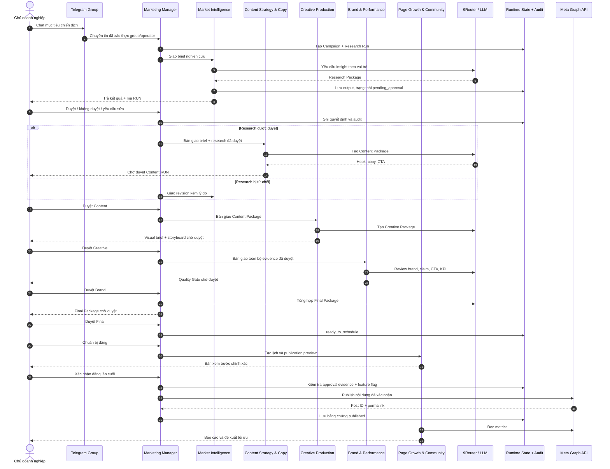

# Kịch bản kiểm thử Sequence Diagram - Phòng Marketing AI

## 1. Sequence chuẩn



## 2. Ví dụ test bằng chat tự nhiên

Gửi cho `@kien_mkt_manager_bot` trong group đã cấu hình:

```text
Hãy tạo chiến dịch giới thiệu giải pháp AI Agent cho doanh nghiệp SME trên Facebook. Khách hàng là chủ doanh nghiệp 5-50 nhân sự, mục tiêu là đặt lịch tư vấn, giọng điệu thực tế và không phóng đại.
```

Kết quả mong đợi:

1. Manager tạo `CMP-...` và `RUN-...-RSH-1`.
2. Market Intelligence hiện trạng thái đang soạn, trả Research Package và dừng.
3. Không Agent nào chạy stage sau trước khi Admin duyệt.

Sau đó lần lượt chat:

```text
Có gì đang chờ tôi duyệt?
Duyệt
```

Sau Content Package, thử nhánh sửa:

```text
Không duyệt vì CTA còn chung chung, cần một CTA đặt lịch tư vấn duy nhất và thêm ví dụ doanh nghiệp 20 nhân sự.
Sửa lại theo đúng phản hồi vừa nêu.
Duyệt
```

Tiếp tục trả lời `Duyệt` ở Creative, Brand và Final khi mỗi lần chỉ có một RUN đang chờ. Cuối luồng:

```text
Tình hình chiến dịch thế nào?
Chuẩn bị đăng CMP-<ID vừa tạo>
Xác nhận đăng CMP-<ID vừa tạo>
```

Ở cấu hình an toàn hiện tại, câu cuối phải trả rằng Meta publish đang khóa. Đây là kết quả đúng: hệ thống đã ghi nhận ý định nhưng không đăng khi credential chưa được rotate và feature flag chưa bật.

## 3. Tiêu chí đạt

- Mỗi stage chỉ bắt đầu sau khi quyết định trước đó đã lưu thành công.
- Mỗi output có Campaign ID, Run ID, vai trò, trạng thái và audit event.
- `Duyệt` mơ hồ không làm thay đổi dữ liệu.
- Reject bắt buộc có lý do; revision giữ liên kết với run cũ.
- Nội dung Final không đồng nghĩa đã đăng.
- Publish cần hai bằng chứng: Final đã duyệt và xác nhận đúng preview.
- Meta lỗi không được làm mất workflow; lỗi phải được làm sạch, không lộ token.
- Dashboard hiển thị cùng campaign/stage/audit với runtime local.
