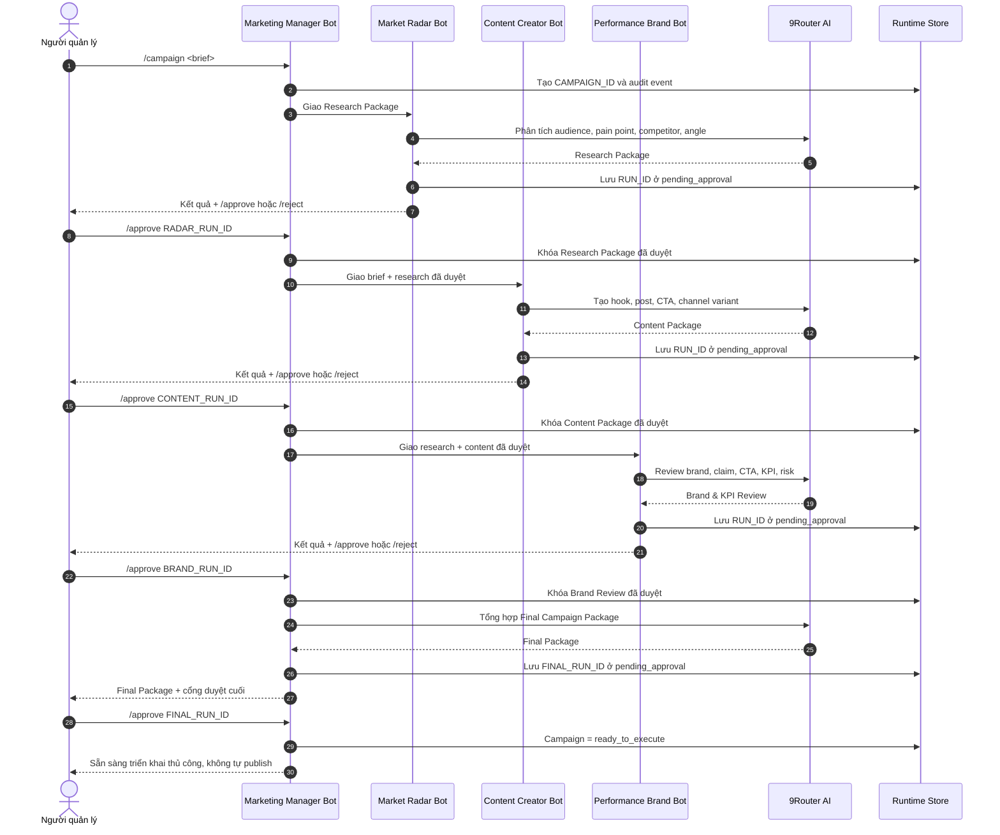
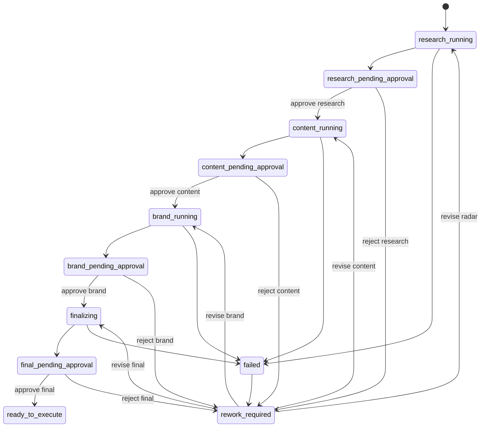

# Thiết kế Enterprise Stage-Gate cho Telegram AI Marketing Team

## 1. Mục tiêu

Nâng phần `OWNER-A` từ một chuỗi bot tự động tạo output thành quy trình Marketing Operations có kiểm soát như doanh nghiệp: mỗi phòng ban chỉ nhận đầu vào đã được phê duyệt, mọi quyết định có dấu vết, trạng thái sống qua restart và không một hành động publish/ads/deploy nào xảy ra tự động.

Thiết kế này chỉ thay đổi Telegram và AI Agent runtime. Dashboard, database dùng chung và giao diện Approval Queue thuộc phần phối hợp với `OWNER-B`.

## 2. Quyết định kiến trúc

Sử dụng **Stage-Gate tuần tự với bốn cổng phê duyệt**:

1. Market Radar tạo Research Package.
2. Owner duyệt Research Package.
3. Content Creator tạo Content Package từ research đã duyệt.
4. Owner duyệt Content Package.
5. Performance Brand tạo Brand & KPI Review từ research và content đã duyệt.
6. Owner duyệt Brand & KPI Review.
7. Marketing Manager tổng hợp Final Campaign Package.
8. Owner duyệt Final Campaign Package.
9. Campaign chuyển sang `ready_to_execute`; hệ thống không tự publish.

Lý do chọn phương án này:

- Thể hiện đúng human-in-the-loop.
- Mỗi phòng ban có trách nhiệm và quality gate riêng.
- Không truyền output chưa duyệt sang phòng ban sau.
- Có thể giải thích rõ trong sequence diagram và bảo vệ khóa luận.
- Có rework loop thay vì chạy lại toàn bộ campaign.

## 3. Luồng nghiệp vụ mục tiêu



## 4. State machine



`ready_to_execute` không có nghĩa đã đăng bài. Đây chỉ là gói chiến dịch đã được con người duyệt để chuyển sang thao tác thủ công hoặc connector tương lai.

## 5. Mô hình dữ liệu runtime

### 5.1. Campaign

```ts
type MarketingCampaignStage =
  | "research_running"
  | "research_pending_approval"
  | "content_running"
  | "content_pending_approval"
  | "brand_running"
  | "brand_pending_approval"
  | "finalizing"
  | "final_pending_approval"
  | "rework_required"
  | "ready_to_execute"
  | "failed";

interface MarketingCampaignRuntime {
  id: string;
  brief: string;
  stage: MarketingCampaignStage;
  activeRunId?: string;
  approvedRunIds: string[];
  createdBy: string;
  createdAt: string;
  updatedAt: string;
}
```

ID có dạng `CMP-YYYYMMDD-XXXX`, không dùng trực tiếp `Date.now()` làm ID hiển thị.

### 5.2. Agent run

```ts
type MarketingRunStage = "research" | "content" | "brand" | "final";
type MarketingRunStatus =
  | "running"
  | "pending_approval"
  | "approved"
  | "rejected"
  | "superseded"
  | "failed";

interface MarketingAgentRunRuntime {
  id: string;
  campaignId: string;
  stage: MarketingRunStage;
  role: "market-radar" | "content-creator" | "performance-brand" | "manager";
  status: MarketingRunStatus;
  input: string;
  output: string;
  parentRunId?: string;
  revisionFeedback?: string;
  fallbackReason?: string;
  createdAt: string;
  updatedAt: string;
}
```

ID có dạng `RUN-<CAMPAIGN_SUFFIX>-<STAGE>-<REVISION>`.

### 5.3. Audit event

```ts
interface TelegramAuditEvent {
  id: string;
  campaignId?: string;
  runId?: string;
  actorType: "human" | "agent" | "system";
  actorId: string;
  action:
    | "campaign_created"
    | "task_assigned"
    | "run_completed"
    | "run_approved"
    | "run_rejected"
    | "revision_started"
    | "provider_fallback"
    | "campaign_ready"
    | "runtime_recovered";
  summary: string;
  createdAt: string;
}
```

Audit summary không chứa token, API key hoặc prompt đầy đủ có dữ liệu nhạy cảm.

### 5.4. Snapshot persistence

```ts
interface TelegramRuntimeSnapshot {
  schemaVersion: 1;
  telegramSession: TelegramSession;
  campaigns: MarketingCampaignRuntime[];
  runs: MarketingAgentRunRuntime[];
  auditEvents: TelegramAuditEvent[];
  botOffsets: Record<string, number>;
  processedUpdateIds: number[];
  savedAt: string;
}
```

## 6. Persistence và phục hồi

- File mặc định: `output/telegram-runtime-state.json`.
- Có thể đổi bằng `TELEGRAM_RUNTIME_STATE_PATH`.
- Ghi atomic: serialize sang file `.tmp`, flush/close, sau đó rename.
- Chỉ giữ 500 audit event và 1.000 processed update ID gần nhất.
- Snapshot phải validate `schemaVersion` và các collection bắt buộc trước khi dùng.
- Snapshot lỗi được đổi tên sang `.corrupt-<timestamp>`; runtime khởi tạo state mới và ghi audit cảnh báo.
- Sau mỗi mutation nghiệp vụ hoặc offset mới, state được đưa vào hàng đợi ghi tuần tự.
- Khi restart, pending approvals, campaign stage và offset được khôi phục.

Persistence local JSON phù hợp MVP và không thêm dependency database. Dashboard không được đọc file trực tiếp trong production; giai đoạn sau dùng API/persistence chung với OWNER-B.

## 7. Idempotency và concurrency

### 7.1. Telegram update

- Mỗi bot lưu offset riêng theo role.
- Trước khi xử lý, kiểm tra `update_id` đã tồn tại trong `processedUpdateIds` chưa.
- Sau khi xử lý thành công hoặc từ chối có chủ đích, lưu update ID và offset.
- Không đánh dấu processed khi runtime crash trước mutation; Telegram có thể retry an toàn.

### 7.2. Command mutation

- Tất cả command thay đổi state đi qua một queue tuần tự.
- Hai `/approve` gửi gần nhau không được cùng duyệt một run.
- Approve một run không còn `pending_approval` phải trả thông báo idempotent, không kích hoạt phòng ban tiếp theo lần nữa.
- Mỗi campaign chỉ có tối đa một `activeRunId`.

## 8. Command contract

### Tạo và theo dõi

```text
/campaign <brief>
/campaigns
/status <CAMPAIGN_ID>
/approvals
/audit <CAMPAIGN_ID>
```

### Phê duyệt và rework

```text
/approve <RUN_ID>
/reject <RUN_ID> <lý do bắt buộc>
/revise <RUN_ID> <yêu cầu sửa bắt buộc>
```

### Vận hành

```text
/health
/report [CAMPAIGN_ID]
/whoami
```

`/revise` chỉ chấp nhận run đang `rejected`. Run cũ giữ nguyên để audit; revision mới có `parentRunId` và tăng revision number.

## 9. Quy tắc chuyển phòng ban

| Run được duyệt | Hành động tiếp theo | Context được phép sử dụng |
|---|---|---|
| Research | Chạy Content Creator | Brief + Research output đã duyệt |
| Content | Chạy Performance Brand | Brief + Research đã duyệt + Content đã duyệt |
| Brand | Chạy Manager Finalizer | Toàn bộ ba package đã duyệt |
| Final | Campaign `ready_to_execute` | Không gọi publish connector |

Reject không tự chạy lại. Manager phải đọc feedback và dùng `/revise`; điều này tránh vòng lặp AI không kiểm soát.

## 10. Output contract từng phòng ban

### Market Radar

- Audience và buying context.
- Pain points có thứ tự ưu tiên.
- Competitor/alternative landscape.
- Strategic angle và evidence cần kiểm tra.
- Research quality gate.

### Content Creator

- Channel và objective.
- Hook.
- Main copy/script.
- CTA duy nhất.
- Claim cần Brand kiểm tra.
- Content quality gate.

### Performance Brand

- Brand consistency.
- Claim/compliance risk.
- CTA review.
- KPI và cách đo.
- Go/No-Go có lý do.

### Manager Final Package

- Executive summary.
- Approved insight.
- Approved content.
- Brand/KPI decision.
- Execution checklist.
- Danh sách việc vẫn cần con người thực hiện.

## 11. Error handling

- AI lỗi: run hoàn thành bằng fallback có nhãn, vẫn phải chờ approve; audit `provider_fallback`.
- Telegram lỗi tạm thời: exponential backoff như runtime hiện tại.
- Persist lỗi: command không được xác nhận thành công cho tới khi state đã ghi; trả mã lỗi theo dõi.
- Run/campaign không tồn tại: hướng dẫn dùng `/campaigns` hoặc `/approvals`.
- Sai stage: trả stage hiện tại và command hợp lệ tiếp theo.
- Người không có quyền: không đọc dữ liệu campaign, không mutation state.

## 12. Cấu trúc module

```text
src/integrations/telegramRuntime.ts
  Authorization, formatting, context và health helper.

src/integrations/marketingWorkflow.ts
  Campaign/run state machine, command transition và rework rule.

src/integrations/telegramStateStore.ts
  Snapshot validation, atomic persistence và recovery.

scripts/telegram-bot.ts
  Telegram I/O, serialized command queue và stage orchestration.

src/integrations/aiProvider.ts
  Prompt, model call, timeout/retry/fallback.
```

Không đưa persistence hoặc state transition mới vào một file `telegram-bot.ts` duy nhất.

## 13. Kế hoạch kiểm thử

### Unit

- Tạo campaign sinh ID và research run.
- Chỉ approve pending run.
- Approve Research tạo Content run đúng context.
- Approve Content tạo Brand run đúng context.
- Approve Brand tạo Final run.
- Approve Final chuyển `ready_to_execute`.
- Reject bắt buộc reason.
- Revise giữ parent run và lịch sử.
- Approve lặp không tạo run tiếp theo lần hai.
- Queue serialize hai mutation đồng thời.
- Snapshot round-trip giữ campaign/run/approval/offset.
- Snapshot corrupt được quarantine.
- Processed update không chạy lại.

### Integration

- Campaign đi đủ bốn approval gate.
- Restart giữa Content pending và approve vẫn tiếp tục đúng stage.
- AI fallback vẫn tạo pending approval và audit event.
- Người sai group/operator không xem `/campaigns`, `/approvals`, `/audit`.

### Regression

- `/health`, `/whoami`, `/brief`, command specialist trực tiếp vẫn hoạt động.
- `npm run test`, `npm run typecheck`, `npm run build`, `npm run smoke` pass.
- Telegram setup vẫn cấu hình 4/4 bot.

## 14. Acceptance criteria

- Một `/campaign` chỉ tự chạy Market Radar, không chạy Content trước khi research được duyệt.
- Mỗi approval chỉ kích hoạt đúng một bước tiếp theo.
- Mọi run có `campaignId`, `stage`, `status` và timestamp.
- Rejected run không bị xóa và có reason.
- Revision giữ liên kết với run cũ.
- Restart không làm mất pending approval hoặc xử lý lại update đã hoàn tất.
- `/status`, `/approvals`, `/audit` trả dữ liệu đúng quyền và đúng campaign.
- Final approval chỉ chuyển `ready_to_execute`; không publish.
- Secret scan sạch.
- Có handoff cho OWNER-B về contract và API/persistence migration tiếp theo.

## 15. Ngoài phạm vi

- Publish Facebook/TikTok/LinkedIn.
- Ads API hoặc thanh toán.
- Production database/cloud deployment.
- Dashboard realtime implementation.
- Lark integration.
- Tự merge GitHub hoặc tự deploy.

## 16. Rủi ro và kiểm soát

| Rủi ro | Kiểm soát |
|---|---|
| Demo dài do bốn approval gate | Chuẩn bị script lệnh và seed campaign; không bỏ gate |
| File state hỏng khi tắt máy | Atomic write + quarantine + test recovery |
| Run kích hoạt hai lần | Serialized queue + status guard + processed update IDs |
| Context quá dài | Chỉ dùng approved package, giới hạn theo stage |
| Fallback bị hiểu là AI thật | Gắn `fallbackReason`, source label và audit event |
| Dashboard chưa đồng bộ | Handoff contract rõ cho OWNER-B; không tuyên bố realtime |

## 17. Kết luận

Enterprise Stage-Gate biến bốn bot từ các persona trả lời song song thành một hệ điều hành marketing có kiểm soát. Giá trị khóa luận nằm ở orchestration, governance, persistence, auditability và human approval, không chỉ ở khả năng gọi model AI.
