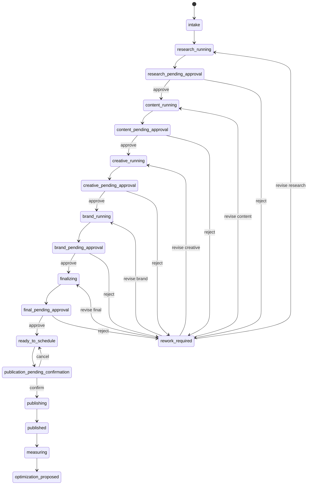

# Thiết kế hệ thống sáu AI Marketing Agent, Meta Page Operations và Visual Agent Office

## 1. Mục tiêu

Nâng hệ thống Telegram-first hiện tại thành một phòng Marketing AI có sáu vai trò chuyên môn, điều khiển bằng hội thoại tiếng Việt, có cổng phê duyệt của con người, có khả năng kết nối Fanpage qua Meta Graph API và có giao diện Visual Agent Office để quan sát trạng thái, bàn giao, hội thoại, chi phí và KPI.

Hệ thống mục tiêu là một sản phẩm local-first có thể mở rộng lên server. Không coi việc nhiều bot tự trả lời trong group là orchestration. Mọi nhiệm vụ phải đi qua workflow engine, có input/output contract, audit và approval gate.

## 2. Migration sang workspace mới

### Nguồn

`C:\Users\KIÊN\Downloads\AI_Agent_marketing`

### Đích

`C:\Users\KIÊN\Downloads\AIAGENTSME`

### Quy tắc migration

- Tạo bản sao lưu của workspace đích trước khi đồng bộ.
- Giữ lại `.env` đích dưới dạng local secret, không commit.
- Không sao chép `node_modules`, `dist`, log, screenshot runtime hoặc snapshot tạm.
- Sao chép toàn bộ source, test, tài liệu, seed data và GitHub workflow từ repo nguồn.
- Khởi tạo workspace đích thành Git repo độc lập; không để Git tiếp tục nhận nhầm `C:\Users\KIÊN` là repository root.
- Remote chính là `https://github.com/Harry-Kien/AI_Agent_marketing.git`.
- Mọi thay đổi mới được thực hiện trong workspace đích sau khi migration.

## 3. Cấu trúc sáu bot

| Bot | Vai trò doanh nghiệp | Nhiệm vụ chính | Quyền hạn |
|---|---|---|---|
| AI Marketing Manager | Marketing Director và Marketing Operations | Hiểu yêu cầu, lập campaign, giao việc, quản lý gate, tổng hợp final package | Không publish, không chi tiền |
| Market Intelligence Agent | Market Research | ICP, pain point, competitor, trend, insight, evidence | Không viết final content |
| Content Strategy & Copy Agent | Content Strategist và Copywriter | Content pillar, hook, copy, CTA, calendar, script | Không tự bịa research, không publish |
| Creative Production Agent | Creative Producer | Creative concept, visual brief, asset plan, image/video prompt, format variant | Không thay đổi claim hoặc CTA đã duyệt |
| Brand & Performance Agent | Brand, Compliance và Analytics | Brand voice, AI claim, compliance, KPI, Go/No-Go | Không publish hoặc thay ngân sách |
| Page Growth & Community Agent | Social Media, Community và Lead Operations | Preview, schedule, publish sau duyệt, comment triage, FAQ draft, lead escalation, metrics | Chỉ dùng Graph API qua connector có policy |

Bot Telegram cũ `@kien_content_creator_bot` trở thành Content Strategy & Copy Agent. Bot Telegram mới `@kien_content_creator1_bot` là Creative Production Agent. Bot Telegram mới `@kien_page_growth_bot` là Page Growth & Community Agent.

## 4. Mô hình orchestration

Telegram Bot API không được dùng làm message bus giữa các bot. Một orchestrator duy nhất nhận update, phân loại intent, kiểm tra quyền, chuyển state, gọi model và gửi kết quả bằng đúng danh tính bot. Cách này tránh bot loop, duplicate task và phụ thuộc việc bot có nhìn thấy tin nhắn của bot khác hay không.

Chỉ Manager Bot tiếp nhận hội thoại tự nhiên của admin trong group. Các bot chuyên môn chỉ nhận task từ orchestrator hoặc yêu cầu trực tiếp có mention rõ ràng.

## 5. Natural Language Command Center

Manager phân loại mỗi tin nhắn thành structured intent:

```ts
type ManagerIntent =
  | "create_campaign"
  | "provide_campaign_context"
  | "view_status"
  | "view_approvals"
  | "approve_active_run"
  | "reject_active_run"
  | "revise_rejected_run"
  | "schedule_publication"
  | "confirm_publication"
  | "cancel_publication"
  | "view_page_metrics"
  | "view_customer_inbox"
  | "reply_customer"
  | "general_question"
  | "unclear";

interface IntentDecision {
  intent: ManagerIntent;
  confidence: number;
  campaignId?: string;
  runId?: string;
  reason?: string;
  requestedAt?: string;
  responseDraft?: string;
}
```

Quy tắc:

- Confidence dưới `0.82` không được mutation state; Manager phải hỏi lại.
- `Duyệt` chỉ tự ánh xạ khi có đúng một pending run trong active campaign.
- Khi có nhiều pending run, Manager trình bày lựa chọn và nút inline.
- `Không duyệt` không có lý do sẽ được hỏi lại; không mutation cho đến khi có reason.
- Publish, reply nhạy cảm, xóa comment và bất kỳ hành động chi tiền nào đều có confirmation riêng.
- Slash command vẫn được giữ là fallback cho debug và vận hành, nhưng không phải UX chính.

## 6. Enterprise Marketing Stage-Gate



Mỗi run có `campaignId`, `stage`, `role`, `status`, `input`, `output`, `parentRunId`, `revisionFeedback`, `model`, `tokenUsage`, `fallbackReason`, `createdAt`, `updatedAt` và evidence.

## 7. Output contract theo phòng ban

### Market Intelligence Package

- ICP và buying context.
- Pain point có thứ tự ưu tiên.
- Competitor và alternative landscape.
- Market signal và evidence status.
- Positioning angle.
- Research quality gate.

### Content Strategy & Copy Package

- Funnel stage và objective.
- Content pillar.
- Hook.
- Main copy hoặc script.
- Một CTA chính.
- Claims cần kiểm tra.
- Channel variants.

### Creative Production Package

- Creative concept.
- Visual hierarchy.
- Asset list và format.
- Image/video generation prompt.
- Caption-to-visual mapping.
- Accessibility note.
- Production checklist.

### Brand & Performance Package

- Brand consistency.
- AI claim và fact-check status.
- Compliance risk.
- CTA review.
- KPI, baseline, target và công thức đo.
- Go/No-Go có lý do.

### Final Campaign Package

- Executive summary.
- Toàn bộ package đã duyệt.
- Channel plan.
- Publication plan.
- Customer care playbook.
- Measurement plan.
- Human action checklist.

## 8. Meta Graph API Connector

Meta connector là adapter hạ tầng, không phải Agent. Chỉ Page Growth & Community Agent được yêu cầu connector thực thi action, và action phải được policy engine cho phép.

Biến môi trường:

```text
META_GRAPH_API_VERSION=v23.0
META_APP_ID=
META_APP_SECRET=
META_PAGE_ID=
META_PAGE_ACCESS_TOKEN=
META_WEBHOOK_VERIFY_TOKEN=
META_PUBLISH_ENABLED=false
META_AUTO_REPLY_ENABLED=false
```

Module phải hỗ trợ:

- Kiểm tra Page identity và token status.
- Tạo preview payload.
- Publish text/link/image sau final confirmation.
- Lưu Facebook Post ID, permalink và response evidence.
- Đọc page post metrics theo phạm vi permission.
- Nhận webhook comment/message khi App và subscription đã đủ điều kiện.
- Không log token, App Secret hoặc full webhook signature.
- Timeout, retry có giới hạn và idempotency key cho publish.

Token đã xuất hiện trong chat/ảnh chỉ được dùng cho connectivity check tạm thời. Production publish bị khóa cho đến khi admin rotate token và cập nhật local `.env`.

## 9. Customer Care Policy

Inbound interaction được phân loại:

```ts
type CustomerInteractionType =
  | "faq"
  | "product_question"
  | "qualified_lead"
  | "pricing_request"
  | "personal_data"
  | "complaint"
  | "legal_or_security"
  | "spam"
  | "unclear";
```

Policy:

- FAQ có trong approved knowledge base: có thể tạo auto-reply khi `META_AUTO_REPLY_ENABLED=true`.
- Product question: tạo draft và chờ duyệt trong giai đoạn đầu.
- Qualified lead: trả lời acknowledgment an toàn và escalation cho admin.
- Pricing, personal data, complaint, legal/security và unclear: không auto-send; tạo alert và draft.
- Spam: chỉ gắn nhãn; không xóa hoặc block tự động.
- Mọi inbound/outbound interaction có audit event, source ID, campaign attribution nếu có và response status.

## 10. Visual Agent Office

Không nhúng toàn bộ Holons hay AI Town vào runtime. Giao diện được xây trong dashboard hiện tại, lấy cảm hứng từ roster, group room, workflow graph và observability của Holons. Cách này giữ một source of truth và không tạo runtime Agent thứ hai.

### Views

1. **Agent Office:** sáu workstation, avatar, role, busy/idle/waiting/blocked/offline, active campaign và current task.
2. **Live Collaboration:** timeline hiển thị assign, typing, output, handoff, approval, reject, revise, publish và customer escalation.
3. **Workflow Graph:** node theo stage, edge bàn giao, gate chờ admin, failed/rework branch.
4. **Approval Desk:** package preview, evidence, risk, approve/reject/revise và final publish confirmation.
5. **Campaign Board:** campaign stage, owner, KPI, deadline, progress và channel.
6. **Community Inbox:** comment/message triage, lead priority, suggested reply và escalation.
7. **Operations:** Telegram health, 9Router health, Meta health, model, latency, token/cost, error rate và queue depth.
8. **Audit Timeline:** actor, action, object ID, timestamp, evidence và correlation ID.

UI là công cụ vận hành, không phải landing page hay game. Visual office phải dễ quét, không dùng animation trang trí làm che mất trạng thái nghiệp vụ.

## 11. Realtime API cho dashboard

Telegram runtime mở local control API trên `127.0.0.1`, mặc định port `8787`:

```text
GET  /api/health
GET  /api/runtime
GET  /api/campaigns
GET  /api/campaigns/:id
GET  /api/approvals
GET  /api/audit
GET  /api/community
POST /api/approvals/:runId/approve
POST /api/approvals/:runId/reject
POST /api/runs/:runId/revise
POST /api/publications/:campaignId/confirm
GET  /api/events
```

`/api/events` dùng Server-Sent Events. Mutation endpoint chỉ bind localhost, yêu cầu local API token và vẫn kiểm tra operator policy. Dashboard không đọc trực tiếp file snapshot.

## 12. Persistence

MVP nâng cấp tiếp tục hỗ trợ atomic JSON snapshot để migration an toàn, nhưng model được tách qua repository interface để chuyển sang SQLite:

```ts
interface MarketingRuntimeRepository {
  load(): Promise<MarketingRuntimeSnapshot>;
  save(snapshot: MarketingRuntimeSnapshot): Promise<void>;
  appendAudit(event: TelegramAuditEvent): Promise<void>;
}
```

Sản phẩm local một process có thể dùng JSON. Trước khi deploy nhiều process hoặc cloud, phải chuyển campaign, run, audit, publication và customer interaction sang SQLite/PostgreSQL.

## 13. Error handling và observability

- Mọi inbound Telegram update có idempotency key theo bot role và update ID.
- Mọi publish request có idempotency key theo campaign, content hash và schedule time.
- AI timeout dùng fallback có nhãn; fallback vẫn chờ approval.
- Meta timeout không được suy diễn là publish thất bại; connector phải reconcile bằng idempotency/evidence trước khi retry.
- Webhook phải verify signature và deduplicate event ID.
- Structured log không chứa token, full prompt, App Secret hoặc dữ liệu cá nhân không cần thiết.
- Dashboard hiển thị correlation ID cho failed run và external request.

## 14. Security boundaries

- Operator Telegram User ID và Group ID là allowlist bắt buộc.
- Specialist bot không có quyền approve, publish hoặc mutate campaign ngoài task được giao.
- Meta secrets chỉ được đọc bởi connector.
- Graph API publish mặc định tắt.
- Auto-reply mặc định tắt.
- Không auto ads, không auto budget, không auto delete/block, không auto merge/deploy.
- Token đã lộ phải được rotate trước khi bật production action.

## 15. Testing

### Unit

- Parse natural-language intent với confidence và ambiguity gate.
- `Duyệt` chỉ approve đúng một pending run.
- Content approved tạo Creative run, Creative approved tạo Brand run.
- Publish không thực thi khi thiếu final confirmation.
- Graph API adapter sanitize error và token.
- Customer Care policy chỉ auto-reply approved FAQ.
- Snapshot round-trip sáu agent, campaign, publication và customer interaction.

### Integration

- Sáu bot `getMe` và command/profile setup thành công.
- Campaign chạy đủ Research → Content → Creative → Brand → Final.
- Reject/revise giữ parent run và audit.
- Restart giữ pending approval và Telegram offset.
- Meta connectivity check xác thực Page ID mà không publish.
- Meta publish dry-run tạo đúng payload.
- Webhook invalid signature bị từ chối.
- Dashboard nhận event realtime và hiển thị cùng campaign/run ID.

### Browser

- Desktop và mobile không overlap.
- Agent Office hiển thị đủ sáu Agent.
- Workflow graph hiển thị stage hiện tại, pending gate và rework branch.
- Approval mutation cập nhật UI mà không reload trang.
- Empty, loading, offline, error và recovered state có hiển thị rõ.

## 16. Acceptance criteria

- Workspace mới là Git repo độc lập và chứa toàn bộ source/tài liệu nâng cấp.
- Sáu Telegram bot có profile, role, prompt, command fallback và poller riêng.
- Admin có thể tạo campaign, xem status, approve, reject và revise bằng hội thoại không slash.
- Luồng có Research, Content, Creative, Brand, Final và Publication gate; không stage nào bị bỏ qua.
- Visual Agent Office hiển thị sáu Agent, live activity, workflow graph, approval, campaign, community và operations.
- Meta adapter có connectivity check và dry-run; publish thật chỉ bật sau token rotation và final confirmation.
- Customer Care có classification, draft, escalation và audit; không auto-send nội dung nhạy cảm.
- Test, typecheck, build và browser smoke test pass.
- Secret scan sạch; `.env`, token, runtime state và log không nằm trong commit.

## 17. Phạm vi chưa thể kích hoạt chỉ bằng token hiện tại

- Production webhook cần Meta App ID, App Secret, verify token, callback HTTPS và subscription/permission hợp lệ.
- Messenger/Customer Care thật phụ thuộc permission và App Review của Meta.
- Scheduled publishing và media publishing phải được xác nhận bằng connectivity/capability test của Page token đã rotate.
- Ads, payment và autonomous budget optimization không thuộc phạm vi.

## 18. Kết luận

Kiến trúc sáu bot tách đúng các năng lực Research, Content Strategy, Creative Production, Brand/Performance và Page/Community trong một phòng Marketing hiện đại. Manager là đầu mối hội thoại; workflow engine là nguồn sự thật; Graph API là connector bị policy kiểm soát; Visual Agent Office là control plane. Việc tách bốn lớp này giúp hệ thống trực quan mà không đánh đổi auditability, human approval và an toàn vận hành.
